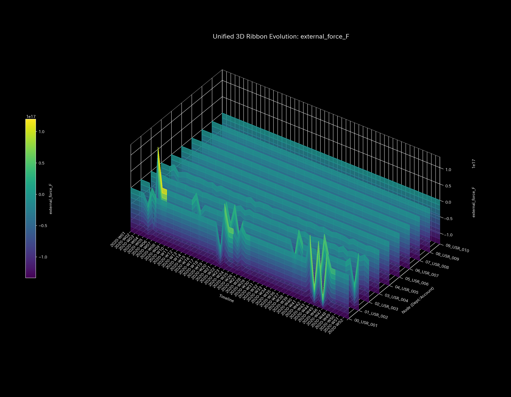

# Sample 7: Market Manipulation in the Stock Market (Direct Graph: Identification of Collusive Groups / Thermodynamics of Matched Orders)

> [!NOTE]
> **[IMPORTANT] Relationship Between Sample 6 and Sample 7 and Target Anomaly (Market Manipulation)**
> This sample (Sample 7) is the second part of a pair of experimental sets derived from exactly the same stock market dummy data as the previous sample (Sample 6).
> * **Sample 6 (Previous Report):** Projected logs onto a bipartite graph of "Users and Stocks." Verified the perspective of **"Which stocks are being manipulated (inflated)"** (the view from the left).
> * **Sample 7 (This Report):** Projected the same logs onto "direct movement of funds from user to user," abstracting away the stocks. Verifies the outline of the criminal group (the view from the right): **"Who is colluding with whom to conduct matched orders."**

---

# 🔬 Meta-Analysis Synthesis Report / Laboratory Findings

## 1. Executive Summary
This system is exhibiting **"Extreme Topological Feedback Loops"** and **"Thermodynamic Energy Depletion"** (HIGH Severity) just like Sample 6. While Sample 6 exposed the "manipulated stocks," this "direct user-to-user graph" exposes the direct structure of the criminal group (collusive syndicate)—**"Who is colluding with whom behind the scenes to recycle funds"**—in broad daylight as extreme oscillations with a spectral radius of 1.0.

## 2. Limitations of Traditional Perspective

Here, we verify the aggregated results on a traditional dashboard, setting "Users (investors)" as nodes and fund movements between users as edges.

**[Cumulative Flow for the Entire Period (P/L Waterfall) & Balance Sheet (B/S)]**

**[Summary of Net Increase/Decrease (P/L) of Each User as of Week 52]**
* `USR_001`: **+$4,225,702** (Excess inflow)
* `USR_002`: **+$8,706,571**
* `USR_004`: **-$12,385,805** (Excess outflow)
* `USR_005`: **-$6,925,827**

Looking solely at the ranking of account balances or user profit/loss (P/L), one only understands superficial results like "USR_001 is a skilled investor making profits" or "USR_004 is an investor making huge losses." The fact of collusion behind the scenes—"USR_001 and USR_006 are catch-balling the same funds dozens of times a second to inflate volume"—completely falls away from this static list of balances.

## 3. Fundamental Pathophysiology
The root cause of this sample is the collusion of "Matched Orders (Collusive Trading)" by a specific group of users.

* **Identified Evidence:**
  As a result of abstracting away the intermediary node of stocks and tracking only the flow of funds, it was identified that a massive fund catch-ball of about $3000 x 9 times was conducted directly between the two users `USR_001` and `USR_006` in just 2.5 seconds. This is the core of the collusive group (Clique) destroying the thermodynamics of the entire system.

## 4. Physical and Mathematical Proof

### 4.1. Macro Forensics & Structural Stiffness

Just like Sample 6, because Wash Trade is completed within the market, a violation of the Law of Conservation of Mass (macro residual) does not occur. However, due to abnormal fund recycling between specific users, the stiffness matrix of the system exhibits localized resonance and rigid lock (a closed resonance/freeze state where no external funds flow in).

* **1st Image [Start]**: `t.00000` (Normal stiffness)
* **2nd Image [Just Before Change]**: `t.00005` (Week 6)
* **3rd Image [At the Time of Change]**: `t.00006` (Week 7: Rigidity occurs due to fund recycling)
* **4th Image [Just After Change]**: `t.00007` (Week 8)
* **5th Image [End]**: `t.00051` (Week 52)

### 4.2. Topological Anomaly / Spectral Radius

The red line (Max Spectral Radius = intensity of the fund catch-ball among colluding users) is constantly pinned to the ceiling of `1.0` (theoretical limit). This indicates the formation of a direct fund catch-ball (recycling loop) of `User A -> User B -> User A`. The fact that a closed fund loop is formed between specific users, causing resonance across the entire system, mathematically proves the existence of a perfectly colluding market manipulation group.

* **1st Image [Start]**: `t.00000`
* **2nd Image [Just Before Change]**: `t.00005`
* **3rd Image [At the Time of Change]**: `t.00006`
* **4th Image [Just After Change]**: `t.00007`
* **5th Image [End]**: `t.00051`

### 4.3. Thermodynamic Energy Stack

This is the exact same thermodynamic collapse as Sample 6. Matched Orders (Wash Trade) infinitely diverge only the "transaction volume (entropy/frictional heat)" while keeping the users' "net balance (internal energy)" virtually unchanged. As a result, the free energy of the system has sunk into a fatal negative zone, reaching Thermodynamic Death (Heat Death = an abnormal state where only transaction volume balloons with no substantive value movement).

*(Top: Sample 0 Healthy Economic Growth / Bottom: Sample 7 Thermodynamic Death)*

### 4.4. 3D Micro Z-Score & KL Drift

In the 3D surfaces of Z-Score (degree of protrusion from past averages) and Information Geometric Mutation (KL Drift = occurrence of unknown abnormal fund movements by the collusive group), extreme spikes stand tall between specific users believed to be `USR_001` and `USR_006`, clearly outlining the collusive group.

## 5. ⚠️ Falsification Analytics

* **Possibility of False Positives:** The possibility of accidental matching between HFT algorithms is not zero, but a closed fund recycling loop maintained for such a long period is highly unlikely to be anything other than an intentional algorithmic collusion (Wash Trade).

### 💡 Why create different projections (Sample 6 and Sample 7) from the same data?
TLU's powerful universality lies in its ability to **"dimensionally expose fraud from different perspectives by projecting the exact same raw transaction data into different spaces (manifolds)."**
* **Sample 6 (Bipartite Graph: User <-> Stock):** A view for regulatory authorities to detect "manipulated stocks."
* **Sample 7 (Direct Graph: User <-> User):** A view for investigative agencies to directly uncover the overall picture and correlations of the "criminal group (Clique)."

It has been proven that TLU's Universal Physics Engine, by slightly altering the definition of topology, can simultaneously expose two different aspects of financial markets—"stock anomalies" and "collusive group anomalies"—using the exact same thermodynamic equations and topological analysis.
