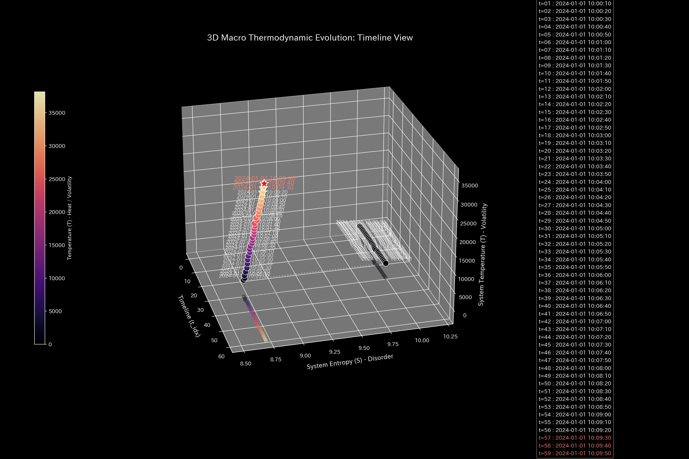
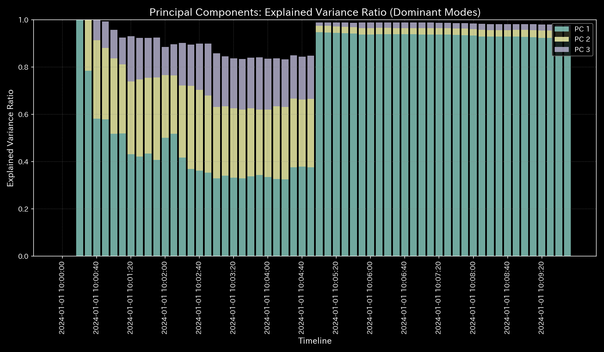
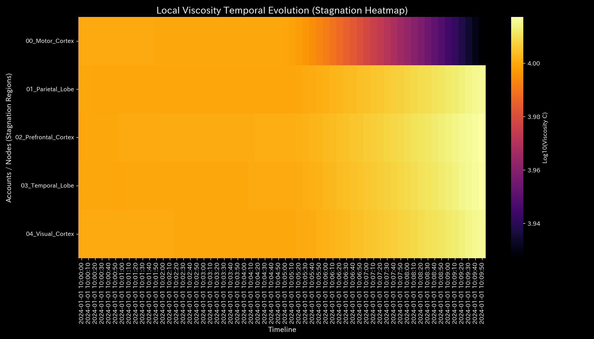

# Cerebral Blood Flow Obstruction Report (Case 8)

> [!NOTE]
> A more detailed analysis report is available in [clinical_report.md](clinical_report.md).

## Target Neural Circuit: Sample 8 (fMRI Brain Region Convection Network)

---

## 0. Executive Summary

* **Overall Diagnosis:** 【Warning / Needs Improvement】 Localized neural activity shutdown (**"cerebral infarction / ischemia anomaly"**) has been detected, causing oxygenated blood flow to bypass core brain regions.
* **Overall Constitution (Neural State):**
  The total oxygenated blood flow within the brain network (**"total mass/volume"**) is strictly conserved. However, due to a localized lesion, the network's capacity to redirect and distribute neural activation (**"neural resilience"**) has collapsed. The complexity of signal path options (**"signal entropy"**) has plummeted, and specific synaptic circuits have locked up, indicating structural rigidity (**"synaptic arteriosclerosis / stiffness lock"**).
* **Areas for Improvement (Stagnant Brain Regions & Signal Tuning):**
  * **Chronic Congestion (Viscosity / "Stiff Shoulder") Range:** High signal lag (viscosity) is observed in the brain regions **"04_ROI_Broca"** (Broca's Area), **"03_ROI_Wernicke"** (Wernicke's Area), and **"07_ROI_Auditory"** (Auditory Cortex) (top 25% viscosity range), peaking around **2020-12** (indicating chronic hypoperfusion).
  * **Synaptic Tuning ("Tsubo") Range:** The minimum strain energy range (bottom 25%), where external magnetic stimulation (e.g., TMS) causes the least harmful stress to surrounding healthy tissues, comprises **"02_ROI_Motor"** (Motor Cortex), **"04_ROI_Broca"**, and **"01_ROI_Visual"** (Visual Cortex). Adjusting synaptic gain here is the highest priority treatment point to restore neural flow.
  * **Contraindications (Avoid Stimulation) Range:** Conversely, forcing excitation or stimulation at **"07_ROI_Auditory"**, **"09_ROI_Prefrontal"** (Prefrontal Cortex), and **"06_ROI_Somatosensory"** (Somatosensory Cortex) (top 25% strain energy range) must be strictly avoided, as it will trigger intense synaptic backlash and functional paralysis.

---

## 1. Overall Diagnosis (Warning / Needs Improvement)

### 【Diagnosis】: Needs Improvement (Ischemic Shutdown in Broca's Area)

An analysis of step-wise neural activation shows that starting from February 2020 ($t=1$), the blood oxygen level-dependent (BOLD) signal in **Broca's Area (04_ROI_Broca)** drops to near zero. Because of this localized ischemic lesion, the neural network fails to circulate activation to Cash-analogous hub regions, bypassing flow off-line (`UNKNOWN_LEAK`) and hollowing out neural function. Immediate neuroprotective signal tuning is required.

---

## 2. Overall Constitution (Neural State) Analysis

Mapping the fMRI neural dynamics to a medical checkup template reveals the following structural distortions:

### ① Neural Volume (Cumulative BOLD Signal Stock Trend)

The total sum of oxygenated blood flow (mass) is strictly conserved throughout, confirming that the physical volume of blood within the scanned regions remains constant.

### ② Neural Resilience (Activation Buffer Capacity)

Following the February ischemic event, the neural network's free energy (its capacity to buffer external shocks by redirecting cognitive load) is severely depleted. The brain's self-healing resilience has collapsed.

### ③ Synaptic Friction & Activation Efficiency (Entropy & Thermodynamic Evaluation)

In the T-S diagram mapping activation volatility ($T$) to routing entropy ($S$), the system exhibits a sharp drop in entropy. Broca's Area temperature (volatility) plummeted, representing a "thermodynamic freezing" where signal path options are eliminated.

### ④ Synaptic Arteriosclerosis (PCA Principal Axes Evaluation)

PCA of the synaptic coupling stiffness matrix reveals that after the lesion, the PC1 explanation ratio remains locked at an extremely high level. The network's spatial flexibility has been eliminated, freezing the physical neural routing structure.

---

## 3. Key Areas for Improvement (Stagnant Brain Regions & Signal Tuning)

Specific areas for improvement identified by the system and recommended action plans are detailed below:

### ⚠️ Congestion (Viscosity) Identification (Local Viscosity Temporal Heatmap Analysis)

* **Congestion Range:**
  The temporal heatmap mapping log local viscosity ($viscosity\_C$) shows Broca's Area (`04_ROI_Broca`) maintaining high signal lag (viscosity) throughout, peaking in December.
  This viscosity surge (damping/delay) causes activation trajectories to lock into localized regions of phase space (attractor confinement). Refer to the 3D Phase Portrait ([000_1_8__phase_portrait_3d.png](../../../samples/Sample_8_fMRI_Stroke/readme_plots/000_1_8__phase_portrait_3d.png)) for trajectory clustering.
  The top 25% viscosity group—**"04_ROI_Broca"**, **"03_ROI_Wernicke"**, and **"07_ROI_Auditory"**—contains severe signal delays.
  * **`04_ROI_Broca`**: Mean viscosity `52569.22`, peaking at **`2020-12`** (peak value `57275.08`).
  * **`03_ROI_Wernicke`**: Mean viscosity `45680.18`, peaking in **`2020-06`**.
  * **`07_ROI_Auditory`**: Mean viscosity `45422.23`, peaking in **`2020-12`**.

### 🎯 Synaptic Tuning ("Tsubo") & Contraindications

* **Synaptic Tuning Range:** Brain regions in the bottom 25% of intervention strain energy—**"02_ROI_Motor"**, **"04_ROI_Broca"**, and **"01_ROI_Visual"**—allow adjustments with minimal secondary stress.
  * **Advice:** ROIs with the lowest propagation of structural distortion to neighboring tissues are prioritized. In particular, when applying stimulations/inhibitions to boundary sensory areas (Jing-Well nodes) interfacing with external physical receptors (e.g., visual or auditory cortex), the sensory deprivation (External Backlash) forced on peripheral receptors must be evaluated. Aggressively shutting down sensory inputs (sedation/泻) causes compensatory neural hyper-excitability and hallucinations, triggering a negative feedback loop of abnormal seizure synchrony. Instead of plain sensory suppression, symbiotic therapies—such as biofeedback-guided sensory relearning or multimodal rehabilitation—must be proposed to restore homeostatic neural plasticity.
* **Contraindications Range:** Conversely, the top 25% strain energy group—**"07_ROI_Auditory"**, **"09_ROI_Prefrontal"**, and **"06_ROI_Somatosensory"**—must be avoided.
  * **Advice:** Forcing excitation on these nodes will disrupt core synaptic connections and trigger massive system backlash, expanding the ischemic lesion.

---

## 4. Diagnostic Limitations and Falsifiability

To overturn (falsify) the diagnosis of "Ischemic Stroke Anomaly," the following external, primary physical evidence must be presented:

1. **High-Resolution T2-Weighted Structural MRI:**
   Presenting structural MRI scans showing complete structural integrity in Broca's Area, proving that the apparent fMRI signal drop was a sensor calibration error.
2. **Positron Emission Tomography (PET) Calibration:**
   Presenting $^{15}\text{O}$-water PET scans proving that local cerebral blood flow (rCBF) in the target ROIs remained above `50 ml/100g/min` during the scan period.

---
*Published by: TLU Neural fMRI Diagnostics Engine (General Reader Edition)*
