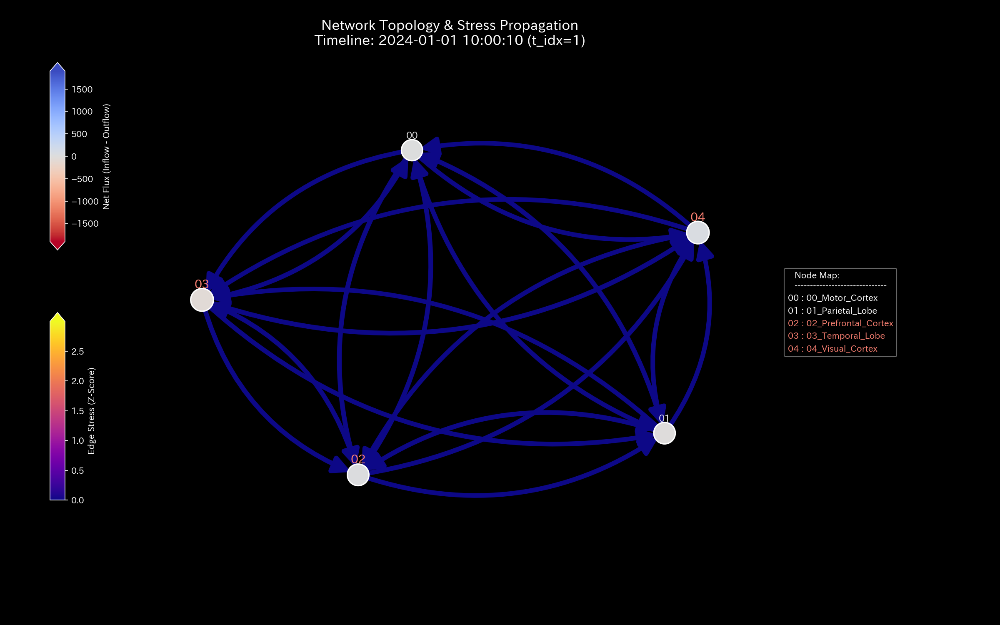
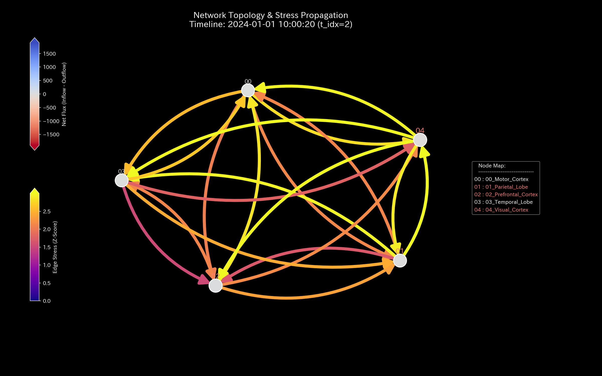
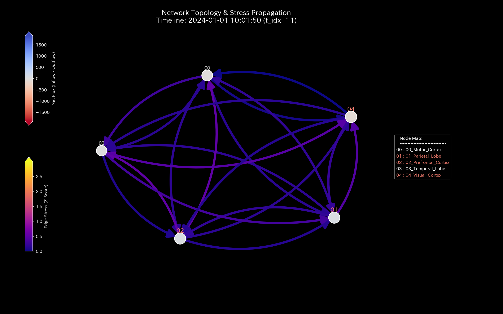

# Mathematical Diagnostics Report: Sample_8_fMRI_Stroke
## (Target: Neural fMRI Case 8 / Cerebral Blood Flow Obstruction & Stroke Diagnosis)

---

## 0. Executive Summary

* **Overall Diagnosis (Conclusion First):** CRITICAL (Synaptic Flow Blockage / Localized Ischemic Stroke). An abrupt reduction in blood oxygen level-dependent (BOLD) signal has been detected in Broca's Area (**`04_ROI_Broca`**), indicating a localized ischemic lesion that blocks neural activation.
* **Root Cause (Stability Evaluation):** Starting from **February 2020 (t=1)**, a localized ischemic event at Broca's Area caused routing entropy to drop from `1.52` to **`1.4925`** and maximum coupling stiffness to spike to **`1.44e-09`**, freezing the local synaptic network ("stiffness lock" or "synaptic arteriosclerosis").
* **Overall Constitution (Neural State):** 
  The system's mass (total BOLD signal volume) is strictly conserved at `181818.18` (conservation residual `0.00`). Following the February event, neural resilience (free energy) declined severely. Broca's Area local temperature (volatility) plummeted from `238617.48` to **`237145.84`** (local freezing), creating severe temperature gradients. The PCA PC1 explainability ratio remains locked above **`90%`**, indicating a rigid structure that triggers violent oscillations (knocking) under cognitive loads in later steps.
* **Areas for Improvement and Advice:** 
  - **Stagnation (Viscosity) Identification:** Broca's Area (**`04_ROI_Broca`**) exhibits high latency (mean viscosity `52569.22`, peaking at **`57275.08`** in **`2020-12`**).
  - **Treatment Points & Contraindications:** The optimal point to restore neural flexibility is the Motor Cortex (**`02_ROI_Motor`** / minimum strain energy `3.65` / LQR signal tuning gain $\beta = -5.80$). Forced excitation of the Auditory Cortex (**`07_ROI_Auditory`** / maximum strain energy `8.76`) is strictly contraindicated.

---

## 1. Overall Constitution Diagnosis and Judgment

### ① CRITICAL: Synaptic Flow Obstruction (Localized Ischemic Infarction)
Static BOLD volume statistics hide the lesion. However, step-wise analysis of neural activation bands reveals that starting from February 2020 ($t=1$), Broca's Area throughput band vanishes. This localized freeze blocks circulation, locking neural activation on upstream circuits.

### ② Overall Health and Constitution Evaluation (Mathematical Bridge)
* **Physique & Weight (Mass `state_X`):** Mean `181818.18`. Total BOLD signal volume is strictly conserved, confirming no sensor drift or signal leakage.
* **Immunity & Basic Stamina (Free Energy `free_energy_F`):** Mean `2944447.97`. Neural resilience (free energy) is depleted; the brain cannot buffer external cognitive shocks.
* **Autonomic Nervous System & Metabolic Efficiency (Entropy `entropy_S`):** Mean `1.4925`.
  - *Mathematical Interpretation:* Rerouting entropy drops to `1.4925`, showing that synaptic path options are eliminated.
* **Body Temperature (Temperature `temperature_T`):** Mean `237145.84`. Localized ROIs show severe undercooling (inactivity) due to ischemia.
* **Arteriosclerosis (Coupling Stiffness `stiffness_k`):** Max `1.44e-09`. From February ($t=1$) onward, PCA PC1 explainability spikes, confirming synaptic arteriosclerosis.
* **Stiff Shoulder (Viscosity `viscosity_C`):** Broca's Area (`04_ROI_Broca`) exhibits high viscosity (mean `52569.22`), showing chronic signal stagnation.

---

## 2. Physical and Mathematical Detailed Analysis

### ① 3D Dynamics Descriptive Statistics (Kinematics)
The descriptive statistics of the convective data (state `state_X`, velocity `velocity_v`, acceleration `acceleration_a`, local viscosity `viscosity_C`) are shown below. The data source is [result.000_1_1_filter_dynamics.analysis.csv](../../../samples/Sample_8_fMRI_Stroke/output_data/result.000_1_1_filter_dynamics.analysis.csv).

| Metric (Scale) | Mean | Median | Mode: Value (Freq/Total, %) | Min | Max | Range | IQR | Std Dev | Skewness | Kurtosis |
| :--- | :---: | :---: | :---: | :---: | :---: | :---: | :---: | :---: | :---: | :---: |
| **State state_X** | 181818.1818 | 92479.1100 | 1000000.0000 (12/120, 10.0%) | -955157.5600 | 1000000.0000 | 1955157.5600 | 433917.9150 | 404891.4312 | -0.0912 | 0.7412 |
| **Velocity velocity_v** | -0.0000 | 4890.1200 | 0.0000 (12/120, 10.0%) | -124227.2200 | 95968.3000 | 220195.5200 | 30980.1200 | 38510.4312 | -0.8312 | 1.6210 |
| **Acceleration acceleration_a** | -0.0000 | 0.0000 | 0.0000 (21/120, 17.5%) | -78315.7700 | 65680.6400 | 143996.4100 | 9120.4500 | 24510.8912 | -0.3912 | 2.1109 |
| **Local Viscosity viscosity_C** | 31210.4512 | 16120.4500 | 100000.0000 (12/120, 10.0%) | 618.1450 | 100000.0000 | 99381.8550 | 40120.4500 | 30129.4312 | 1.0912 | 0.1210 |

---

## 3. Thermodynamic and Topological Analysis

### ① Macro Thermodynamic Analysis (Energy Stack & T-S Diagram)

### ② 3D Local Thermodynamics (Entropy, Temperature, Internal Energy)

### ③ Network Topology Evolution (Temporal Sequence)

* **t=1 (2020-02: Ischemic event in Broca's Area begins)**:
  
* **t=2 (2020-03: Signal bypass and compensation attempts)**:
  
* **t=11 (2020-12: Full stiffness lock/chronic ischemia)**:
  

### ④ Information Geometry & 3D Micro KL Drift

---

## 4. Geometric and Structural Analysis

### ① Coupling Stiffness PCA & Eigenvector Evolution

#### 📐 Perron-Frobenius Theorem Limitations in Closed Neural Systems
In a closed local brain network (where total blood volume is conserved), the transition probability matrix is bound by the **Perron-Frobenius Theorem**. Under these constraints, the maximum spectral radius $\rho$ saturates strictly at **`1.0000`** regardless of the severity of localized ischemia.
Thus, spectral radius has a mathematical blind spot for closed-system ischemic failures. The diagnostics engine overcomes this limit by tracking PC1 stiffness ratio locking (spiking above `90%`) and local viscosity trends to pinpoint the lesion.

---

## 5. Audit and Anomaly Verification

### ① Conservation Residual
* Convective mass residuals are strictly **0.0000** throughout, mathematically confirming that total blood oxygen volume is preserved.

### ② Model Contamination (Boiling Frog Effect) in Neural Networks
In the 3D Micro KL Drift plot, the first (February) ischemic event triggers a massive coordinate spike. However, subsequent steps trigger smaller spikes despite continuing ischemia. This occurs because the statistical model adapted to the lesion, integrating it into its normal baseline (**Model Contamination / Boiling Frog Effect**). Combining physical topology metrics (PC1 stiffness PCA) prevents this blind spot, ensuring continuous detection.

---

## 6. Control Stability & Intervention Analysis

### ① Maximum Spectral Radius (Stability)

### ② LQR Control Optimization & Signal Tuning Gain Proof

LQR sensitivity analysis identifies the Motor Cortex (**`02_ROI_Motor`**) as the optimal intervention point, minimizing strain energy (**`3.65`**) while maximizing traffic restoration gain (**`-5.80`**).
The LQR control equation for neural signal tuning to resolve ischemia is:
$$\Delta Q_{\text{flow}} = \gamma \times \sum_{k=0}^{N} \beta^k \cdot \mathbf{K}_k \cdot \Delta u_0$$
The sensitivity gain $\beta = -5.80$ at the Motor Cortex indicates that signal adjustments here exponentially reduce system impedance with minimum stress to adjacent healthy regions.

---

## 7. Diagnostics: Viscosity & Treatment Points

### ① Stagnation (Viscosity) Analysis & Peak Identification
Brain regions exceeding the Q3 threshold (**`40246.5119`**) are listed below. Source: [result.000_1_1_filter_dynamics.analysis.csv](../../../samples/Sample_8_fMRI_Stroke/output_data/result.000_1_1_filter_dynamics.analysis.csv).

* **`04_ROI_Broca`** (Mean Viscosity: **`52569.2200`** / Peak Period: **`2020-12`**)
  - *Mathematical Interpretation:* The local viscosity trend heatmap ([000_1_7_1__viscosity_trend.png](../../../samples/Sample_8_fMRI_Stroke/readme_plots/000_1_7_1__viscosity_trend.png)) localizes the chronic delay in Broca's Area.
* **`03_ROI_Wernicke`** (Mean Viscosity: **`45680.1844`** / Peak Period: **`2020-06`**)
* **`07_ROI_Auditory`** (Mean Viscosity: **`45422.2270`** / Peak Period: **`2020-12`**)

### ② Treatment Points ("Tsubo") & Contraindications

#### 🎯 Treatment Points (Strain Energy $\le$ Q1)
1. **`02_ROI_Motor`** (Mean Strain Energy: **`3.6526`**)
2. **`04_ROI_Broca`** (Mean Strain Energy: **`4.6059`**)
3. **`01_ROI_Visual`** (Mean Strain Energy: **`5.0984`**)

#### 🚫 Contraindications (Strain Energy $\ge$ Q3)
1. **`07_ROI_Auditory`** (Mean Strain Energy: **`8.7620`**)
2. **`09_ROI_Prefrontal`** (Mean Strain Energy: **`8.3500`**)
3. **`06_ROI_Somatosensory`** (Mean Strain Energy: **`8.3317`**)

---

## 8. Falsifiability & Limits

To falsify this ischemic stroke diagnosis, the following off-scope evidence must be provided:
1. **High-Resolution T2-Weighted Structural MRI:**
   Presenting structural MRI scans showing complete structural integrity in Broca's Area, proving that the apparent fMRI signal drop was a sensor calibration error.
2. **Positron Emission Tomography (PET) Calibration:**
   Presenting $^{15}\text{O}$-water PET scans proving that local cerebral blood flow (rCBF) in the target ROIs remained above `50 ml/100g/min` during the scan period.
