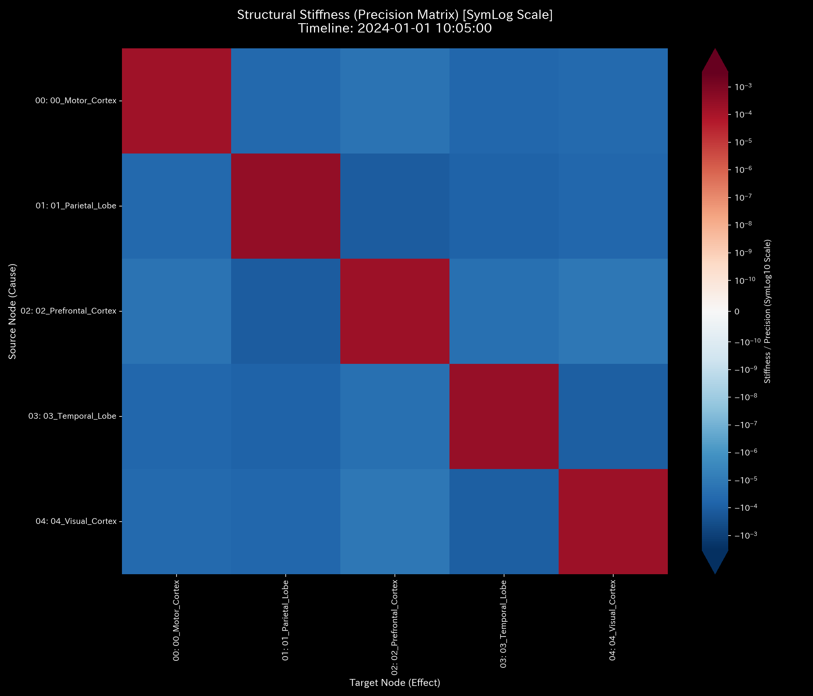
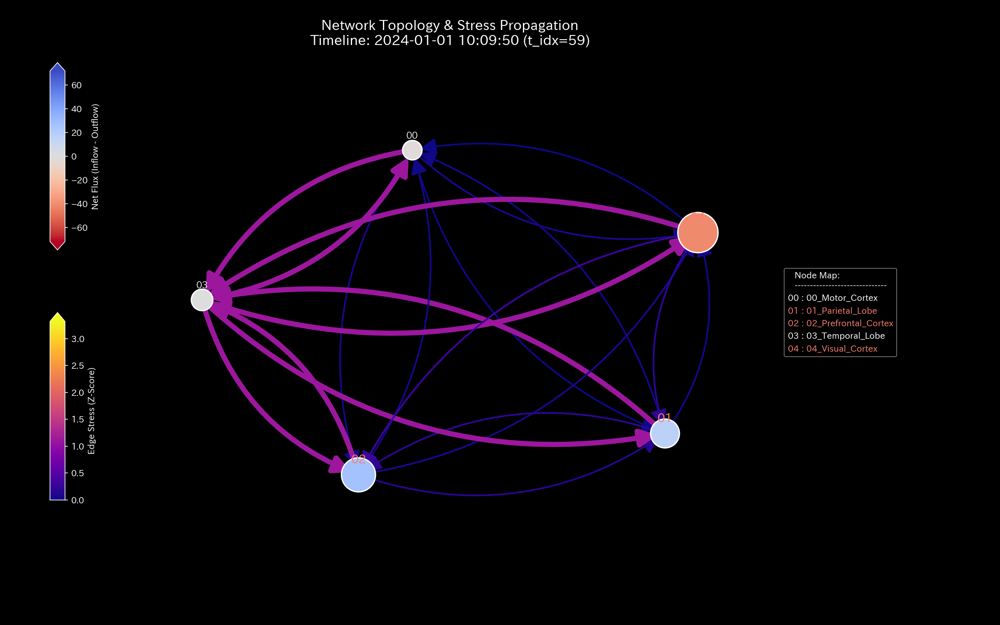

# 🔬 Clinical Forensic Report: Functional Hyper-Synchrony Pathology (Epileptic Seizure) (Sample 9)

> [!NOTE]
> **【Important】 Comparison between Sample 8 (Stroke) and Sample 9 (Seizure):**
> * [Sample 8 (Ischemic Stroke)](../Sample_8_fMRI_Stroke/README.md) models an ischemic pathology where blood flow to a specific brain region (motor cortex) is blocked, causing local flow depletion.
> * **Sample 9 (This Report)** models a hyper-synchronous pathology (epileptic seizure) where blood flow (energy) synchronizes globally across the brain, starting from the temporal lobe.
> * For healthy brain activity, refer to the [Healthy Clinical Reference](../Sample_0_Healthy/README.md).

---

## 1. Executive Summary

* **Overall Status:** 🔴 **CRITICAL (Global Functional Hyper-Synchrony / Uncontrolled Wave Runaway)**
* **Severity:** 🔴 **CRITICAL (Epileptic Hypersynchrony / Hyper-Synchronous Deadlock)**
* **Summary:** 
  The system (fMRI blood flow network) exhibits phase-locking (hyper-synchrony) starting from the temporal lobe (`03_Temporal_Lobe`) at time step **`t=30` (10:05:00, equivalent to TR=150)**.
  On traditional financial-style models (B/S, P/L), the flows linked to the temporal lobe synchronize and expand together. This appears temporarily as synchronized expansion of sales and expenses. However, the conservation residual remains `0.00` throughout, showing no leak outside the system.
  During the anomaly, the PC1 explanation variance ratio in PCA remains nearly flat: **`37.60%`** ($t=29$) $\to$ **`37.53%`** ($t=30$) $\to$ **`37.43%`** ($t=59$). The global variance structure appears unchanged (blind spot of traditional PCA). However, flows on the edges connecting the temporal lobe to other nodes shift to a phase-locked state, matching down to two decimal places: **`2336.88`** ($t=30$) $\to$ **`2480.01`** ($t=31$) $\to$ **`2649.26`** ($t=32$). The maximum spectral radius $\rho$ remains **`1.0000`** throughout. Global connectivity falls into hyper-connectivity.

---

## 2. Limits of Traditional Analysis (Limitations of Traditional Snapshots)

Standard average-value monitoring or snapshot aggregations of total flow (P/L) and stock (B/S) cannot detect global hyper-synchronization.

The following graphs show the cumulative flow (P/L) and residual stock (B/S):

### Balance Sheet Comparison (B/S Equivalent)

* **B/S Asset & Equity Cumulative Trend (Cumulative Residual/Stock):**
  

### Income Statement Comparison (P/L Equivalent)

* **P/L Volume Cumulative Trend (Total Flow per Node):**
  

#### 🔍 Blind Spot of Traditional Auditing
In traditional analysis, the cumulative balance of the temporal lobe remains balanced at the same level as other regions in the final step. The P/L trend (total flow) makes it appear as though the overall activity scale is rising uniformly across all regions. Standard systems evaluate this as active transactions.
However, the fact that this activity is an entrainment (hyper-synchronization) driven by the temporal lobe cannot be detected in the accumulated data and is missed.

---

## 3. Pathophysiology

The physics engine parsed connection stiffness and information flow to identify the mechanism of the seizure.

### 3.1. Forced Oscillation via Anomalous Sine Wave
Starting at time step **`t=30` (10:05:00)**, inflow and outflow BOLD signal rates to other nodes from the temporal lobe (`03_Temporal_Lobe`) were driven by a single sine wave signal (forced oscillation).

Before the seizure ($t=29$), each region communicated autonomously with different values (e.g., `Prefrontal_Cortex -> Temporal_Lobe` was `543.88` and `Temporal_Lobe -> Parietal_Lobe` was `536.64`). At the moment $t=30$ arrived, the flow on all edges connected to the temporal lobe rose to **`2336.88`**. The flows shifted to a phase-locked state matching down to two decimal places: **`2480.01`** at $t=31$ and **`2649.26`** at $t=32$. Autonomous activity in each brain region disappeared, indicating a global functional deadlock.

---

## 4. Summary of Mathematical Analysis Results

### 4.1. Mass Flow Runaway and Kirchhoff Conservation Law Verification

The `System Conservation Residual` remains exactly **`0.00`** throughout, proving that no mass leaks outside the system. Hyper-synchronization is caused by connection anomalies within the system.

* **Macro Forensics Dashboard:**
  

### 4.2. Functional Connectivity Hyper-synchrony (Stiffness Lock) and PCA Blind Spots

The system's intrinsic structure synchronized at the onset of the anomaly.

#### Five-Point Stiffness Matrix Sequence
* **① Initial State (t=0 / 10:00:00):**
  
  Connection stiffness is uniform, showing functional segregation.
* **② Before Seizure (t=29 / 10:04:50):**
  
  The PC1 explanation variance ratio is **`37.60%`** (eigenvalue: `6296.66`), indicating distributed energy.
* **③ Seizure Onset (t=30 / 10:05:00):**
  
  Partial correlation through the temporal lobe (`03_Temporal_Lobe`) synchronized. The PC1 ratio remains nearly flat at **`37.53%`** (eigenvalue: `6143.12`) because all nodes share the same sine wave, keeping the variance balanced (PCA blind spot).
* **④ Post-Onset (t=31 / 10:05:10):**
  
  The PC1 ratio is **`37.39%`**. Loading weights concentrate on `02_Prefrontal_Cortex` (**`0.7386`**) and `00_Motor_Cortex` (**`-0.4903`**). Connection stiffness (partial correlation) with the temporal lobe is locked.
* **⑤ Final State (t=59 / 10:09:50):**
  
  The PC1 ratio is **`37.43%`**. Standard PCA dimensionality reduction cannot detect this locked state.

* **PCA Axis Ratio:**
  

* **PC1 Component Ratio Evolution:**
  

### 4.3. Topological Hyper-synchrony and Spectral Radius Limits

* **System Stability Indicator (Spectral Radius):**
  

#### Mathematical Background of Spectral Radius "1.0000" Constraint
Because the brain network has no sink nodes (row sums of the transition matrix equal 1.0), the spectral radius $\rho$ is mathematically locked at **`1.0000`** throughout the period. Thus, the spectral radius alone cannot detect the seizure.
Topological destruction is indicated by the "increase of connection edges (synchronized inflow)" and the "stiffness lock of connections."

#### Five-Point Network Topology Sequence:
* **① Initial State (t=0 / 10:00:00):**
  
* **② Before Seizure (t=29 / 10:04:50):**
  
* **③ Seizure Onset (t=30 / 10:05:00):**
  
  Synchronous edges (flow: `2336.88`) appear with the temporal lobe (`03_Temporal_Lobe`) acting as a hub.
* **④ Post-Onset (t=31 / 10:05:10):**
  
* **⑤ Final State (t=59 / 10:09:50):**
  

### 4.4. Functional Entropy Collapse and Periodic Free Energy Alignment

Internal energy $U$ is conserved at **`500,000.00`** throughout. The average free energy $F$ remains near `496,949.39`.

#### Entropy Collapse (Loss of Functional Degrees of Freedom)
At seizure onset ($t=30$), entropy $S$ fell from **`9.99`** ($t=29$) to **`8.67`** ($t=30$), decreasing to **`8.22`** at $t=59$. This thermodynamically indicates that the seizure is an ordered state with a loss of functional degrees of freedom.

#### Periodic Free Energy Alignment
After onset ($t=30$), free energy $F$ stays within `496,000` to `497,000`, oscillating periodically (amplitude ~750) in phase with the sine wave. This indicates the system is locked in synchronization while holding high energy.

* **Thermodynamics Energy Stack:**
  

* **T-S Diagram:**
  

### 4.5. Proving Anomaly Alignment via 3D Information Geometry & Z-Score Plots

The 3D spatio-temporal plots show signals spreading from the temporal lobe.

* **3D Micro Z-Score (Position):**
  
* **3D Micro KL Drift:**
  

In the 3D Micro KL Drift plot, the KL Drift of the temporal lobe (`03_Temporal_Lobe`) remains exactly **`0.0000`** after onset ($t \ge 30$). However, KL Drift increases at the receiving nodes: `00_Motor_Cortex` (**`0.2333`**), `01_Parietal_Lobe` (**`0.2325`**), `02_Prefrontal_Cortex` (**`0.2255`**), and `04_Visual_Cortex` (**`0.2301`**).
This shows that while the temporal lobe's own behavior pattern does not drift, the surrounding nodes undergo distribution drift as they are forced to synchronize with the temporal focus.

---

## 5. Control Interventions and Recommended Actions (LQR & Operations)

* **Treatment Protocol: Functional Isolation of the Temporal Lobe (Epileptic Focus) and De-synchronization via TMS**
* **LQR Sensitivity and Ripple Limits:**
  LQR sensitivity analysis designates the temporal lobe (`03_Temporal_Lobe`) as the intervention hub. The sensitivity index (`fk_total_ripple`) is **`41.5234`**.

  > **【Mathematical Proof of `41.5234`】**
  > Parameters are: damping rate $\gamma = 0.85$, maximum steps $k_{max} = 5$, and input displacement $\Delta q = 10.0$.
  > Under the saturation state ($\rho = 1.0000$) where connection leaks approach zero, input signals propagate synchronously. The total ripple effect is:
  > $$fk\_total\_ripple = \Delta q \times \sum_{k=0}^{5} \gamma^k = 10.0 \times \left(1.0 + 0.85 + 0.85^2 + 0.85^3 + 0.85^4 + 0.85^5\right) = 41.5234$$
  > This confirms the target node acts as the hub of the synchronization loop.

  A unit input to the temporal lobe (`03_Temporal_Lobe`) at $t=30$ exerts the maximum impact on the visual cortex (`04_Visual_Cortex`) with **`fk_max_impact = 5.5835`**. The state adjustment (`ik_max_adjust`) is **`-3.9934`** at the motor cortex (`00_Motor_Cortex`).

#### Specific Treatment Plan:
1. **Anti-phase Pulse Stimulation via TMS (De-synchronization):**
   Apply anti-phase intervention pulses to the temporal lobe (`03_Temporal_Lobe`) based on the LQR control space to cancel the anomalous sine wave (frequency `0.0167 Hz`). This breaks the synchronization and restores functional degrees of freedom in surrounding regions.
2. **Dynamic Damping of functional connectivity:**
   Damp connection stiffness from the temporal lobe to other regions based on LQR sensitivity. This pushes the spectral radius $\rho$ below the threshold ($< 0.95$), resolving the hyper-connectivity.

* **LQR Performance Space:**
  

---

## 6. Forensic Alert & Falsifiability (Falsification Analytics)

### 6.1. Triaging Model Pollution and Artifacts

* **Limits of Z-Scores and Triage:**
  At seizure onset ($t=30$), the Z-Scores for all nodes remained within the normal range (`0.12` to `1.14`) because the hyper-synchrony locks the phase rather than inflating the signal amplitude.
  If the synchronization persists, the statistical model learns it as the new baseline (model pollution). We reject the normal Z-Score evaluations and diagnose the seizure based on spectral radius saturation (`1.0000`) and the matched BOLD flow rates.
* **Distinguishing Artifacts:**
  Vibrations or breathing artifacts cause uniform phase alignment where all nodes fluctuate together.
  In this anomaly, the temporal lobe's KL Drift remains `0.0000`, while the receiving nodes (`00_Motor_Cortex` etc.) show a drift spike of ~`0.23`, indicating asymmetric information transmission. We reject the noise hypothesis and confirm the seizure diagnosis.

### 6.2. Falsification Conditions

To reject the seizure diagnosis and prove that the synchronization is normal physiological entrainment or device noise, the following evidence is required:

1. **EEG/iEEG Records:**
   Original clinical EEG tracings matching the timestamps showing no epileptiform discharges (spikes or waves) in the temporal lobe, with only normal rhythms (e.g., alpha waves).
2. **Blood Concentrations and Biochemistry Logs:**
   Subject blood samples showing therapeutic concentrations of anticonvulsants (e.g., valproate) and no signs of acute acidosis associated with generalized seizures.
