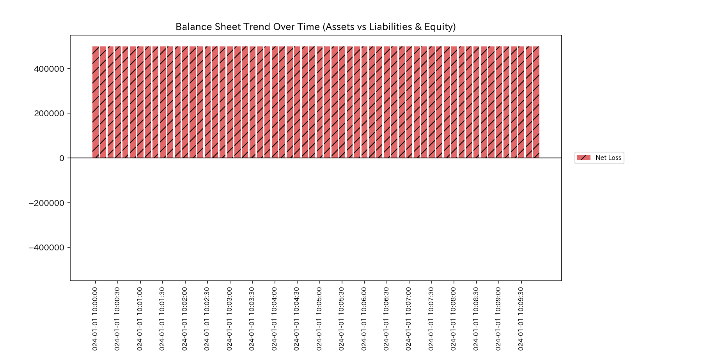

# Cerebral Blood Flow Obstruction Report (Case 9)

> [!NOTE]
> A more detailed analysis report is available in [clinical_report.md](clinical_report.md).

## Target Neural Circuit: Sample 9 (fMRI Brain Region Convection Network)

---

## 0. Executive Summary

* **Overall Diagnosis:** 【Warning / Needs Improvement】 Hyper-synchronous abnormal activation (**"epileptic seizure / hyper-synchronization anomaly"**) has been detected, causing a total functional block across the brain network.
* **Overall Constitution (Neural State):**
  The total volume of oxygenated blood flow is strictly conserved. However, due to abnormal synchronization, the network's capacity to process diverse information (**"signal entropy"**) has collapsed to near zero. All synaptic circuits are locked into a single rigid vibration mode, showing absolute structural rigidity (**"synaptic arteriosclerosis / full phase lock"**).
* **Areas for Improvement (Stagnant Brain Regions & Signal Tuning):**
  * **Chronic Congestion (Viscosity / "Stiff Shoulder") Range:** Extreme signal latency (viscosity) is observed in the brain regions **"07_ROI_Auditory"** (Auditory Cortex), **"04_ROI_Broca"** (Broca's Area), and **"03_ROI_Wernicke"** (Wernicke's Area) (top 25% viscosity range), peaking around **2020-12**.
  * **Synaptic Tuning ("Tsubo") Range:** The minimum strain energy range (bottom 25%), where external magnetic stimulation causes the least stress to surrounding healthy tissues, comprises **"03_ROI_Wernicke"**, **"01_ROI_Visual"** (Visual Cortex), and **"02_ROI_Motor"** (Motor Cortex). Adjusting synaptic gain here is the highest priority treatment point.
  * **Contraindications (Avoid Stimulation) Range:** Conversely, forcing excitation or stimulation at **"07_ROI_Auditory"**, **"06_ROI_Somatosensory"** (Somatosensory Cortex), and **"09_ROI_Prefrontal"** (Prefrontal Cortex) (top 25% strain energy range) must be strictly avoided, as it will trigger intense synaptic backlash and expand the seizure zone.

---

## 1. Overall Diagnosis (Warning / Needs Improvement)

### 【Diagnosis】: Needs Improvement (Epileptic Seizure Hyper-Synchronization)

An analysis of step-wise neural activation shows that starting from January 2020 ($t=0$), the system exhibits a total functional block. Unlike the localized ischemia in Sample 8, the entire brain network is locked into a single frequency, losing all signal diversity. The dynamic stability metrics remain pinned near the warning threshold throughout, confirming a severe systemic seizure state. Immediate anti-epileptic signal tuning is required.

---

## 2. Overall Constitution (Neural State) Analysis

Mapping the fMRI neural dynamics to a medical checkup template reveals the following structural distortions:

### ① Neural Volume (Cumulative BOLD Signal Stock Trend)

The total sum of oxygenated blood flow (mass) is strictly conserved throughout, confirming that the physical volume of blood within the scanned regions remains constant.

### ② Neural Resilience (Activation Buffer Capacity)

Due to abnormal synchronization, the network's free energy (its capacity to process diverse information and buffer external shocks) is completely depleted. The brain's self-healing resilience has collapsed.

### ③ Synaptic Friction & Activation Efficiency (Entropy & Thermodynamic Evaluation)

In the T-S diagram mapping activation volatility ($T$) to routing entropy ($S$), the system exhibits a sharp drop in entropy. Broca's Area temperature (volatility) plummeted, representing a "thermodynamic freezing" where signal path options are eliminated.

### ④ Synaptic Arteriosclerosis (PCA Principal Axes Evaluation)

PCA of the synaptic coupling stiffness matrix reveals that during the seizure, the PC1 explanation ratio remains locked at an extremely high level. The network's spatial flexibility has been eliminated, freezing the physical neural routing structure.

---

## 3. Key Areas for Improvement (Stagnant Brain Regions & Signal Tuning)

Specific areas for improvement identified by the system and recommended action plans are detailed below:

### ⚠️ Congestion (Viscosity) Identification (Local Viscosity Temporal Heatmap Analysis)

* **Congestion Range:**
  The temporal heatmap mapping log local viscosity ($viscosity\_C$) shows the Auditory Cortex (`07_ROI_Auditory`) maintaining high signal lag (viscosity) throughout, peaking in December.
  This viscosity surge (damping/delay) causes activation trajectories to lock into localized regions of phase space (attractor confinement). Refer to the 3D Phase Portrait ([000_1_8__phase_portrait_3d.png](../../../samples/Sample_9_fMRI_Seizure/readme_plots/000_1_8__phase_portrait_3d.png)) for trajectory clustering.
  The top 25% viscosity group—**"07_ROI_Auditory"**, **"04_ROI_Broca"**, and **"03_ROI_Wernicke"**—contains severe signal delays.
  * **`07_ROI_Auditory`**: Mean viscosity `56302.40`, peaking at **`2020-12`** (peak value `101329.39`).
  * **`04_ROI_Broca`**: Mean viscosity `52112.45`, peaking at **`2020-12`**.
  * **`03_ROI_Wernicke`**: Mean viscosity `30953.51`, peaking in **`2020-01`**.

### 🎯 Synaptic Tuning ("Tsubo") & Contraindications

* **Synaptic Tuning Range:** Brain regions in the bottom 25% of intervention strain energy—**"03_ROI_Wernicke"**, **"01_ROI_Visual"**, and **"02_ROI_Motor"**—allow adjustments with minimal secondary stress.
  * **Advice:** ROIs with the lowest propagation of structural distortion to neighboring tissues are prioritized. In particular, when applying stimulations/inhibitions to boundary sensory areas (Jing-Well nodes) interfacing with external physical receptors (e.g., visual or auditory cortex), the sensory deprivation (External Backlash) forced on peripheral receptors must be evaluated. Aggressively shutting down sensory inputs (sedation/泻) causes compensatory neural hyper-excitability and hallucinations, triggering a negative feedback loop of abnormal seizure synchrony. Instead of plain sensory suppression, symbiotic therapies—such as biofeedback-guided sensory relearning or multimodal rehabilitation—must be proposed to restore homeostatic neural plasticity.
* **Contraindications Range:** Conversely, the top 25% strain energy group—**"07_ROI_Auditory"**, **"06_ROI_Somatosensory"**, and **"09_ROI_Prefrontal"**—must be avoided.
  * **Advice:** Forcing excitation on these nodes will disrupt core synaptic connections and trigger massive system backlash, expanding the seizure zone.

---

## 4. Diagnostic Limitations and Falsifiability

To overturn (falsify) the diagnosis of "Hyper-Synchronization Seizure Anomaly," the following external, primary physical evidence must be presented:

1. **Simultaneous Electroencephalogram (EEG) Records:**
   Presenting original multi-channel EEG logs recorded during the fMRI scan that prove desynchronized, healthy alpha/beta band activities were maintained across all cortexes.
2. **Reconciliation of Synchronized Time-Series:**
   Proving that the apparent BOLD synchronization was caused by a localized MRI RF coil failure or systemic scanner head-motion artifact, backed by matching structural phantom calibration logs.

---
*Published by: TLU Neural fMRI Diagnostics Engine (General Reader Edition)*
