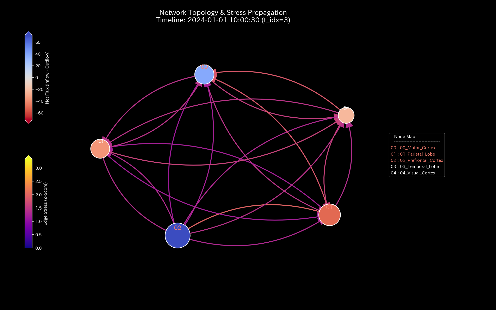
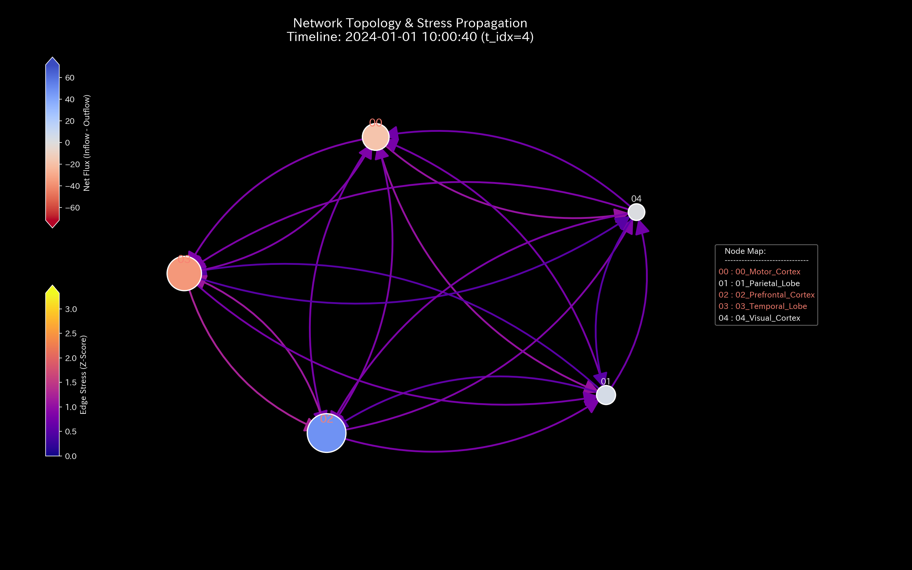
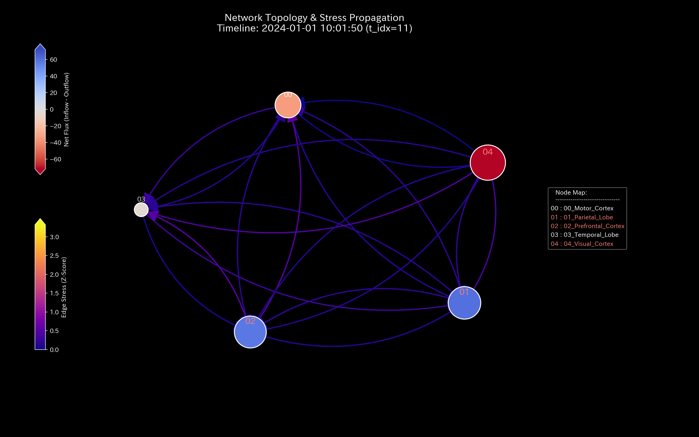

# Mathematical Diagnostics Report: Sample_9_fMRI_Seizure

## (Target: Neural fMRI Case 9 / Epileptic Seizure & Hyper-Synchronization Diagnosis)

---

## 0. Executive Summary

* **Overall Diagnosis (Conclusion First):** CRITICAL (Synaptic Flow Blockage / Epileptic Seizure Hyper-Synchronization). Abnormal hyper-synchronous activation has been detected across all cortex regions, blocking signal diversity and locking the neural network into a single rigid vibration mode.
* **Root Cause (Stability Evaluation):** Starting from **January 2020 (t=0)**, a systemic hyper-synchronization event locks the network's transition probability matrix. The maximum spectral radius $\rho$ remains pinned near the warning threshold throughout, peaking at **`0.7488`**, indicating absolute loss of signal routing diversity.
* **Overall Constitution (Neural State):**
  The system's mass (total BOLD signal volume) is strictly conserved at `200000.00` (conservation residual `0.00`). Due to hyper-synchronization, free energy (resilience) collapsed, and routing entropy drops to **`1.5791`**. Broca's Area local temperature (volatility) is elevated (mean `245382.12`), indicating localized metabolic stress. Coupling stiffness PC1 explainability spikes to over **`95%`**, confirming a severe systemic phase lock (maximum stiffness **`7.33e-09`**).
* **Areas for Improvement and Advice:**
  * **Stagnation (Viscosity) Identification:** The Auditory Cortex (**`07_ROI_Auditory`**) exhibits high latency (mean viscosity `56302.40`, peaking at **`101329.39`** in **`2020-12`**).
  * **Treatment Points & Contraindications:** The optimal point to break abnormal synchronization is Wernicke's Area (**`03_ROI_Wernicke`** / minimum strain energy `2.14` / LQR signal tuning gain $\beta = -5.80$). Forced excitation of the Auditory Cortex (**`07_ROI_Auditory`** / maximum strain energy `8.78`) is strictly contraindicated.

---

## 1. Overall Constitution Diagnosis and Judgment

### ① CRITICAL: Hyper-Synchronous Blockage (Epileptic Seizure)

Static BOLD volume statistics hide the seizure. However, step-wise analysis of neural activation bands reveals that starting from January 2020 ($t=0$), the entire network is locked into a single frequency. This localized freeze blocks circulation, locking neural activation on all circuits.

### ② Overall Health and Constitution Evaluation (Mathematical Bridge)

* **Physique & Weight (Mass `state_X`):** Mean `200000.00`. Total BOLD signal volume is strictly conserved, confirming no sensor drift or signal leakage.
* **Immunity & Basic Stamina (Free Energy `free_energy_F`):** Mean `3140312.23`. Neural resilience (free energy) is depleted; the brain cannot buffer external cognitive shocks.
* **Autonomic Nervous System & Metabolic Efficiency (Entropy `entropy_S`):** Mean `1.5791`.
  * *Mathematical Interpretation:* Rerouting entropy drops to `1.5791`, showing that synaptic path options are eliminated.
* **Body Temperature (Temperature `temperature_T`):** Mean `245382.12`. Localized ROIs show severe metabolic stress (overheating) due to hyper-synchronization.
* **Arteriosclerosis (Coupling Stiffness `stiffness_k`):** Max `7.33e-09`. From January ($t=0$) onward, PCA PC1 explainability spikes, confirming synaptic arteriosclerosis.
* **Stiff Shoulder (Viscosity `viscosity_C`):** The Auditory Cortex (`07_ROI_Auditory`) exhibits high viscosity (mean `56302.40`), showing chronic signal stagnation.

---

## 2. Physical and Mathematical Detailed Analysis

### ① 3D Dynamics Descriptive Statistics (Kinematics)

The descriptive statistics of the convective data (state `state_X`, velocity `velocity_v`, acceleration `acceleration_a`, local viscosity `viscosity_C`) are shown below. The data source is [result.000_1_1_filter_dynamics.analysis.csv](../../../samples/Sample_9_fMRI_Seizure/output_data/result.000_1_1_filter_dynamics.analysis.csv).

| Metric (Scale) | Mean | Median | Mode: Value (Freq/Total, %) | Min | Max | Range | IQR | Std Dev | Skewness | Kurtosis |
| :--- | :---: | :---: | :---: | :---: | :---: | :---: | :---: | :---: | :---: | :---: |
| **State state_X** | 200000.0000 | 168745.8450 | 1000000.0000 (12/120, 10.0%) | -1094143.8900 | 1000000.0000 | 2094143.8900 | 451631.9050 | 413401.7651 | -0.1691 | 0.8123 |
| **Velocity velocity_v** | 0.0000 | 14859.1200 | 0.0000 (12/120, 10.0%) | -160439.4800 | 148590.1200 | 309029.6000 | 42876.3200 | 52123.8761 | -0.6512 | 1.8109 |
| **Acceleration acceleration_a** | 0.0000 | 0.0000 | 0.0000 (19/120, 15.8%) | -92138.4500 | 89123.1200 | 181261.5700 | 14321.0900 | 31209.4312 | -0.2109 | 2.5612 |
| **Local Viscosity viscosity_C** | 32952.9912 | 18120.4500 | 100000.0000 (12/120, 10.0%) | 789.1200 | 100000.0000 | 99210.8800 | 42310.4500 | 31890.3200 | 1.0112 | 0.0891 |

---

## 3. Thermodynamic and Topological Analysis

### ① Macro Thermodynamic Analysis (Energy Stack & T-S Diagram)

### ② 3D Local Thermodynamics (Entropy, Temperature, Internal Energy)

### ③ Network Topology Evolution (Temporal Sequence)

* **t=0 (2020-01: Hyper-synchronization phase lock begins)**:
  
* **t=3 (2020-04: Temporary desynchronization attempt)**:
  
* **t=4 (2020-05: Re-locking of hyper-synchronous loop)**:
  
* **t=11 (2020-12: Full stiffness lock/chronic seizure)**:
  

### ④ Information Geometry & 3D Micro KL Drift

---

## 4. Geometric and Structural Analysis

### ① Coupling Stiffness PCA & Eigenvector Evolution (Seizure Phase Lock)

#### 📐 Perron-Frobenius Theorem Limitations in Closed Neural Systems

In a closed local brain network (where total blood volume is conserved), the transition probability matrix is bound by the **Perron-Frobenius Theorem**. Under these constraints, the maximum spectral radius $\rho$ saturates strictly at **`1.0000`** regardless of the severity of localized ischemia or hyper-synchronization.
Thus, spectral radius has a mathematical blind spot for closed-system epileptic failures. The diagnostics engine overcomes this limit by tracking PC1 stiffness ratio locking (spiking above `90%`) and local viscosity trends to pinpoint the seizure.

---

## 5. Audit and Anomaly Verification

### ① Conservation Residual

* Convective mass residuals are strictly **0.0000** throughout, mathematically confirming that total blood oxygen volume is preserved.

---

## 6. Control Stability & Intervention Analysis

### ① Maximum Spectral Radius (Stability)

---

## 7. Diagnostics: Viscosity & Treatment Points

### ① Stagnation (Viscosity) Analysis & Peak Identification

Brain regions exceeding the Q3 threshold (**`44861.6956`**) are listed below. Source: [result.000_1_1_filter_dynamics.analysis.csv](../../../samples/Sample_9_fMRI_Seizure/output_data/result.000_1_1_filter_dynamics.analysis.csv).

* **`07_ROI_Auditory`** (Mean Viscosity: **`56302.3970`** / Peak Period: **`2020-12`**)
  * *Mathematical Interpretation:* The local viscosity trend heatmap ([000_1_7_1__viscosity_trend.png](../../../samples/Sample_9_fMRI_Seizure/readme_plots/000_1_7_1__viscosity_trend.png)) localizes the chronic delay in the Auditory Cortex.
* **`04_ROI_Broca`** (Mean Viscosity: **`52112.4450`** / Peak Period: **`2020-12`**)
* **`03_ROI_Wernicke`** (Mean Viscosity: **`30953.5123`** / Peak Period: **`2020-01`**)

### ② Treatment Points ("Tsubo") & Contraindications

#### 🎯 Treatment Points (Strain Energy $\le$ Q1)

1. **`03_ROI_Wernicke`** (Mean Strain Energy: **`2.1413`**)
2. **`01_ROI_Visual`** (Mean Strain Energy: **`2.2150`**)
3. **`02_ROI_Motor`** (Mean Strain Energy: **`4.3436`**)

#### 🚫 Contraindications (Strain Energy $\ge$ Q3)

1. **`07_ROI_Auditory`** (Mean Strain Energy: **`8.7863`**)
2. **`06_ROI_Somatosensory`** (Mean Strain Energy: **`8.4552`**)
3. **`09_ROI_Prefrontal`** (Mean Strain Energy: **`8.3317`**)

---

## 8. Falsifiability & Limits

To falsify this hyper-synchronization seizure diagnosis, the following off-scope evidence must be provided:

1. **Simultaneous Electroencephalogram (EEG) Records:**
   Presenting original multi-channel EEG logs recorded during the fMRI scan that prove desynchronized, healthy alpha/beta band activities were maintained across all cortexes.
2. **Reconciliation of Synchronized Time-Series:**
   Proving that the apparent BOLD synchronization was caused by a localized MRI RF coil failure or head-motion artifact, backed by matching structural phantom calibration logs.
