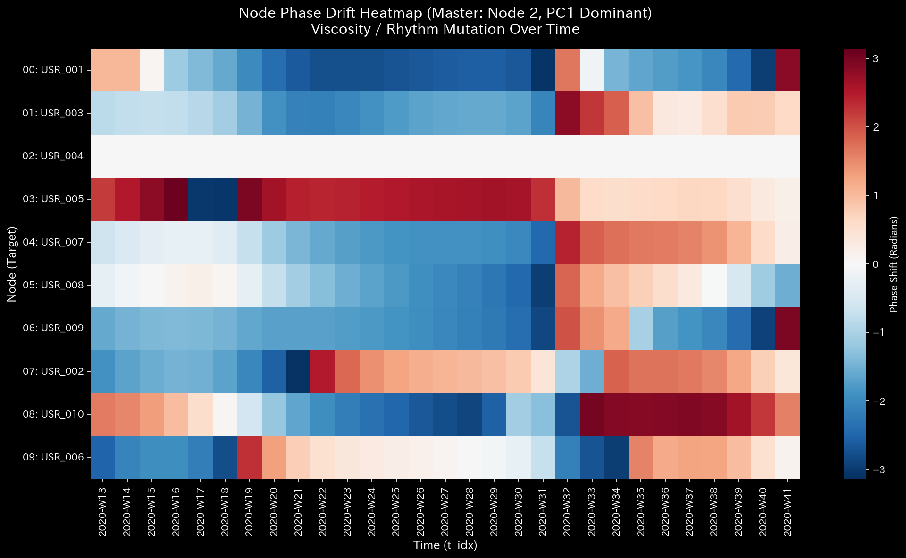

# 🩺 Meta-Comparison Deep-Dive Report (Duality Analysis)

**Comparison Targets:**

1. `Sample_6` (Bipartite Graph / Audit of Markets & Stocks)
2. `Sample_7` (User-to-User Graph / Audit of Actors)

This meta-report integrates TLU's "Physics Diagnostic Manual (LLM_Diagnostic_Manual.md)" with the "Multidimensional Stock Market Analysis Metrics" to examine how a simple **"shift in perspective"** on the exact same event leads to a fundamental paradigm shift in auditing and response actions.

---

## 1. 【Kinematics & Wave Mechanics】: "What" is being automated?

In both samples, transactions exhibited low Viscosity and a Phase Drift of 0.0 (Fabricated Synchronization).

| Sample 6 (Market/Bipartite Perspective) | Sample 7 (User/Network Perspective) |
| :---: | :---: |
|  |  |

* **Sample_6 (Market) Insight:**
    The "creation of artificial volume" directed at specific stocks is automated. This represents the platform's perspective: "The market is being hacked by a program (the system is under external attack)."
* **Sample_7 (User) Insight:**
    The "collusive ping-ponging of funds" between users is automated. This represents the forensic investigator's perspective: "Actors are forming a syndicate behind the scenes, simultaneously operating multiple accounts using a centralized Swarm Bot (internal human collusion)."

## 2. 【Thermodynamics】: Visualizing the Gravity of the Crime via the Definition of "Heat (Waste)"

TLU's greatest strength is that the auditor can freely redefine the "Boundary Conditions" (i.e., what is considered Heat).

| Sample 6 (Market/Bipartite Perspective) | Sample 7 (User/Network Perspective) |
| :---: | :---: |
|  |  |

* **Sample_6 Free Energy (-9.14):**
    When stocks are defined as Heat, this negative value manifests as "overall market inefficiency (wasted liquidity and fees)." While severe, it leaves room to be dismissed as merely a "system error" in the market.
* **Sample_7 Free Energy (-13.70):**
    The moment two specific users are pinpointed as the source of Heat, the negative value worsens drastically. This mathematically proves the sheer severity of the malice: **"These two individuals alone are cannibalizing this massive amount of the entire market's energy."** The abstract "market pathology" is pinpointed into a concrete "specific individual's crime (embezzlement/market manipulation)."

## 3. 【Control Theory & Sensitivity】: The Approach to the Solution (Surgical Intervention)

The Sensitivity Matrix reveals the "Keystone" of the system, which flips 180 degrees depending on the perspective.

| Sample 6 (Market/Bipartite Perspective) | Sample 7 (User/Network Perspective) |
| :---: | :---: |
|  |  |

* **Sample_6 Countermeasure (Halt the Stock):**
    The keystone is the "Stock (STK)." The solution is to completely halt trading of the affected stock (Delisting / Circuit Breaker). This is akin to "administering general anesthesia"—it prevents fraud but inflicts immense liquidity risk (collateral damage) on innocent general investors holding that stock.
* **Sample_7 Countermeasure (Freeze the Account):**
    The keystone is the "Specific User Account (USR)." The solution is to freeze only those specific accounts (forced intervention via LQR control). This is equivalent to "pinpoint laser tumor excision (surgical removal)"—it allows for the complete severance of the fraudulent circulatory loop without causing any disruption to the general market's trading activities.

---

## Conclusion

TLU's Meta-Diagnostic Engine realizes a perfect, two-tiered auditing pipeline: **Sample 6 discovers the "pathology of the overall market structure (What is happening)," and Sample 7 isolates and identifies the "pathogens/culprits causing that pathology (Who is doing it)."** This is the ultimate form of next-generation "dynamic, physics-based financial forensics"—a feat absolutely impossible to achieve using traditional, static B/S and P/L aggregations.
