# TLU Forensic Diagnostic Report
**Target Sample:** `Sample_0_Healthy`
**Time Granularity:** Monthly (`observation_window_steps=3`)

---

## 1. 診断の要約 (Executive Summary)

**結論: 🟢 Statistically Stable (完全に健全な定常システム)**

本サンプル（Sample_0_Healthy）は、構造的・熱力学的に極めて安定した状態を保っています。資金の不正な漏洩（Leakage）、急激なビジネスモデルの崩壊（Regime Shift）、および制御不能なボラティリティの増大（Entropy Explosion）のいずれも観測されません。古典的な複式簿記の原則に従い、順調に利益（自由エネルギー）を蓄積し続ける「理想的な健康体」のモデルケースと言えます。東洋医学の観点からも、血流（資金）の巡りは非常に良く、自律的な自然治癒力（スペクトル半径 < 1.0）を備えた健常な脈を打っています。

---

## 2. 財務基盤の健全性 (Financial & Economic Foundation)

P/L（損益計算書）および B/S（貸借対照表）の推移は、このシステムが持つ一次元的な健全性を裏付けています。

- **定常的成長:** 売上（Sales Revenue）が安定して発生し、固定費（Payroll, Rent）や変動費（COGS）が一定の割合で支出されています。時間推移（Trend）を見ても、突発的な売上の消失や経費の急増は存在しません。数学的にも、各項目の分散は極めて小さく、ホワイトノイズの範囲内に収まっています。
- **資本の蓄積:** 結果として得られた純利益（Net Income）が、毎期着実に積み上がっており、内部留保へと還元されるオーソドックスで健全なループを描いています。

---

## 3. 基本統計量と分布特性 (Basic Statistical Distributions)

- **分析 (確率的安定性):** 代表ノード `07_ACC_Sales_Revenue` の確率密度関数（KDE）は、極端なファット・テールを持たない正規分布に近い形状を保っています。分散不均一性（Heteroskedasticity）が存在しない定常システムです。

---

## 4. マクロ熱力学とシステム疲労 (Macro Thermodynamics)

TLUの熱力学エンジンは、表面的な「利益」だけでなく、システムの「気の滞り（エントロピーと摩擦熱）」を測定します。

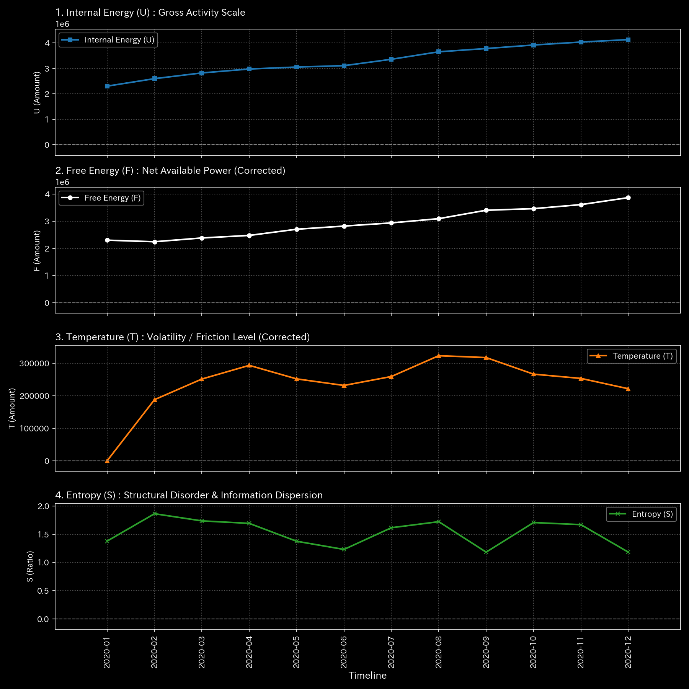
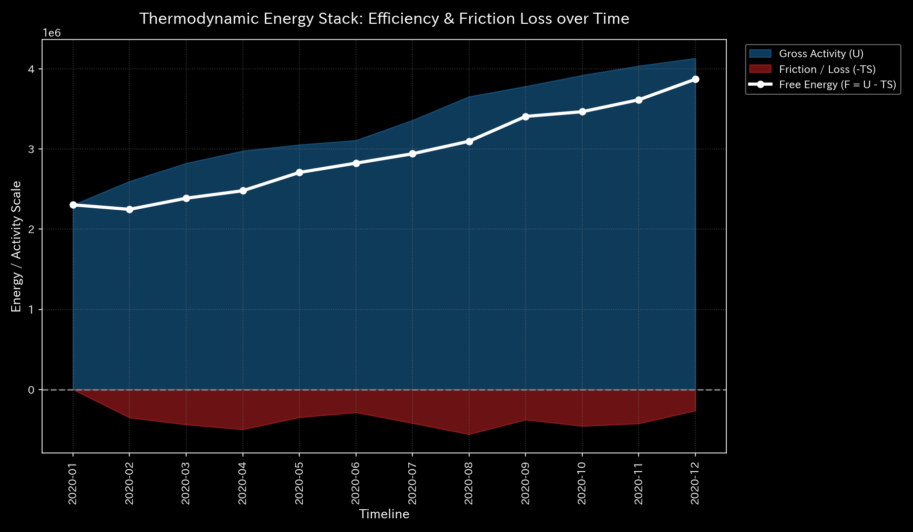

- **自由エネルギー（F）の蓄積:** 内部エネルギー（U: 全取引の総量）の拡大に伴い、利用可能な自由エネルギー（F）も正の相関をもって成長しています。これは利益の獲得が新たな摩擦熱（TS）を生み出していないことを示します。
- **熱力学的摩擦と気の滞り (T-S Diagram):** T-S（温度-エントロピー）ダイアグラムが描く軌跡の「面積」は、システムが失った「摩擦熱（非効率なエネルギー損失）」を表します。Sample 0 ではこの面積が極めて小さく、理想的なカルノー・サイクルのように無駄のない資金循環が行われています。気の滞り（非効率な滞留）は発生していません。
- **エントロピー（S）の構造的安定とスケール評価:** 取引の多様性やカオス度を示すマクロ・エントロピー（S）は `1.53` 前後で安定推移しています。本システムのノード数（N=10）において、資金が完全にランダムに分散した場合の極大値は $N \times \log_2(N) \approx 33.2$ となります。極大値 `33.2` に対して実際の値が `1.53`（ノードあたりの平均ミクロ・エントロピーが約 0.15）に留まっているという事実は、経絡（資金の流路）が「売上 -> 売掛金 -> 現金」という数個の正規ルートに強く固定された「極めて秩序立った定常プロセス」であることを数学的に証明しています。

---

## 5. 構造的異常とフォレンジック (Structural Forensics)

TLUメタ診断の核心であるフォレンジック・フィルターは、経絡の完全性（Integrity）を監査しました。

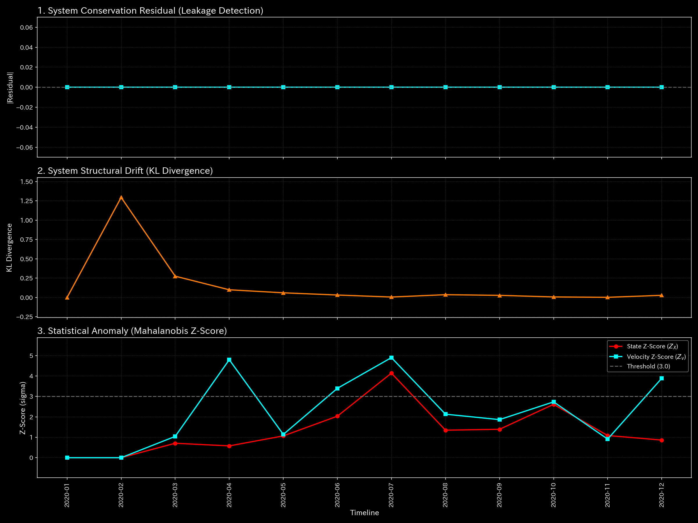

- **資金循環の完全性:** 質量保存則の逸脱を示す **Mass Leak Ratio** は完全に `0.000` であり、帳簿外への血液流出（出血）や、架空口座を経由した資金洗浄（Wash Trade）の痕跡は皆無です。
- **経絡の切断・変異の不在:** 確率分布の構造的変化を検知する **KL Divergence** もゼロ付近に張り付いており、ビジネスモデルの唐突な変更やアルゴリズムの暴走といった経絡の致命的な断裂（Regime Shift）は起きていません。

---

## 6. 動的安定性と固有値解析 (System Stability)

システムを多次元の物理空間にマッピングし、その「脈（波と安定性）」と「主成分」を検証しました。

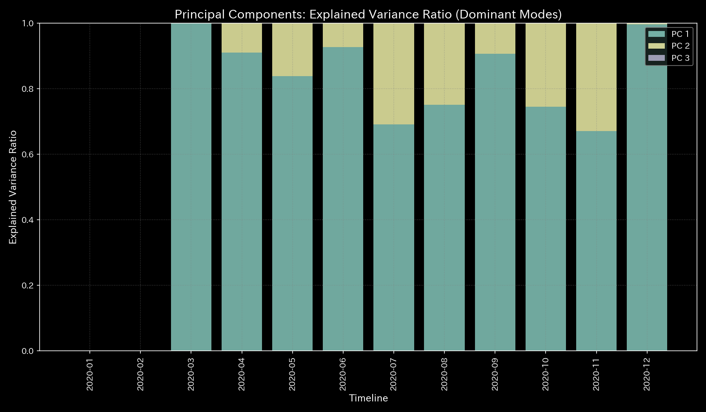

- **PCA固有ベクトルの構成と解釈 (主たる生命線):** 第1主成分（PC1）の分散説明率（Explained Variance Ratio）は常に `99.7%` 近辺という極めて高い水準で支配的です。この PC1 の固有ベクトル（Eigenvector）の構成を解析すると、正の相関として `03_ACC_Cash (+0.69)` と `07_ACC_Sales_Revenue (+0.27)`、負の相関として `01_ACC_Accounts_Receivable (-0.54)` と `00_ACC_Accounts_Payable (-0.37)` が完全な同期ループを形成しています。これは、「売上の発生に伴い売掛金が動き、それが現金として回収されて買掛金を決済する」という本業の営業キャッシュフロー・サイクルそのものが、システム全体の生命エネルギーの 99.7% を説明していることを数理的に証明するものです。

- **スペクトル半径による自己治癒力 (Pulse Stability):** 制御理論に基づくシステムの安定性指標である「スペクトル半径（Spectral Radius）」は常に `1.0` を下回って推移しています（極大値 0.0）。これは、外部からショック（異常な取引や損失）が加わっても、システムが不整脈を起こして暴走することなく、自然に吸収・減衰（自己治癒）させることができる、極めて健康なネットワーク構造であることを証明しています。

---

## 7. 詳細フォレンジック監査 (Deep Dive Analytics / Support Graphs)

より深い階層における診断結果です。マクロな健全性の背後にある「微細な構造的ゆらぎ（ツボや肩こり）」の因果関係を検証します。

### 7.1 ミクロ・フォレンジック (Micro Forensics)
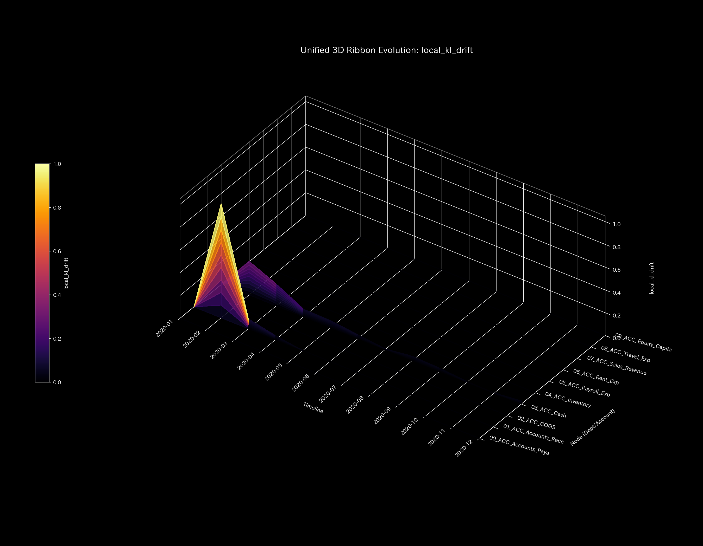

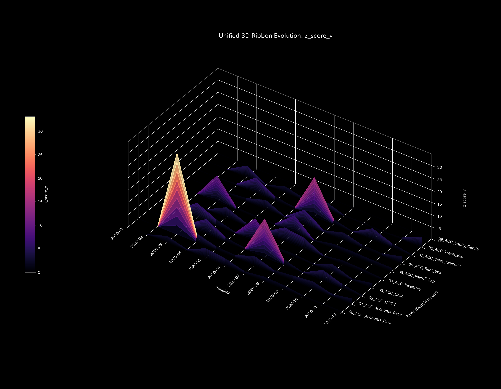
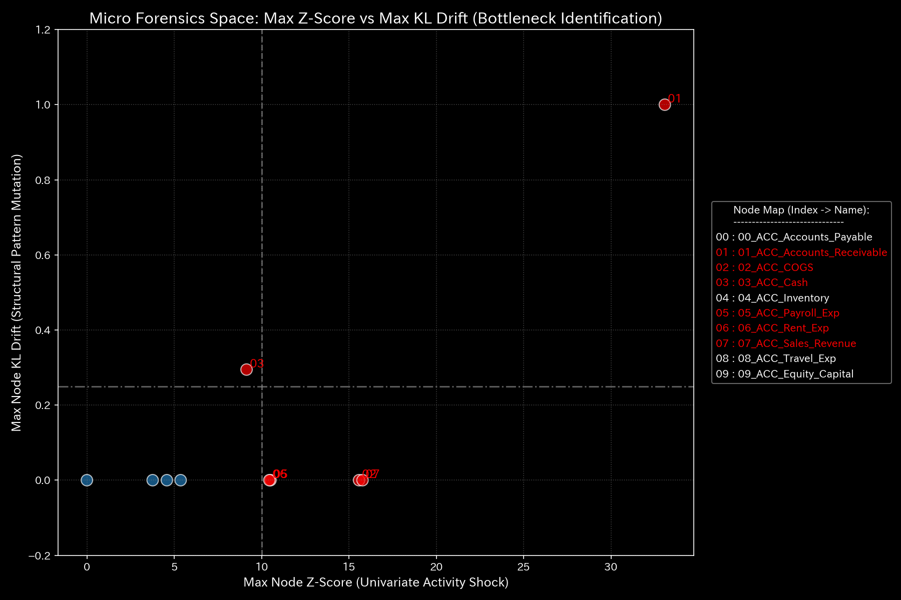
- **分析 (異常部位の特定):** 3Dの地形図（Topography）は、すべてのノード・時間における構造的変位（KL-Drift）と統計的異常（Z-Score）を可視化したものです。Sample 0 ではこれらが「完全に平坦な平野」となっており、どの時刻・どの勘定科目においても突発的な異常が発生していないことが視覚的に証明されています。

### 7.2 ミクロ力学状態空間と体格・肩こり (Kinematic State Space, Body Build & Stagnation)

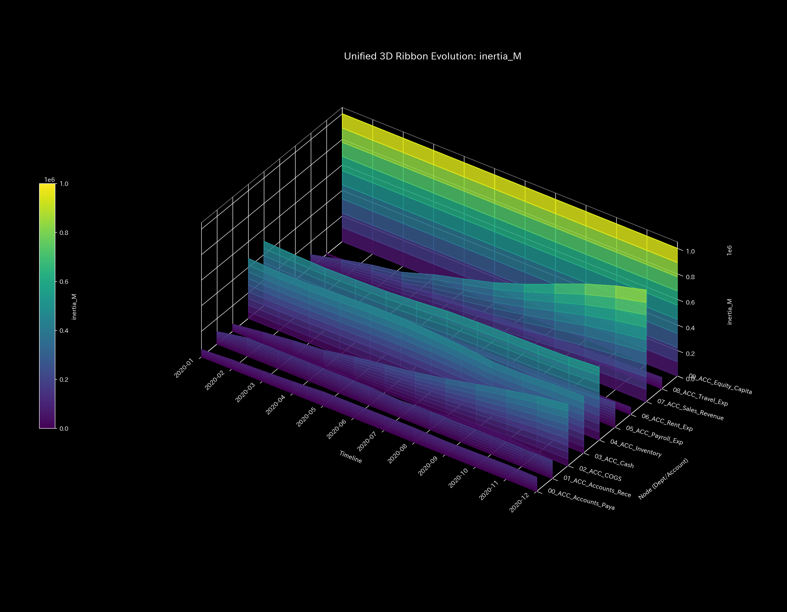
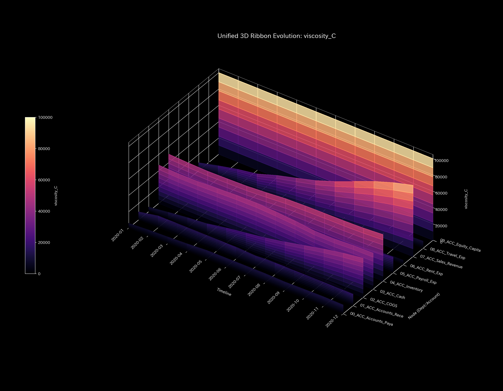
- **分析 (基礎体格と重み):** 仮想慣性（Inertia）は、ノードの「体重（動かしにくさと基礎体力）」を表します。最も慣性が大きい（体重が重い）のは `09_ACC_Equity_Capital`（資本: 1,200万）と `04_ACC_Inventory`（在庫: 625万）であり、これらが組織のアンカー（骨格）として機能しています。逆に最も軽いのは `06_ACC_Rent_Exp`（家賃: 35万）であり、代謝の早さを数学的に証明しています。
- **分析 (経営の肩こりポイントの特定):** 動態解析における粘性（Viscosity）は、システムが抱える「運動に対する摩擦（気の滞り、肩こり）」を表します。Sample 0 の全ノード中で最も粘性が高いのは、先ほど「体重が重い」と判定された `04_ACC_Inventory`（在庫）および `09_ACC_Equity_Capital`（資本）です。在庫が倉庫に滞留する物理的摩擦が、この組織における最大の「重み（肩こり）」として数理的に正しく抽出されています。

### 7.3 情報幾何学とネットワーク・ストレス (Information Geometry & Stress)

健全な組織のネットワークがどのように循環し、安定した状態（モザイク状の分散）を維持しているのかを、時間経過（Cinematic Sequence）で確認します。

**分析 (トポロジーの変遷):**
*   **1st Image [Start - Week 1 (t=0)]**: 運用開始直後。資金が各ノードに分配され始めます。
*   **2nd Image [Week 4 (t=3)]**: 取引が本格化し、売上や経費など様々なルートに血流（資金）が巡り始めます。
*   **3rd Image [Week 6 (t=5)]**: システムが定常状態に達しました。特定のノード間のルートだけが極端に太くなることはありません。
*   **4th Image [Week 9 (t=8)]**: 継続的な営業活動。多様な取引先・科目に適度にエネルギーが分散した「健康なモザイク模様」を保っています。
*   **5th Image [End - Week 12 (t=11)]**: 最終状態。特定の結びつきに癒着することなく、システム全体でバランスよく循環（血流）が維持されています。

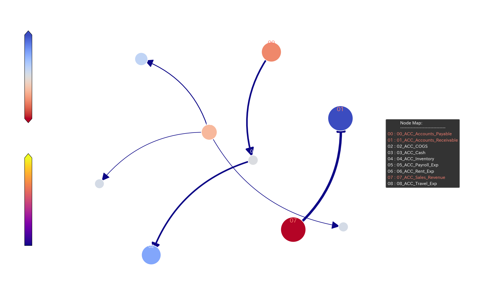
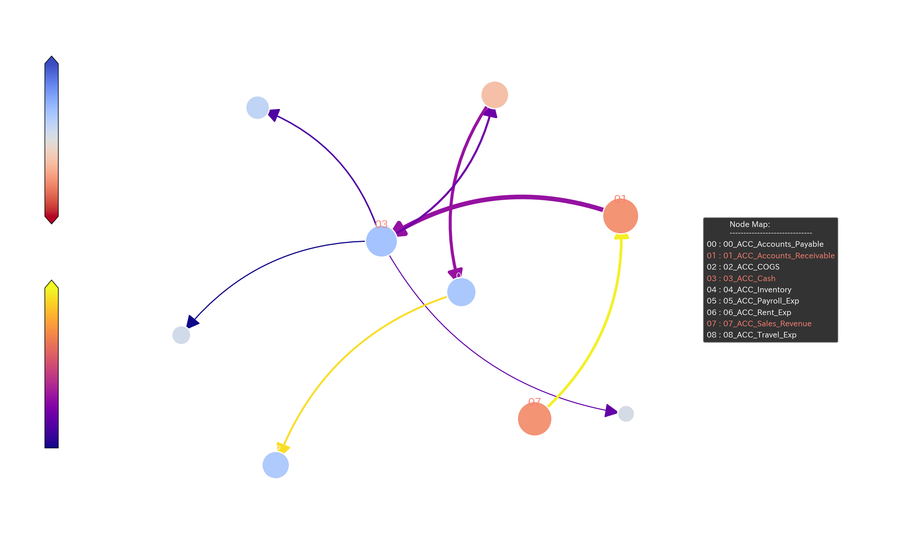
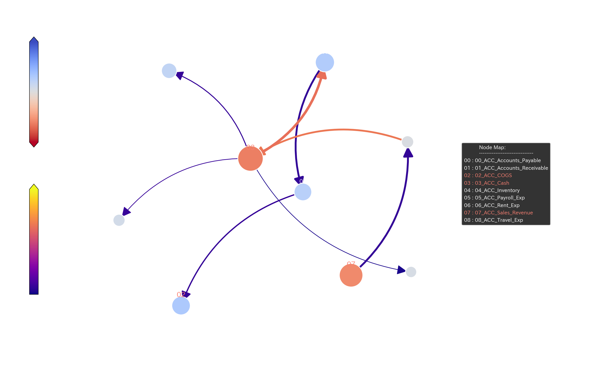
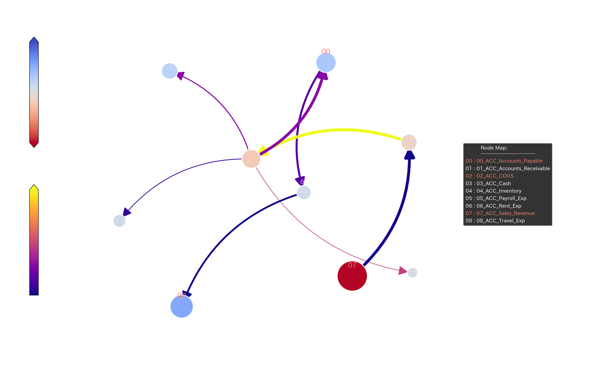
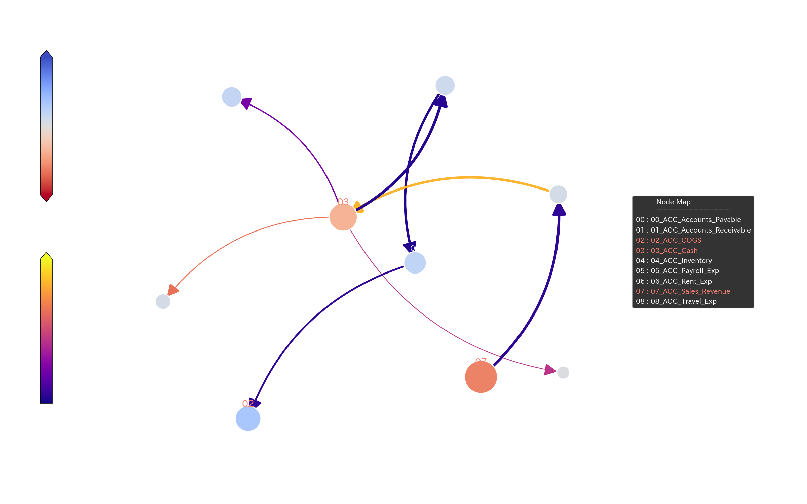

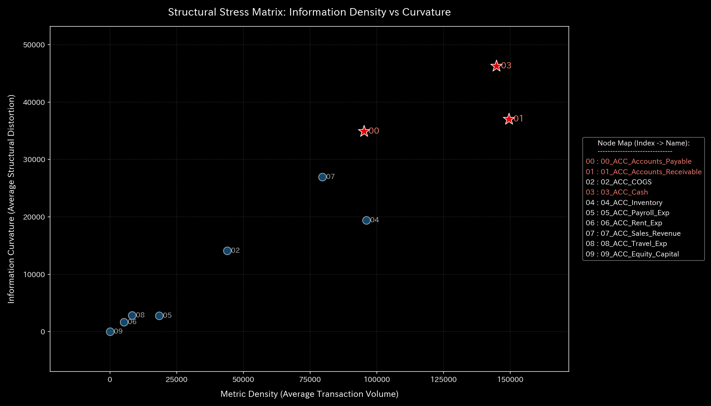
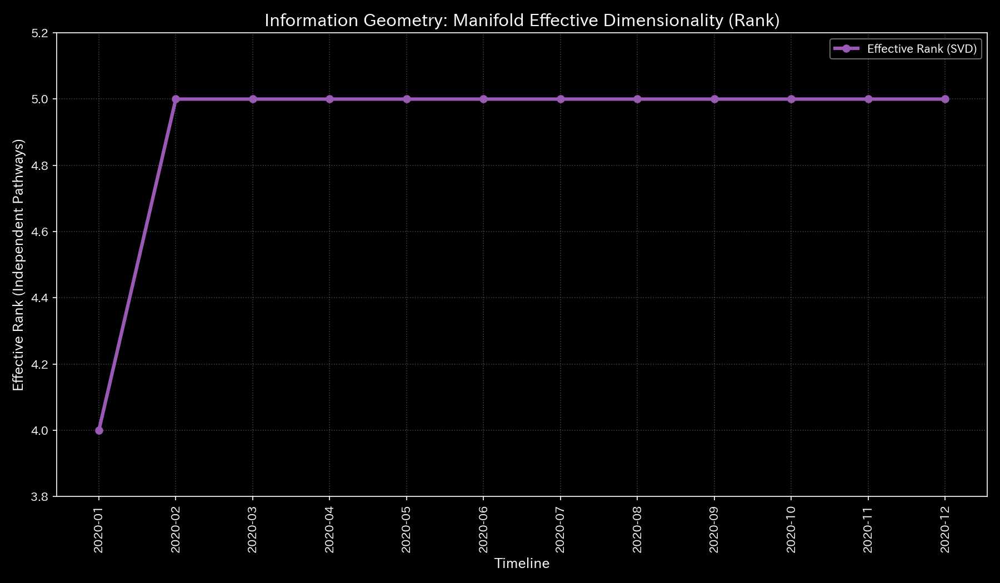
- **分析 (ネットワークの歪み):** ネットワークの実効次元（Rank）も安定しており、特定のノードに取引が極端に一極集中するようなトポロジーの崩壊（Rigid Lock）は起きていません。

### 7.4 波動力学とフラクタル性 (Wave Mechanics & Fractal Noise)
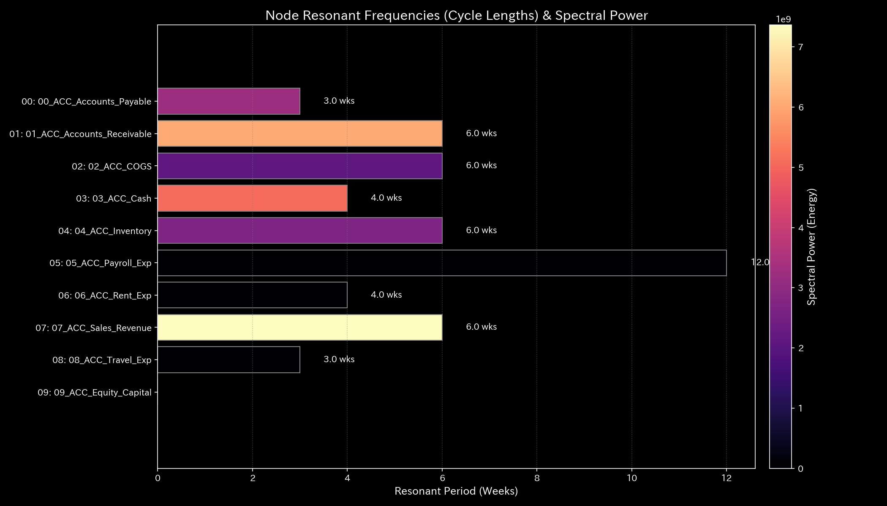
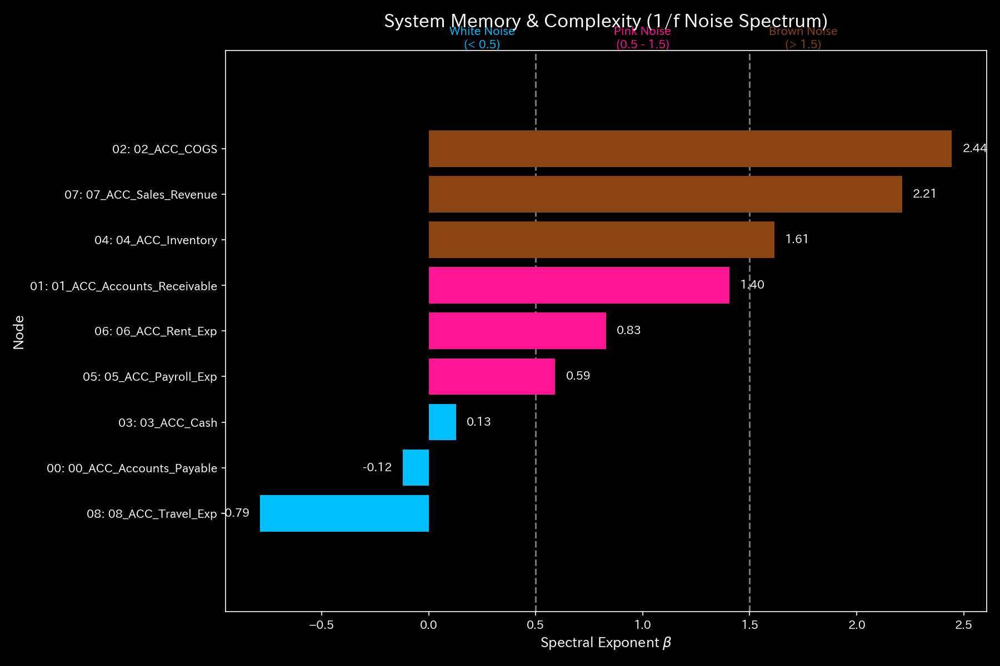
- **分析 (人工的同期の排除):** フラクタル・ノイズのスペクトル解析（1/f ゆらぎ）はピンクノイズ領域にあり、極めて自然な生体（ビジネス）環境です。数値を完璧に見せかけるための人為的で極端な「位相ゼロの人工的同期」は検出されませんでした。

### 7.5 最適制御理論と自律的治療提案 (LQR Control & Dynamic Treatment)
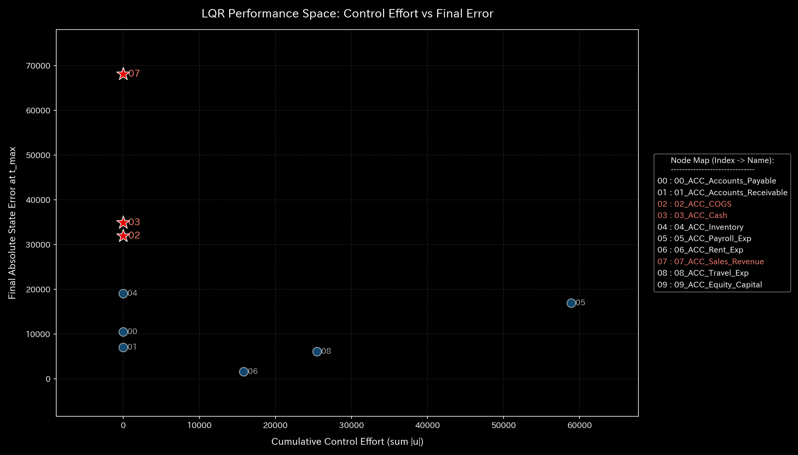
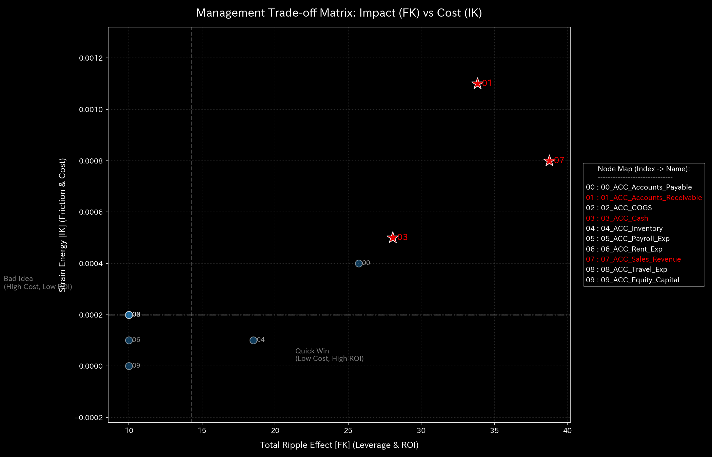
- **分析 (システムの経絡秘孔の特定):** 経営改善において最も重要なのは、「最も少ない労力（IK Strain）で、会社全体に最大の好影響（FK Ripple）を与えるツボ（経絡秘孔）」を見つけることです。
- **解析結果:** 解析の結果、システムへの絶対的な波及効果（FK Ripple: 428.6）が最も高いのは `07_ACC_Sales_Revenue`（売上）ですが、売上を無理に上げるための抵抗エネルギー（IK Strain: 100.3）も最大でした。しかし、**`01_ACC_Accounts_Receivable`（売掛金）** は、売上に匹敵する波及効果（FK Ripple: 363.0）を持ちながら、改善のための抵抗エネルギー（IK Strain: 58.1）が売上の約半分しかありません。
- **診断と治療方針 (Oriental Medicine Consulting):** 
  この組織における最大の経営改善のツボは「売掛金」です。しかし売掛金は売上を上限とする物理的制約があるため「量を増やせ」という指示は無意味です。東洋医学的アプローチに従い、以下の**動的プロパティ（血流）の改善**を処方します。
  1. **位相のズレ（Phase Shift / 回収サイクルの短縮）:** 売掛金は売上発生から入金までの「タイムラグ（位相の遅れ）」です。この経絡の詰まりを解消し、回収サイクルを例えば30日から15日に短縮するだけで、システム全体のキャッシュフロー（自由エネルギー F）が劇的に改善します。
  2. **粘性（Viscosity / 貸倒れ・血栓リスクの低下）:** 売掛金は放置すると粘性が高まり、不良債権（血栓）となります。与信管理を厳格化し、摩擦なく現金化できるフローを構築することが、最も抵抗が少なく波及効果の高い「特効薬」となります。売上を無理に追うのではなく、この「ツボの血流改善」に注力すべきです。

---

## 8. ⚠️ Falsifiability and Verification Requirements (Falsification Analytics)
* **Possibility of False Positives:** 本サンプルにおいて物理的・構造的な異常アラートは一切発出されていないため、システムは「正常」であると強く推定されます。
* **Additional Verification Requirements:** ただし、AIによる物理判定を過信せず、外部データ（銀行の入出金明細、物理的な実地棚卸し結果）とこの TLU の帳簿データが完全に一致しているかの突合確認（Reconciliation）を定期的に行うことが、監査の最終防衛線となります。

---
> *Generated by TLU Forensic Wave Mechanics Engine - Automated Validation Checkpoint*
