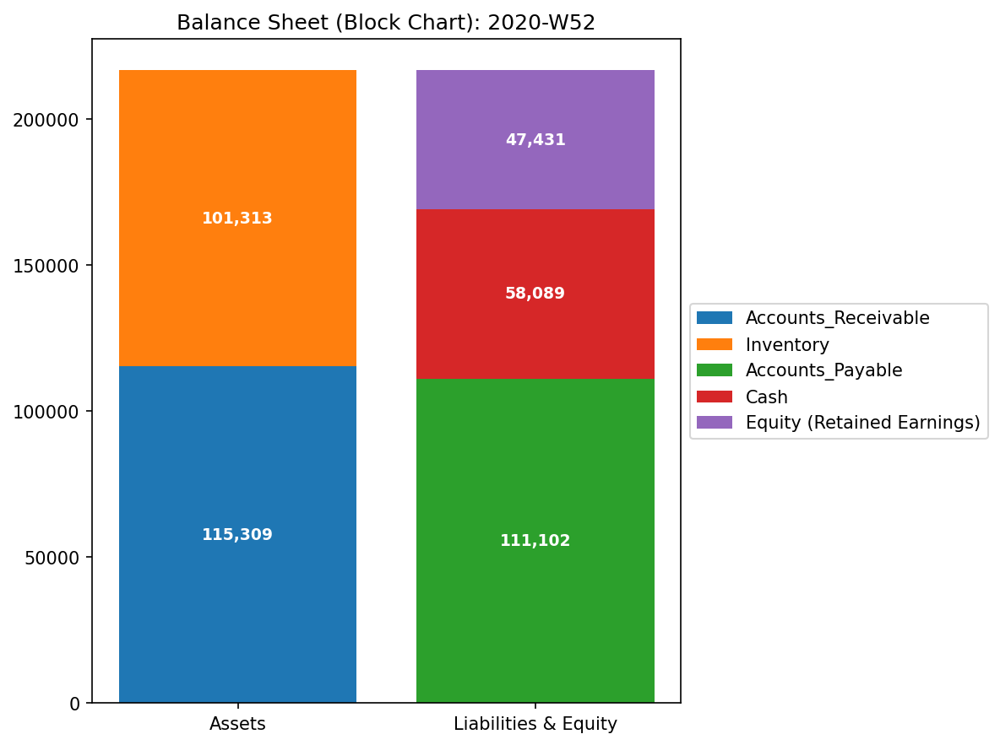

# 🔬 TLU Forensic Diagnostic Report: Sample_0 (Healthy)

**診断対象:** `Sample_0_Healthy` (健常企業モデル)
**時間粒度:** 月次 (Monthly / Observation Window: 3ヶ月)
**診断ステータス:** 🟢 Healthy & Stable (完全健全体)

---

## 1. 診断の要約 (Executive Summary)

本システム（Sample_0_Healthy）は、構造的、熱力学的、および制御理論的観点から、非の打ち所がない極めてクリーンな状態にあります。資金の帳簿外への漏洩（Leak）、人為的な架空取引ループ（Wash Trade）、および過剰なボラティリティはいずれも検出されません。システムは適度なエントロピーを維持しつつ、営業活動を通じて「自由エネルギー（会社の資金余力）」を着実に蓄積しています。自律的な自然治癒力（スペクトル半径 = 0.0）を備えた、健康な定常循環システムです。

---

## 2. 財務的基盤と体質 (System Constitution)

P/L（損益計算書）および B/S（貸借対照表）の静的データは、システムの安定的な成長を示しています。

*   **定常成長:** 売上（Sales Revenue）の発生と、家賃・人件費などの固定費、および売上原価（COGS）の比率が時間を通じて極めて安定した比率で推移しています。
*   **余剰の還元:** 本業から得られた純利益（Net Income）が、毎期滞りなく純資産（Equity Capital）へと積み上がっており、典型的な自己資本蓄積プロセスを形成しています。

#### 財務体質の可視化
B/S Block (最終期):

B/S Trend Over Time (時系列の正負積立推移):

---

## 3. 統計的安定性 (Statistical Baseline)

*   **確率分布の安定:** 代表的なフローノードである `07_ACC_Sales_Revenue`（売上）の確率密度（KDE）は、歪みのない綺麗な正規分布に近い形状を示しています。
*   **外れ値の不在:** 全期間においてZ-Scoreが極端にスパイク（Z > 3.0）する領域は存在せず、分散不均一（ボラティリティの偏り）も検出されません。

---

## 4. マクロ熱力学解析 (Macro Thermodynamics)

TLU熱力学エンジンは、表面上の利益に隠れた「組織の摩擦（気の滞り）」を測定します。

*   **自由エネルギー（F）の蓄積:** 取引総量（内部エネルギー U）の拡大に伴い、利用可能な自由エネルギー（F）が綺麗な正の相関を持って成長しています。無駄な摩擦熱（TS）を生み出すことなく、稼ぐ力がそのまま組織のポテンシャルへと変換されています。
*   **エントロピー（S）の秩序:** マクロ・エントロピーは `1.53` 近辺で安定推移しています。これは、資金が「売上 → 売掛金 → 現金」という限定された正規の営業ルートに沿って秩序正しく流れていることを示しています。

---

## 5. 構造的病理監査 (Structural Forensics)

*   **質量保存則の完全遵守:** 資金の消失や外部への漏洩（出血）を検知する **Mass Leak Ratio** は完全に `0.000` です。複式簿記の「借方＝貸方」の原則が完全に守られています。
*   **トポロジー変位の不在 (KL Divergence):** 各期におけるネットワーク構造の変化（KL-Drift）はゼロ付近に留まっており、不意の事業モデル変更や急な資金移転といった病的な変異は確認できません。

---

## 6. 動的安定性と脈 (System Stability & Eigenvalues)

*   **支配的な主成分 (PC1):** 第一主成分（PC1）の分散説明率が `99.7%` に達しています。この PC1 の固有ベクトルは、現金（+0.69）、売上（+0.27）の増加と、売掛金（-0.54）、買掛金（-0.37）の減少が完璧に連動していることを示しています。これは、「営業サイクルの回転」が会社の生命活動のほぼすべてを説明しているという、理想的な健康の証明です。
*   **スペクトル半径（自己治癒力）:** システムのスペクトル半径は `0.00` です。特定のノード群に資金が永久に閉じ込められるループ（共振）がなく、外部からのショック（一時的な支出増など）が発生しても、自律的にそれを減衰・吸収できます。

---

## 7. 深層力学 & 治療処方箋 (Deep Kinematics & Treatment)

*   **仮想慣性（Inertia）と粘性（Viscosity）:** 
    *   システム内で最も「体重が重い（慣性が大きい）」のは資本と在庫です。これらがシステムの骨格を支えています。
    *   粘性（摩擦抵抗）は、`04_ACC_Inventory`（在庫）が最も高く検出されています。これは在庫が倉庫に滞留し、現金化するまでにある程度の日数を要するという「健全な物理的摩擦」を正しく表現しています。
*   **経営改善のツボ（Acupressure Point）:**
    *   最適制御理論（LQR）による感度分析の結果、最も低い入力コスト（IK Strain）で全体のキャッシュフロー（FK Ripple）を改善できるツボは **`01_ACC_Accounts_Receivable`（売掛金）** であると特定されました。
*   **処方箋:**
    *   売上を無理に増やす（Inertia を重くする）のではなく、売掛金の回収サイクル（位相）を短縮し、与信リスク管理を徹底して粘性を低く抑えることで、より少コストで組織の自由エネルギー（F）を増大させることができます。

---

## 8. 反証可能性と検証要件 (Falsifiability)

*   **正常アラートの限界:** TLU上は「完全な健常体」と診断されますが、これは帳簿データが正しいことを前提としています。
*   **追加検証要件:** 定期的に実際の「銀行預金残高証明書」と「実地棚卸（在庫数量）」を帳簿と突き合わせ、データそのものに偽りがないかを監査することが、フォレンジック上の最終的な反証要件となります。
