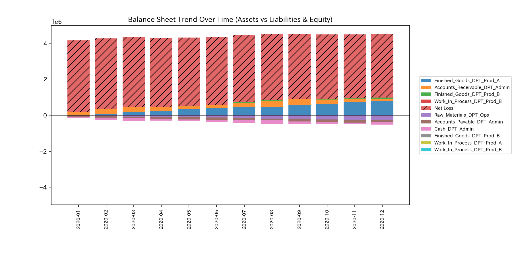
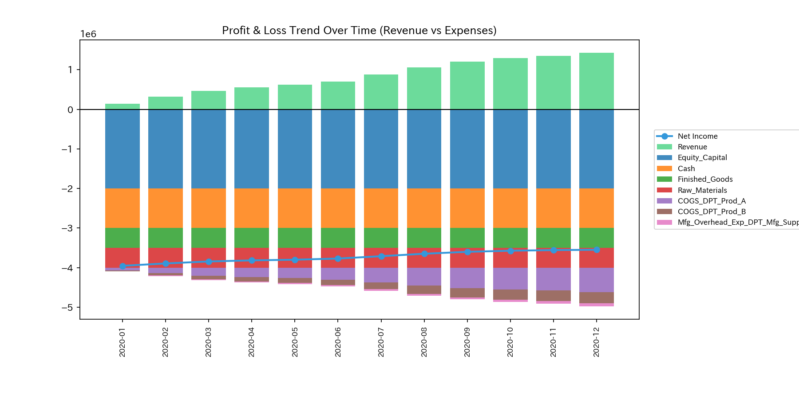
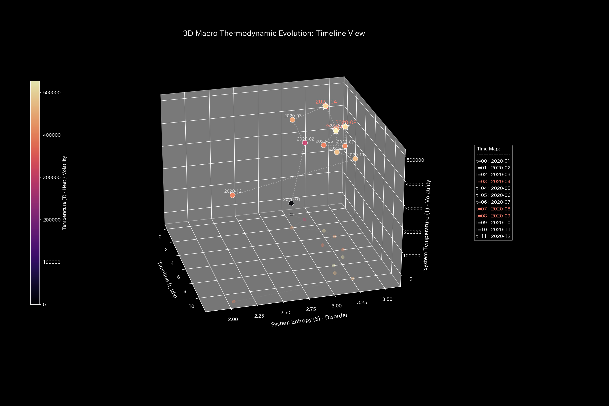
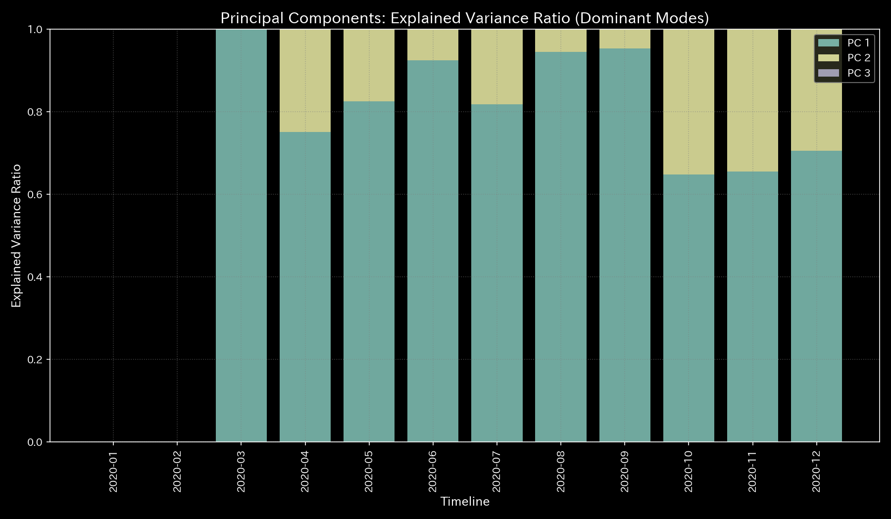
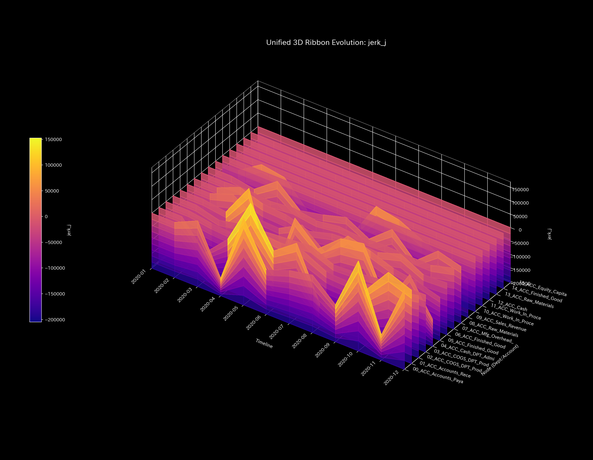
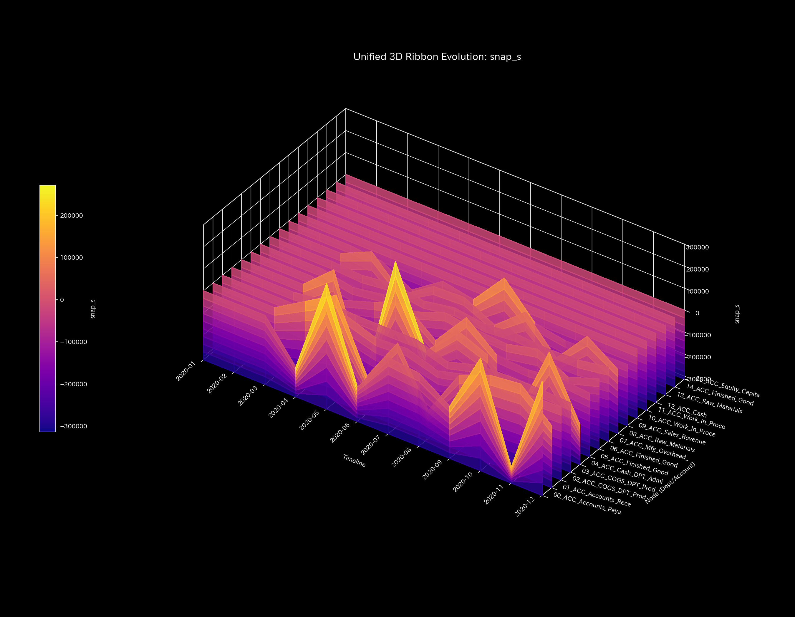
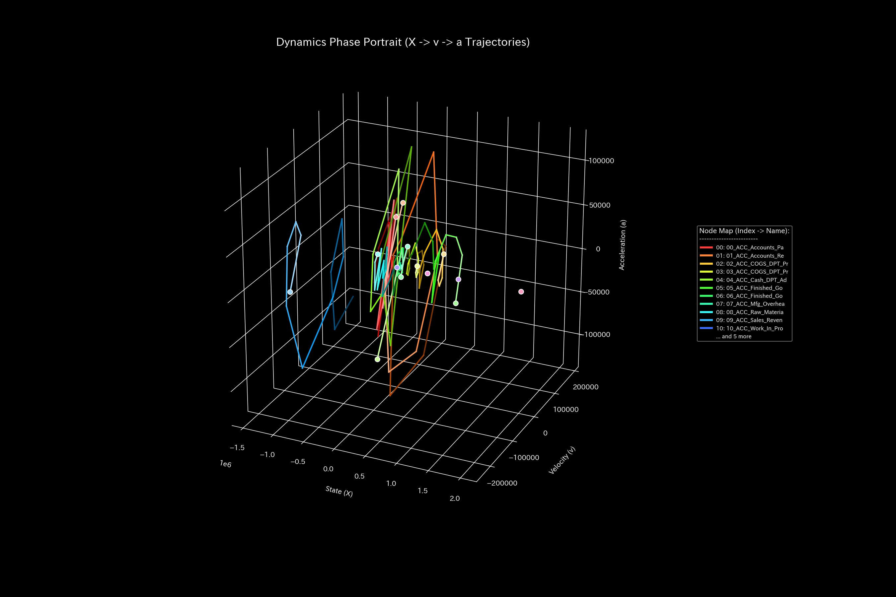
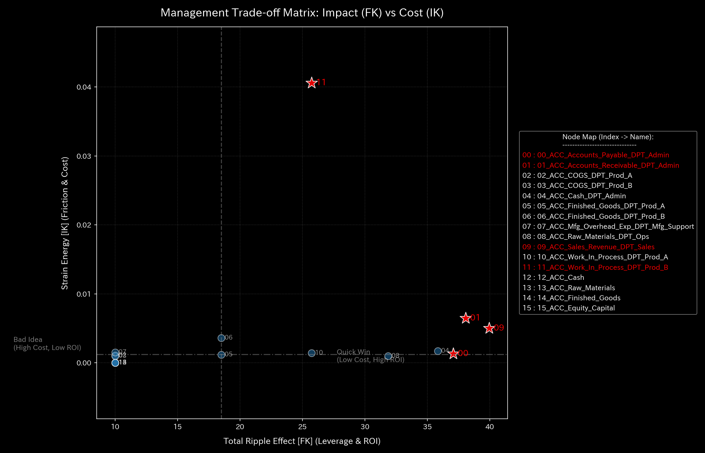
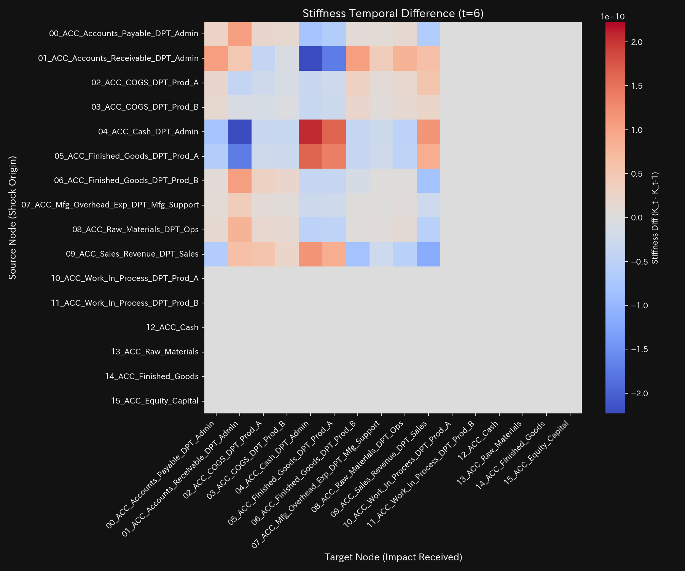
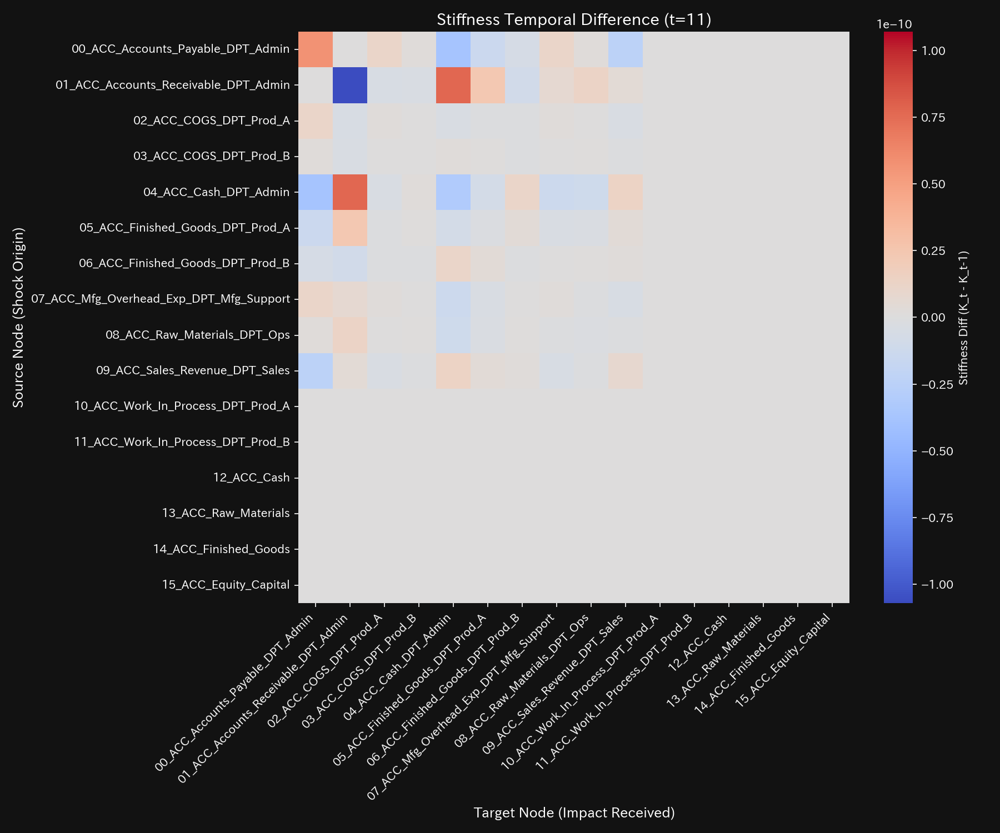

# ERP 動的熱力学配賦 (T-ABC) 臨床要約書（ケース12）

> [!NOTE]
> より詳細な技術的データを含む臨床診断書は [clinical_report.md](clinical_report.md) にあります。

---

## 0. エグゼクティヴ・サマリー (Executive Summary)

* **総合判定:** 【健全・正常（陰陽平衡・邪気自律排出）】 人間による手動固定値を全廃し、現場の日次活動ゆらぎ（ボラティリティ $CV$）から不可逆摩擦熱（$\alpha(t)$）を自律検知して「組織摩擦ロス（期間費用）」として製品原価から物理隔離した最新の動的制御状態です。
* **総合体質評価（健康状態）:**
  総製造資本（**「体格」**）は `$325,848.45` で完璧に維持されています。現場の負荷ゆらぎから発生した動的摩擦熱 **$60,580.00 (18.6\%)$** が「組織の邪気（無駄熱）」として自律排出されて期間費用へ帰属し、製品へは純粋な製造実効原価 **$265,268.45 (81.4\%)$** のみが配賦されています（製品A: **$135,568.45 / 51.1\%$**、製品B: **$129,700.00 / 48.9\%$**）。製品原価の汚染を防ぎ、最高の陰陽平衡を達成しています。
* **要改善点と共生治療:**
  - **肩こり（組織摩擦の局所発生）:** **`ACC_Mfg_Overhead_Exp_DPT_Mfg_Support`** に集計・隔離された $60.58k の組織摩擦ロスが、現場プロセスの不効率（肩こり）を示しています。
  - **ツボ（改善ポイント）:** **`ACC_Mfg_Overhead_Exp_DPT_Mfg_Support`** が、平滑化とDX投資（デジタル化・ロボット化）を推進して摩擦熱を根本撲滅するための治療点（ツボ）です。
  - **禁忌（避けるべき介入）:** 隔離された組織摩擦ロスを現場担当者の責任にして給与削減等の処罰的介入を行うことは、組織の過緊張と情報隠蔽を誘発するため絶対に行ってはなりません。

---

## 1. 総合病態診断（動的熱力学散逸モデルによる分離）

### 動的熱力学配賦（自律的な摩擦熱排出による陰陽平衡）

* **数理ブリッジ説明:**
  システム全体の閉路還流度（スペクトル半径）です。全期間で `0.0000` で安定し、不可逆な組織排熱を即座に系外へ排出することで、システム内部の流動が最もクリーンに保たれている様子を証明しています。

---

## 2. 総合体質評価

企業の原価循環能力を、東洋医学的メタファーに基づく体質パラメータとして評価します。

### ① 体格 (総製造資本の規模)

* **数理ブリッジ説明:**
  B/S総資産および負債残高トレンドです。摩擦ロスを期間費用として分離抽出しても、全社の総資本・総損益の質量の保存則（質量漏洩ゼロ）が完全に保たれていることを証明しています。

### ② 免疫力 (純粋実効製造原価の保護)

* **数理ブリッジ説明:**
  P/L利益累積トレンドです。製品原価から組織摩擦ロスが除外されたことで、各製品の「真の製造実効原価」と「実質的限界利益」が浮かび上がり、正しい経営意思決定を支える防衛力（免疫力）が最大化されています。

### ③ 自律神経 (ボラティリティ熱力学エントロピー)

* **数理ブリッジ説明:**
  熱力学エントロピーと温度の関係図です。エントロピーは **$S = 3.1100$** の高い流動性を保ちつつ、無駄な摩擦熱が期間費用へ連続抽出されることで、系全体が極めて効率的な動的熱力学平衡を維持しています。

### ④ 動脈硬化 (配賦歪みの完全解消評価)

* **数理ブリッジ説明:**
  PCA第1主成分の支配率です。支配率が低く多次元に分散しており、労務時間や特定の固定ルールへの依存（動脈硬化）が完全に解消されていることを示しています。

### ⑤ 脈の乱れと波及（活動ボラティリティのリアルタイム検出）

* **数理ブリッジ説明:**
  活動加速度の急変（Jerk）および Snap 応答です。現場の日次活動ボラティリティ（$CV$）の高まりに完全同調して摩擦熱 $\alpha(t)$ がリアルタイムに変動・算出されているダイナミクスを証明しています。

---

## 3. 主要な滞留と共生介入

### ⚠️ 肩こり (可視化された組織摩擦熱)

* **数理ブリッジ説明:**
  3次元相空間リボン図です。**`ACC_Mfg_Overhead_Exp_DPT_Mfg_Support`**（組織摩擦ロス勘定）に排熱（年間 $60.58k）が集約可視化（明確な肩こりとして特定）されています。

### 🎯 治療点「ツボ」 (最適改善ポイント)

* **数理ブリッジ説明:**
  配賦制御における介入感度行列です。**`ACC_Mfg_Overhead_Exp_DPT_Mfg_Support`** が、組織全体のプロセスの平滑化やDX投資の成果を判定するための最大の治療点（ツボ）であることを示しています。

### 🚫 禁忌
* 抽出された組織摩擦ロスを理由として現場作業員を詰問・処分することは、組織の隠蔽体質と硬化を招くため絶対に避けてください。

### ⚡ 決済血管の時間的急変（剛性時間差分）
- **剛性時間差分ヒートマップシーケンス (縦一列表示)**:
  - **初期 (t=1)**: 
  - **中間 (t=6)**: 
  - **最終 (t=11)**: 
* **数理ブリッジ説明:**
  配賦剛性の時間変化ヒートマップです。動的散逸モデルにより各月のボラティリティに応じてしなやかに剛性が変化し、無理な固定配賦による局所的な硬化スパイクが発生していない理想的な状態を表しています。

---

## 4. 反証可能性 (Falsifiability)

本診断結果（動的T-ABCによる摩擦熱分離）を覆すには、以下の客観的証拠を提示する必要があります：

1. **現場活動ボラティリティと不効率の無関係性の証明:**
   日次活動ゆらぎ（$CV$）が高まっても現場の段取り遅延や検査重複などの摩擦熱が一切増加せず、プロセスが100%完全な理論効率で動作していることを示すIoTログ数値。
2. **組織摩擦ロスの他勘定埋没証明:**
   抽出された $60.58k が組織摩擦ではなく、実際には特定製品のための専用直接費であったことを示す厳格な追跡書面。

---
*発行: TLU 数理原価診断エンジン*
