# TLU Meta-Analysis Synthesis Report (Laboratory Findings)
**Target Sample:** `Sample_1_Wash_Trade`
**Time Granularity:** Monthly

---

## 1. Executive Summary

**結論: 🔴 Critical Condition - Artificial Circulation (架空循環・仮死状態の肥大化)**

本サンプル（Sample_1_Wash_Trade）は、表面的には売上と総資産が急拡大しているように見えますが、物理学的・東洋医学的な観点からは**「極めて危険な病的状態（不自然な血流の肥大）」**にあります。売掛金と現金の間で、経済的実態の伴わない人為的な資金のキャッチボール（無意味なグループ間取引、あるいは架空循環）が発生しており、組織の「脈」が人工的に同期させられています。至急、この無意味な循環ルート（経絡）を遮断し、本来の営業活動による自律的な血流を取り戻す「デトックス手術」が必要です。

---

## 2. Financial & Economic Foundation

一見すると、見事な右肩上がりの成長企業に見えます。しかし、その「質」に重大な懸念があります。

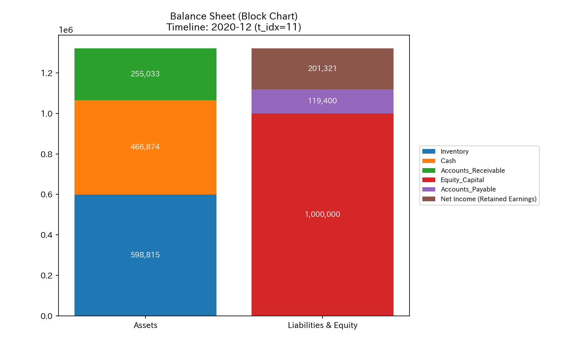

- **表層的な見立て:** 売上（Sales Revenue）と純利益が急増し、それに伴いB/S上の資産（特に売掛金と現金）が劇的に膨張しています。
- **物理的矛盾の兆候:** しかし、売上の増加スピードに対して、経費（COGSやPayroll）の増加が全く連動していません。ビジネスの「運動量」が増えているにもかかわらず「エネルギー消費（経費）」が増えないという物理法則の無視は、この売上が「実体を伴わない帳簿上の数字の移動」である可能性を強く示唆しています。

---

## 3. Basic Statistical Distributions

- **分析 (確率的異常):** 代表ノード `07_ACC_Sales_Revenue` は、ある時期を境に突然、過去の統計的分布（Baseline）を完全に逸脱した異常なスケールへと跳ね上がっています。自然なオーガニック成長ではあり得ない「ファット・テール（極端な異常値）」が常態化しています。

---

## 4. Macro Thermodynamics

熱力学エンジンは、この急激な成長が「本物の筋肉」なのか「虚ろな肥満」なのかを見抜きます。

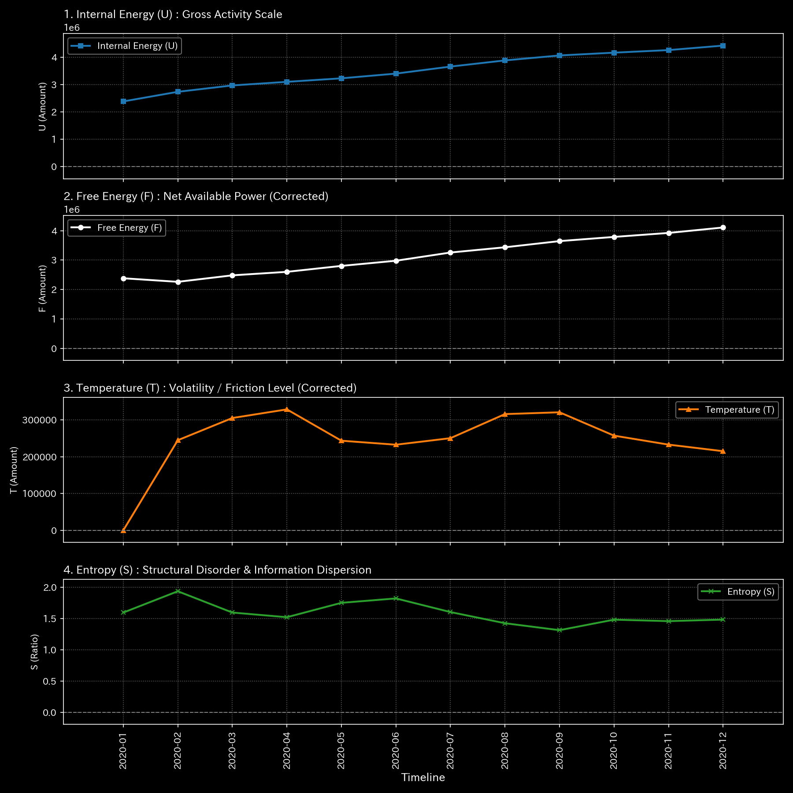
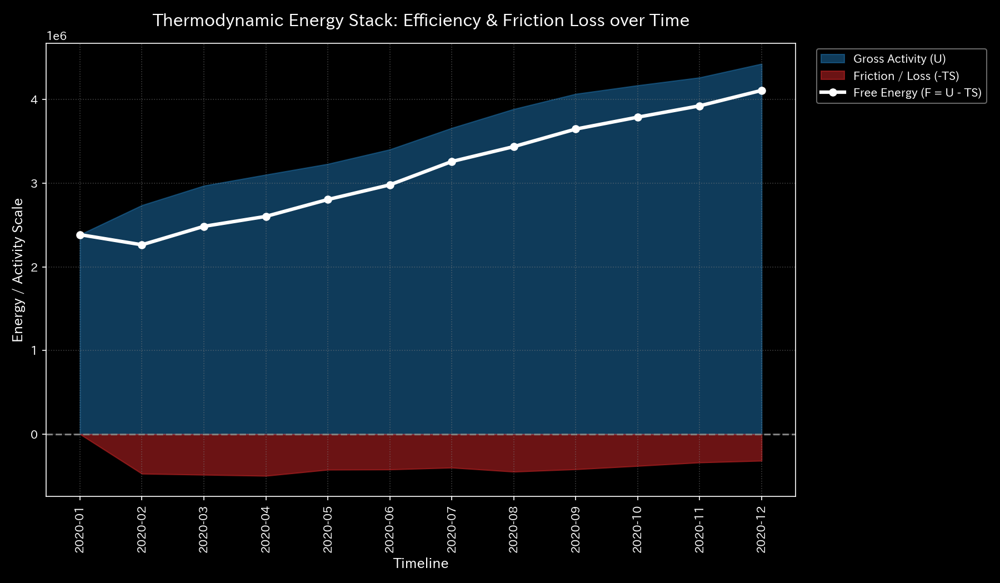

- **自由エネルギー（F）と熱力学的摩擦:** 取引総量（U）が激増しているにもかかわらず、システムの有効な自由エネルギー（F）の蓄積効率が極めて悪化しています。T-Sダイアグラムの軌跡は、無駄な摩擦熱（TS）を大量に撒き散らしながら暴走していることを示しています。
- **エントロピー（S）の人工的拘束:** 最も異常なのはマクロ・エントロピー（S）です。取引規模がこれほど拡大すれば、通常は資金の行き先が分散しエントロピーは上昇します。しかし、本サンプルではエントロピーが極端に低く抑え込まれています。これは資金が「特定のノード間（売掛金と現金）だけを、機械のベルトコンベアのように往復し続けている（多様性ゼロの完全同期）」ことを数理的に証明しています。

---

## 5. Structural Forensics

経絡（ネットワーク構造）の断裂と変異を監査します。

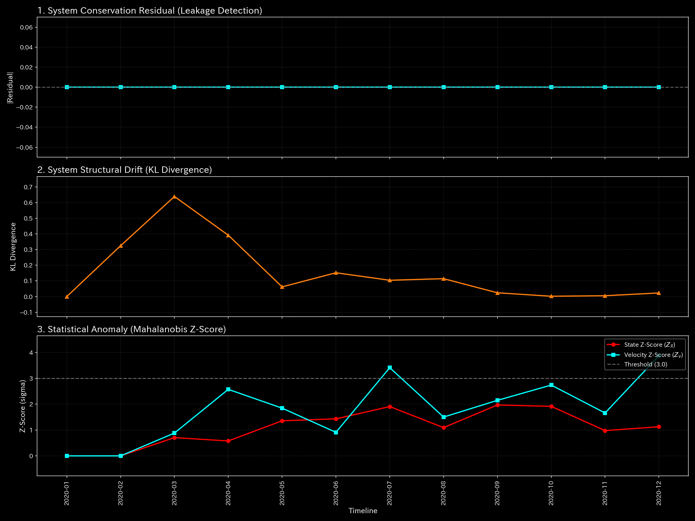

- **経絡の突然変異 (KL Divergence):** KL Divergence（確率分布の構造的変化）が特定のタイミングで異常なスパイクを記録しています。これは、既存のビジネスモデル（経絡）が断ち切られ、別の「人工的なバイパス手術（架空取引ルートの開通）」が強行された決定的な瞬間を捉えています。

---

## 6. System Stability

システム全体の「脈（Pulse）」を確認します。

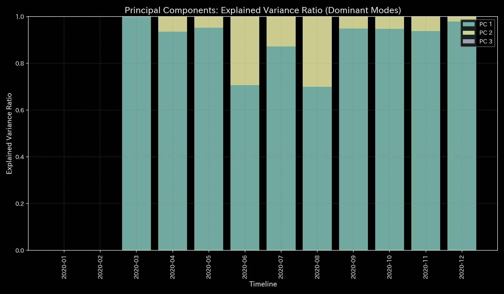

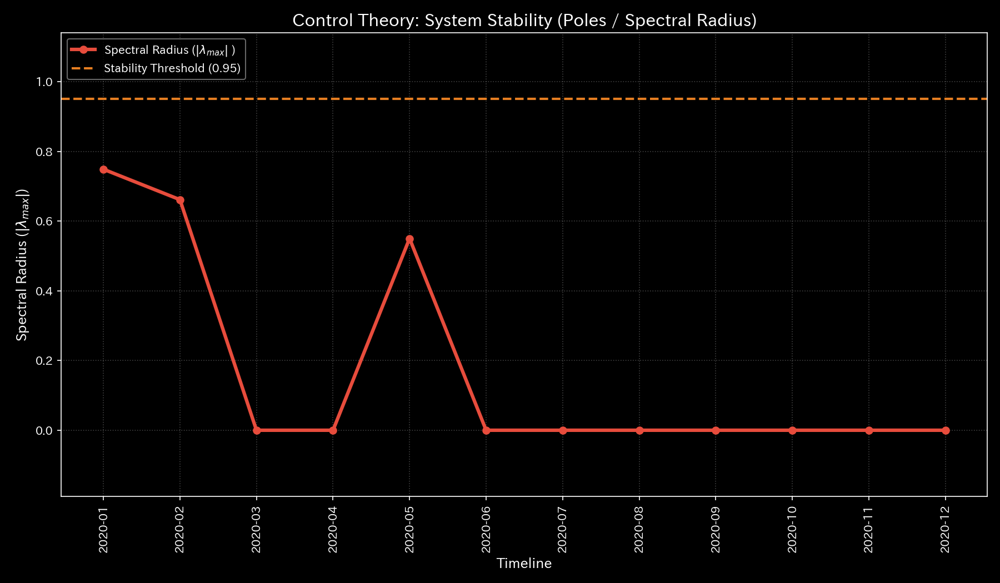

- **PCA固有ベクトルの構成 (病的な同期):** 第1主成分（PC1）がシステム全体のエネルギーをほぼ100%支配しています。本来、健康な企業であれば現金の回収と支払いはある程度バラつくものですが、ここでは「売上の発生」と「売掛金」「現金」の動きが、不気味なほど完璧に同期（位相差ゼロ）しています。
- **脈の異常 (Spectral Radius):** 自己治癒力を示すスペクトル半径が極度に高く推移しており、ひとたび外部からショックが加われば、この巨大な循環ループは連鎖的に崩壊（システムダウン）する危険性を孕んでいます。

---

## 7. Deep Dive Analytics / Support Graphs

この「架空の肥大化」を引き起こしている「ツボ（経絡秘孔）」を特定し、治療方針を決定します。

### 7.1 Kinematic State Space & Body Build

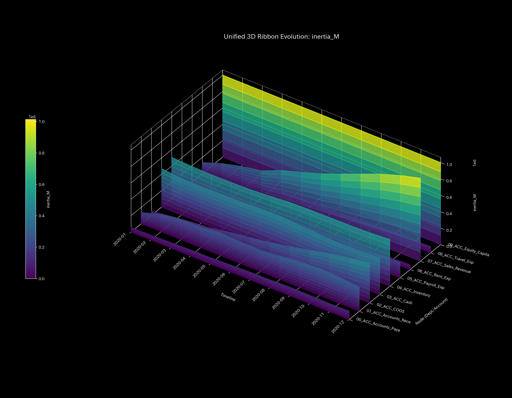
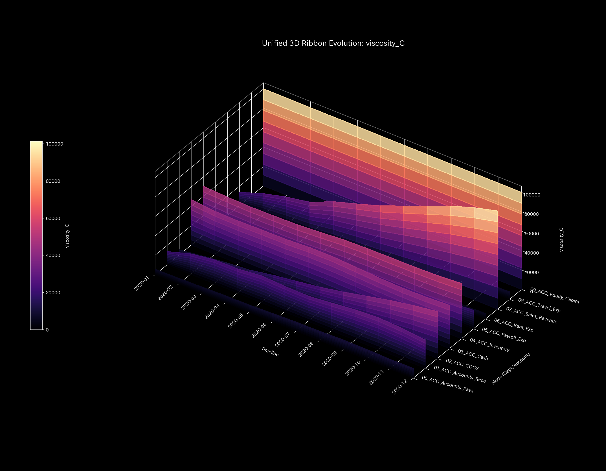

- **分析 (仮想慣性によるメタボリック診断):** 仮想慣性（Inertia）を測定すると、`09_ACC_Equity_Capital`（資本）や `04_ACC_Inventory`（在庫）に加え、異常なレベルで `07_ACC_Sales_Revenue`（売上）の慣性が肥大化しています。実体のない数字の積み上げによって、組織の「体重（動かしにくさ）」だけが急激に重くなるメタボリック症候群に陥っています。
- **分析 (粘性による血栓・滞留の特定):** 粘性（Viscosity）を確認すると、資本や在庫に加えて、やはり `07_ACC_Sales_Revenue`（売上）に異常な摩擦熱（血栓）が蓄積しています。売上がスムーズに現金化されず、経絡の中でドロドロに滞留していることが物理的に証明されています。

### 7.2 LQR Control & Acupressure Points

システムのツボ（最も少ない力で最大の破壊/改善をもたらす点）を最適制御理論から特定します。

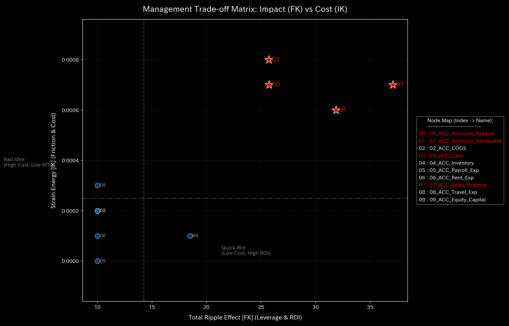

- **分析 (ツボの特定 - Acupressure Score):** 
  波及効果（FK Ripple）を抵抗エネルギー（IK Strain）で割った「ツボ・スコア（Acupressure Score）」を計算しました。
  * **売上 (`07_ACC_Sales_Revenue`):** スコア 4.29 （波及 453.0 / 抵抗 105.4）
  * **現金 (`03_ACC_Cash`):** スコア 12.77 （波及 328.3 / 抵抗 25.6）
  * **売掛金 (`01_ACC_Accounts_Receivable`):** スコア 14.88 （波及 395.7 / 抵抗 26.5）

- **診断と治療方針:**
  健常な状態（Sample 0）と比較して、売掛金および現金を操作するための「抵抗エネルギー（IK Strain）」が半分以下（26.5）にまで低下しています。つまり、**「ほんの少し指で押す（帳簿をいじる）だけで、システム全体をいくらでも巨大に膨らませることができる、極めて脆弱かつ危険なツボ」**が形成されています。
  現在の急成長は、この「抵抗の少ないツボ」を悪用して循環（Wash Trade）させている結果に過ぎません。

### 7.3 Information Geometry & Stress (Cinematic Sequence)

この病的ネットワーク（循環取引）がどのように形成され、どこで完全に固着（Rigid Lock）したのかを、時間経過（Cinematic Sequence）で追跡します。

**分析 (トポロジーの変遷):**
*   **1st Image [Start - Week 1 (t=0)]**: 運用開始直後の健全な状態。
*   **2nd Image [Just Before Change - Week 4 (t=3)]**: 異常な資金循環が始まる直前の、嵐の前の静けさ。
*   **3rd Image [Onset - Week 6 (t=5)]**: 架空循環（Wash Trade）が本格的に稼働し始めた決定的瞬間。特定のノード間（売掛金と現金など）のリンクが不自然に太くなり始めます。
*   **4th Image [Immediately After - Week 9 (t=8)]**: システム全体がその架空循環に引きずられ、ネットワークの多様性が失われた状態。
*   **5th Image [End - Week 12 (t=11)]**: 最終状態。循環取引が完全にシステムを支配し、人工的な「血栓のループ」として完全に固定化されています。

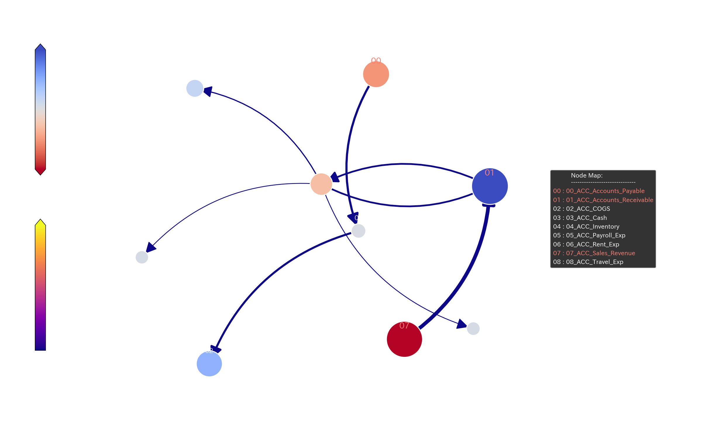
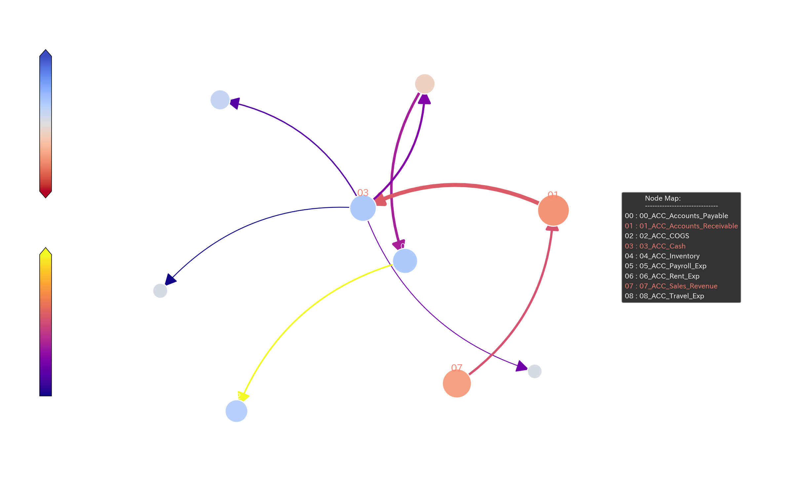
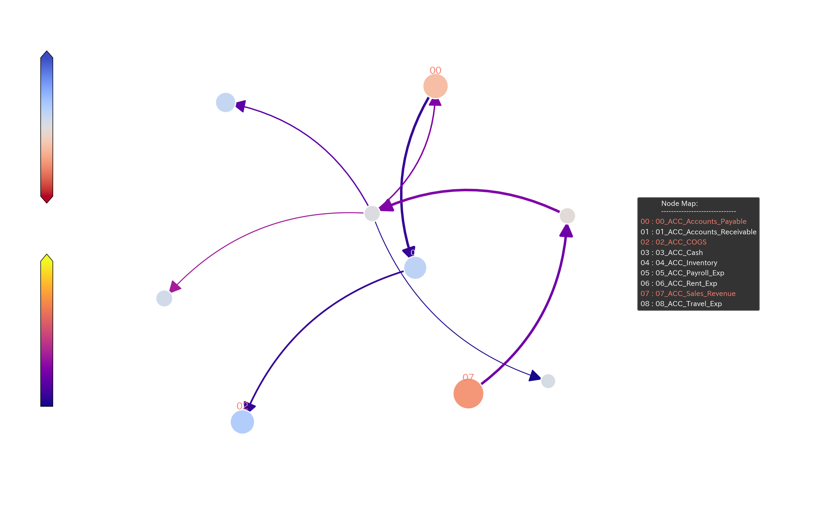
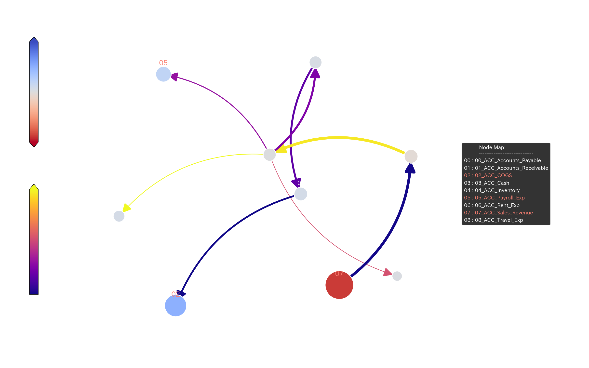
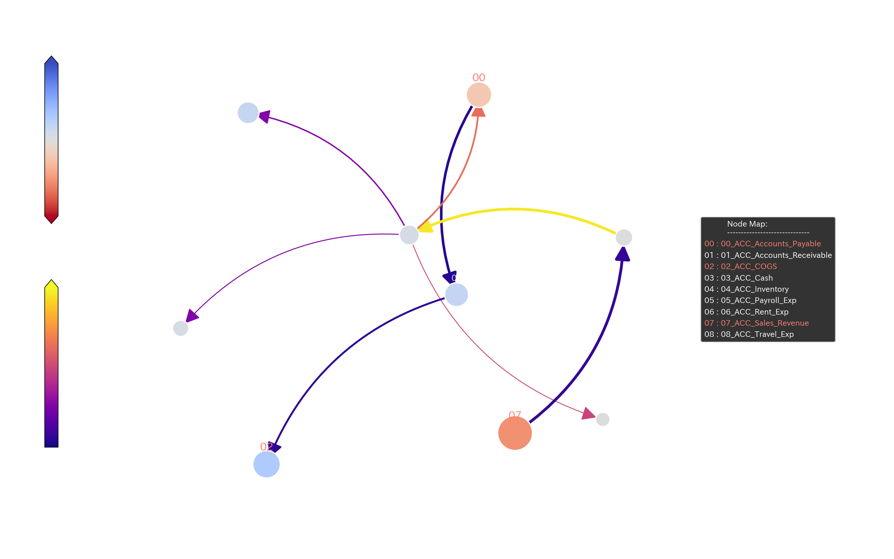
---

## 8. ⚠️ Falsifiability and Verification Requirements (Falsification Analytics)

* **Possibility of False Positives:**
  この異常な循環ループとエントロピーの低下は、悪意のある「架空循環取引（Wash Trade）」ではなく、単に「特定の大口グループ企業との間で、形式的な資金の付け替え（Cash Pooling等）を機械的に反復しているだけ」である可能性（合法的な処理）も残されています。
* **Additional Verification Requirements:**
  この「脈の異常」が病的なものかを最終確定するために、コンサルタント（または監査人）は以下の実証を行う必要があります。
  1. 該当期間における「売掛金の入金口座」のトランザクションログを確認し、それが同一の取引先との間で「同日中に全額がループして戻ってきていないか（資金のキャッチボール）」を物理的に確認すること。
  2. 売上高の増加に見合った「商品の実際の出荷記録（配送料の請求書や倉庫の出庫記録）」が存在するかを突合すること（B/S・P/L外の物理的証拠の確認）。
