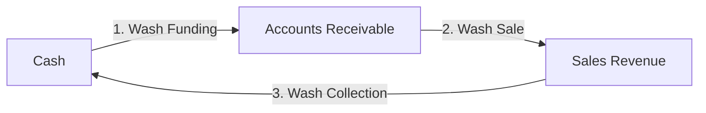

# Sample 1 (Wash Trade): 中小企業簿記・架空還流取引モデル ダミーデータ解説

本サンプル（Sample 1）は、意図的な**架空還流取引（Wash Trading / 循環取引）**を注入し、企業の売上高と取引ネットワークの流動性を人工的に膨張させた取引データです。

---

## 1. 生成スクリプトとパラメータ
* **使用スクリプト**: [`src/filters/_0_0_generate_dummy_journal.py`](file:///Users/renpoo/Documents/GitHub/TLU/src/filters/_0_0_generate_dummy_journal.py)
* **アノマリーパラメータ**:
  * `--wash-trade-prob`: `0.05` ($5\%$ の確率で毎日循環取引が発生)
  * `--sales-leak-prob` / `--purchase-leak-prob` / `--unbalanced-mistake-prob`: `0.0` (リークやミスはなし)

---

## 2. アノマリー（循環取引）の生成ロジック

毎日 $5\%$ の確率で、通常の営業取引とは別に、以下の3ステップからなる大規模な「架空取引のループ」が発生します。

1. **Step 1: 還流用資金の供給 (Wash Funding)**
   * 手元の現金からペーパーカンパニー（架空の売掛金口座）へ資金をダミー送金します。
   * 仕訳：`Debit: Accounts_Receivable` / `Credit: Cash`
2. **Step 2: 架空売上の計上 (Wash Sale)**
   * 同額の売上が発生したように偽装し、架空の請求書を切ります。
   * 仕訳：`Debit: Accounts_Receivable` / `Credit: Sales_Revenue`
3. **Step 3: 架空売掛金の即時回収 (Wash Collection)**
   * ペーパーカンパニーに送金した現金を、売掛金の「回収」として自社に戻します。
   * 仕訳：`Debit: Cash` / `Credit: Accounts_Receivable`

* **取引規模**:
  通常取引（数百〜数千円）に比べ、循環取引は1回あたり **2万〜5万円以上** の大規模な資金量（`wash_amount`）で実行されます。

---

## 3. TLU数理・物理フィルターにおける特徴

この架空還流取引は、ネットワークのトポロジーと流体力学において極めて顕著なサインを示します。

* **エントロピー（Entropy）の低下と剛性（Stiffness）の増大**:
  資金が `Cash` と `Accounts_Receivable` の間で高速にぐるぐると巡回するため、取引ネットワークに「太いパイプ（閉回路）」が形成されます。これにより、資金の分布が特定の経路に固定化され、システムのエントロピーが著しく低下し、構造剛性が跳ね上がります（Rigid Lock / 還流ロック）。
* **主成分分析 (PCA) における支配的な PC1**:
  固有値解析において、第一主成分（PC1）の説明比率が $90\%$ 以上に集中し、固有ベクトル（Eigenvector）の重みが `Cash` と `Accounts_Receivable` に極端に偏在します。
* **保存則の成立**:
  循環取引自体は複式簿記のルールに則って仕訳が切られているため、**「質量保存の法則（貸借一致）」は破綻しません。** 財務諸表は完璧にバランス（`✅ BALANCED`）し続けます。つまり、通常の貸借対照表（B/S）を眺めているだけでは、この大規模な不正取引を見抜くことはできません（TLUの動的分析が必要とされる理由です）。
