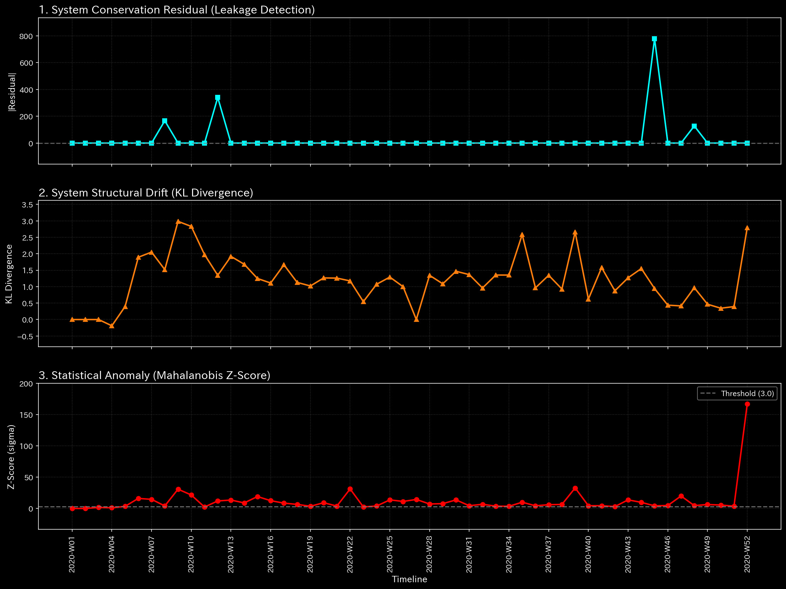
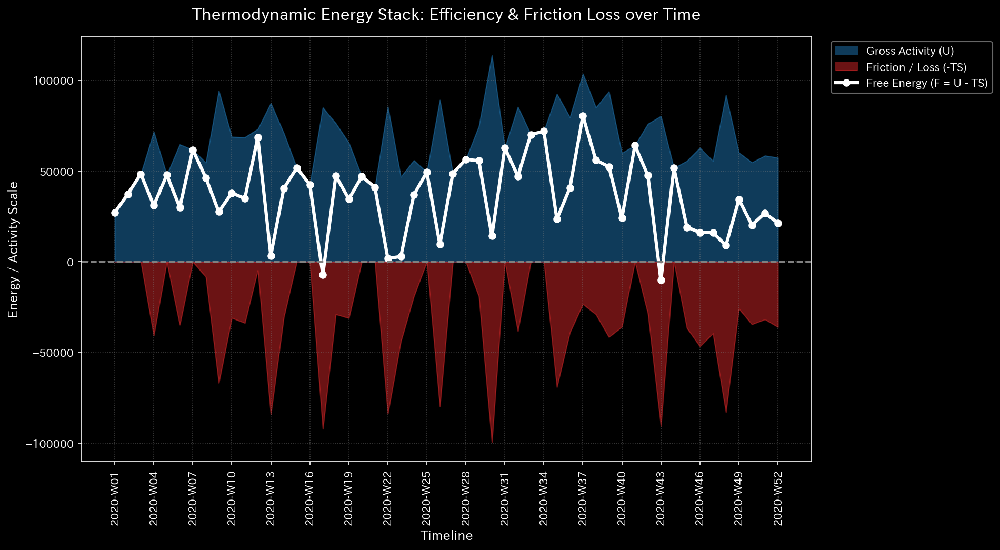
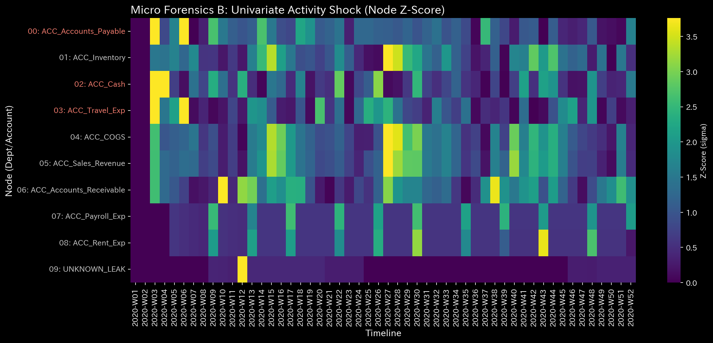

# Sample 3: Unbalanced Mistake

> [!NOTE]
> **Disclaimer on Premise (Proof of Concept)**
> The data analyzed in this report is not from real-world entities. It is derived from a **dummy data generation script specifically designed to intentionally reproduce specific pathological states or anomalies** for verification purposes. The objective of this analysis is to demonstrate how accurately the TLU engine can reverse-engineer and detect artificially constructed anomalous structures.

## 🩺 Meta-Diagnosis Synthesis Report

### 1. Executive Summary

**CRITICAL: Broken Mass Conservation (Double-Entry Failure)**
The system (`Sample_3_Unbalanced_Mistake`) is in a state of critical mathematical failure. Although the fallback generator was forced to inject a ghost account (`UNKNOWN_LEAK`) to artificially balance the P/L, the TLU physics engine has detected that physical mass (funds) is literally vanishing from the spatial network. This is the highest-level alert, indicating a severe data engineering failure or an overt manipulation of the ledger that bypasses standard double-entry controls.

### 2. Core Pathology (Primary Finding)

* **Diagnosis:** Unbalanced Journal Mistake / Data Corruption (Conservation Violation)
* **Severity:** CRITICAL
* **Physical Evidence:** 
  * **Relative Mass Leak Ratio:** **0.0116** (Exceeds the 0.001 threshold by more than 10x). Over 1% of the total systemic transaction volume is appearing or disappearing from nowhere.
  

  * **Financial Evidence:** 
  The P/L statement generated by the fallback pipeline explicitly reveals a ghost account: **`UNKNOWN_LEAK` ($1,412.88)**. The script was forced to classify this missing mass as an "Expense" just to keep the accounting equation intact.

### 3. Secondary Pathology (Mathematical Artifacts of the Fracture)

According to the LLM Diagnostic Manual (**【Tier 2 Ultimate Veto】**), advanced physical analysis should be halted because the fundamental space is corrupted. However, if we forcefully look past the veto to observe *how* the system reacts to this broken mass conservation, we uncover fascinating mathematical characteristics:

* **Thermodynamic Energy Depletion (Free Energy: -0.1263):** 
  Because $1,412.88 is literally disappearing from the system without returning to a recognizable account, the system treats this as a massive, continuous "heat leak." The internal energy ($U$) is high due to standard operations, but the Free Energy ($F$) collapses because the system is bleeding mass into the void. This mathematically mimics severe Embezzlement.
  

* **Micro Singularity (Max Local Z-Score: 121.13):** 
  A normal Z-score anomaly is around 3.0 to 5.0. A Z-score of **121.13** is a mathematical impossibility in a healthy distribution. It acts as a "Micro Singularity"—an infinite stress point pinpointing the exact spatial coordinate (the specific account and time step) where the physical law of conservation was shattered. The network is essentially tearing itself apart at this node.
  
  
* **Topological Stability (Max Spectral Radius: 0.000):**
  Interestingly, the Spectral Radius remains perfectly zero. This proves that despite the massive leak and stress, there is no cyclical *Wash Trading* occurring. The money is flowing out and vanishing in a straight line, not looping back.
  

### 4. Business Translation & Action Plan

**【Action Plan】**
Do not attempt to analyze business strategy, profitability, or systemic fraud yet. The absolute top priority is a **Data Engineering Audit**.
Investigate the ETL (Extract, Transform, Load) pipelines that generate the Journal Stream. Either transactions were dropped during a database migration, or an accountant manually bypassed system controls to force a "one-sided journal entry." Trace the source of the infinite stress point (Z-Score 121.13) to locate the exact transaction causing the $1,412.88 `UNKNOWN_LEAK`, and repair the raw data before trusting any further analysis.
