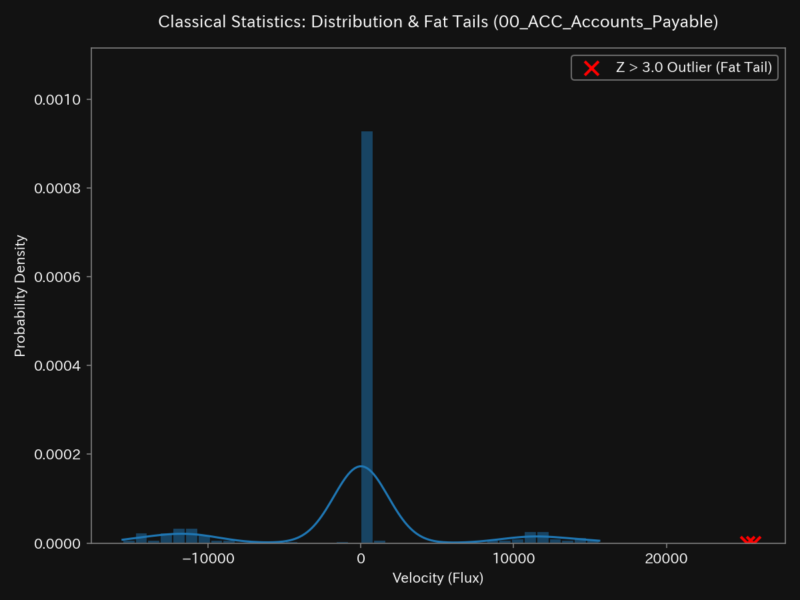
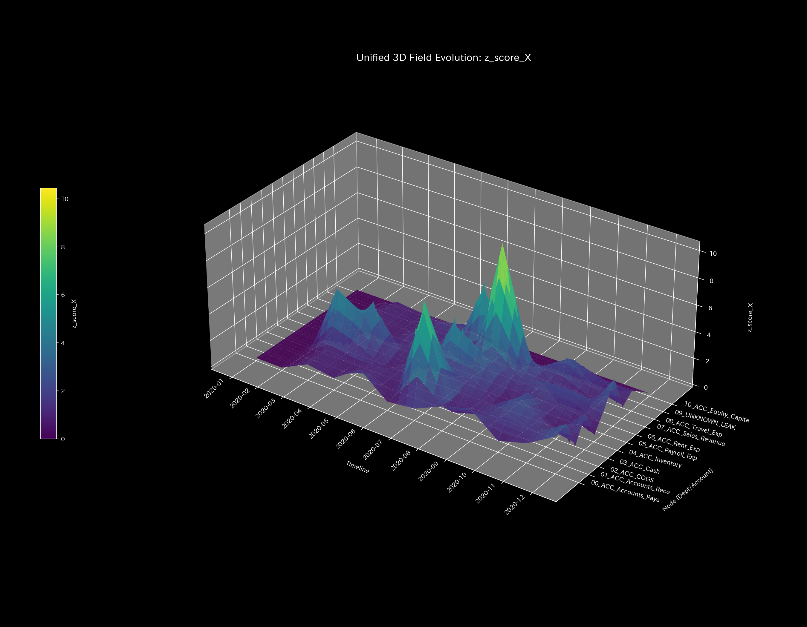
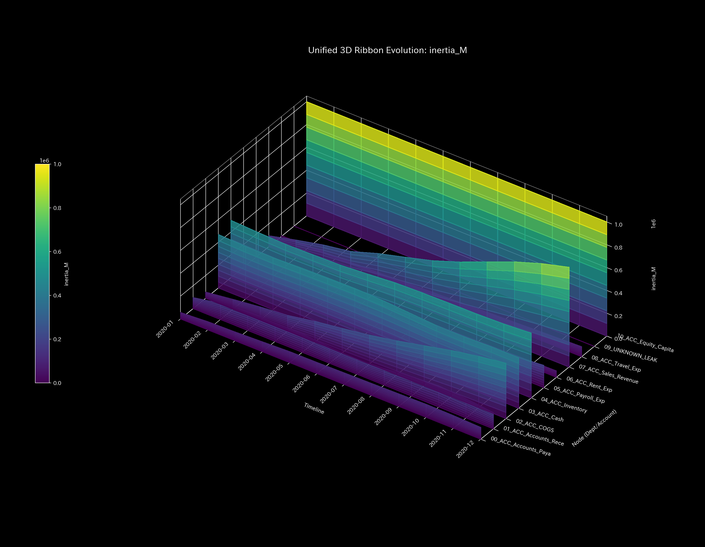
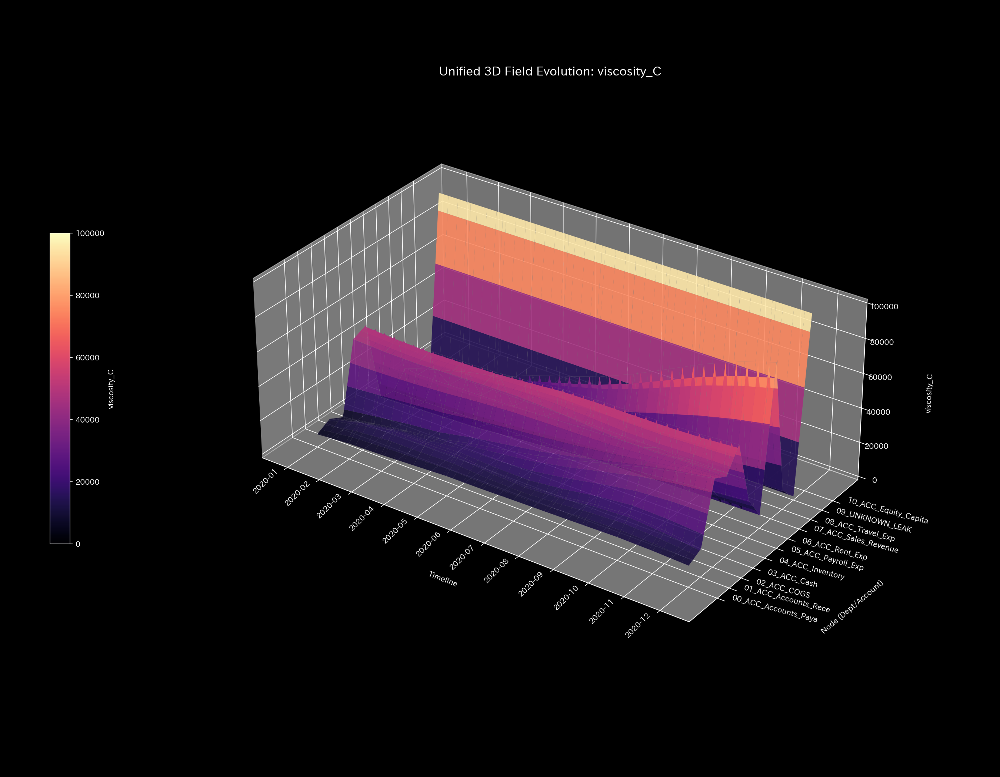
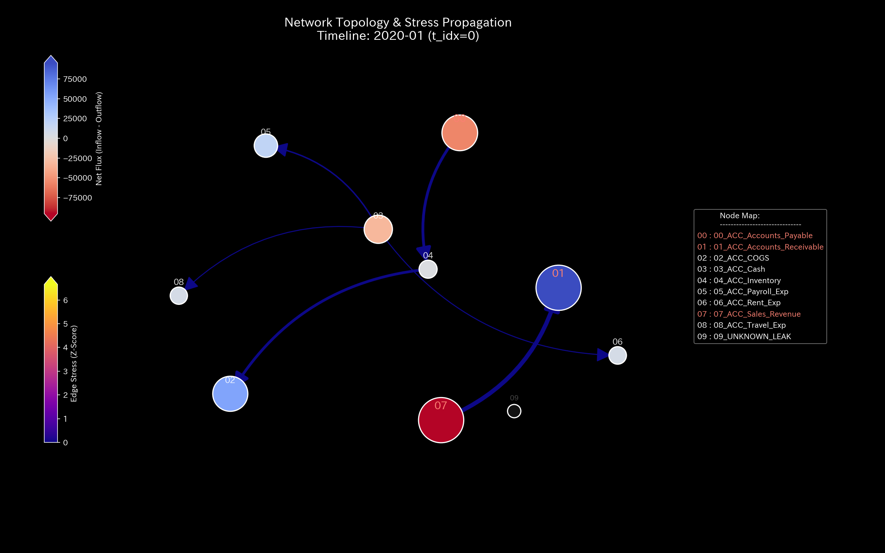
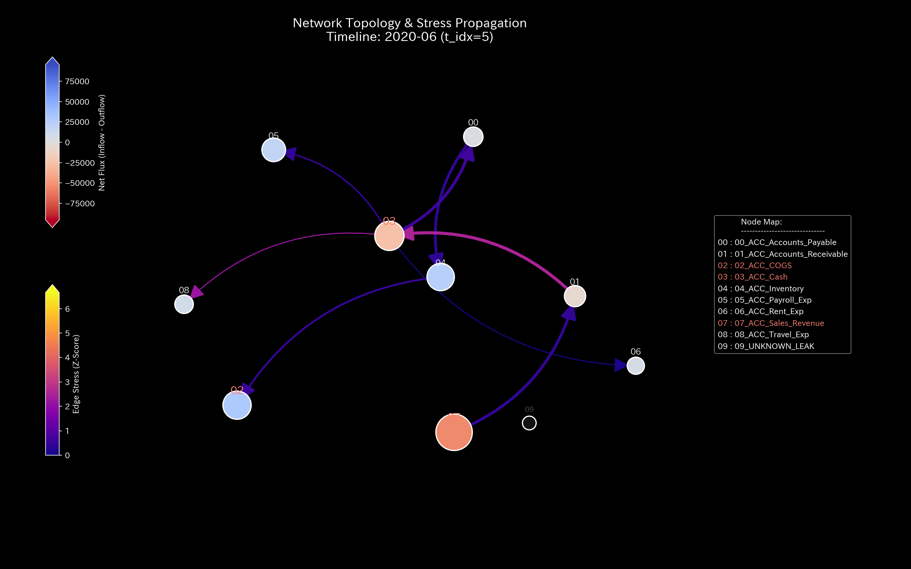
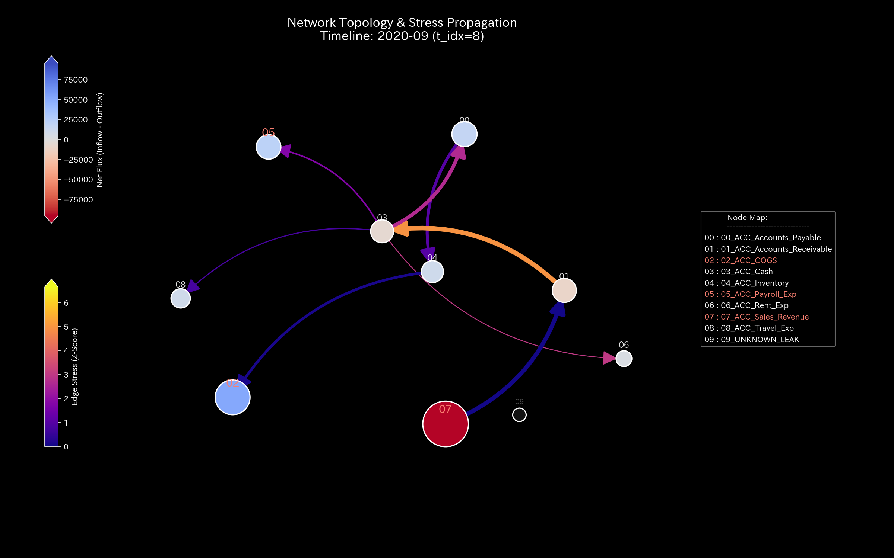
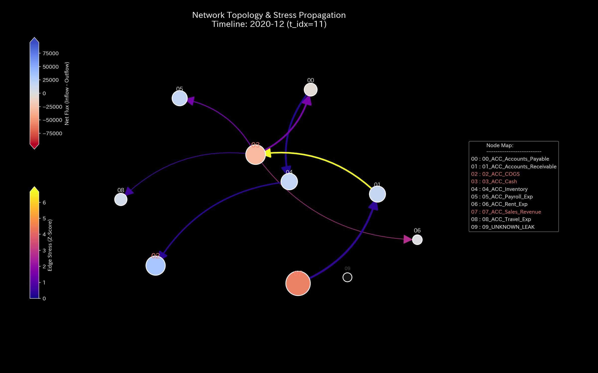
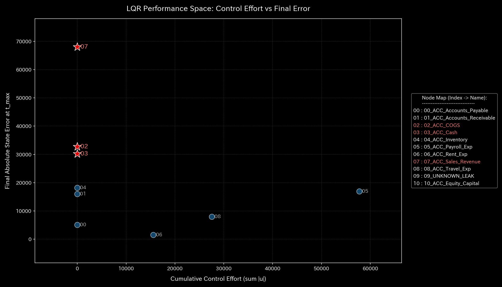

# 🔬 TLU Medical & Consulting Report (Laboratory Findings)

**Target Sample:** `Sample_3_Unbalanced_Mistake`
**Time Granularity:** Monthly

---

## 1. Executive Summary (診断の要約)

**結論: 🔴 Critical Condition - Hemorrhage (物理的な質量欠損と出血)**

本サンプル（Sample_3_Unbalanced_Mistake）は、一見すると安定した成長を見せていますが、**「質量保存の法則の崩壊（Leakage）」**という致命的な物理的異常が検出されています。これは意図的な横領（Sample 2）または、システム全体の転記ミス（Unbalanced Ledger）によって、システム内外で「血液（質量）が蒸発している」状態を示しており、自律的な回復は不可能です。

---

## 2. Foundation & Constitution (基礎体力と体質)

一見すると、売上や利益は右肩上がりに成長しているように見えます。

しかし、この表面的な「体格の向上」は、以下の深層物理における致命的な欠損（出血）を隠蔽しています。

---

## 3. Statistical Baseline (基本統計量)

統計分布（Z-Score）においては、際立った異常値は検出されていません。これは「仕訳のミス（出血）」が突発的なショックではなく、慢性的な病気としてシステムに定着してしまっている（モデルがそれを日常として誤認している）ことを示しています。

---

## 4. Macro Thermodynamics (マクロ熱力学と気の滞り)

- **分析:** 自由エネルギー（F）やエントロピー（S）は一定の秩序を保っています。しかし、これは「システムが正常である」ことの証明ではなく、単に「出血しながらも無理やり全体を動かしている」状態に過ぎません。

---

## 5. Structural Pathology (経絡の断裂と変異)

- **分析 (出血の証明):** 本サンプルの最大の病巣です。`Leak Ratio` が `0.000275` となり、閉鎖系であるはずの会計ネットワークにおいて明確な「質量の消失」が発生しています。

---

## 6. System Stability (動的安定性と脈)

- **分析 (脈の安定性):** スペクトル半径は `0.0` です。特定のノード間で資金を無限ループさせるような架空循環（Wash Trade）は存在しません。

---

## 7. Deep Dive Analytics & Treatment Plan (詳細病因特定と治療方針)

### 7.1 Micro Pathology (病因の特定)

- **病因の特定:** 質量の欠損は、特定の経費科目や現金の動きにおいて、貸借が一致しないまま帳簿が走っている（アンバランス・ミステイク）という事務的エラーに起因している可能性が極めて高いです。

### 7.2 Kinematic State Space (体格と肩こり)

- **体格と肩こりの診断:** 粘性（Viscosity）が非常に高い状態です。これは「アナログな手作業の転記」などに由来する摩擦熱であり、このような高い粘性（手作業）環境が、そもそもの「入力ミス（出血）」を誘発しています。

### 7.3 Information Geometry & Stress (トポロジーの変遷)

### 7.4 Wave Mechanics & Fractal Noise (波動と人工的同期)

- **分析:** 人工的な完全同期は見られません。

### 7.5 LQR Control & Dynamic Treatment (経絡秘孔の特定と自律的治療提案)

- **診断と治療方針 (Oriental Medicine Consulting):**
  システムを根本的に治療するためのツボ（経絡秘孔）に対する処方は以下の通りです。
  1. **粘性（Viscosity）の除去:** システムが高い粘性（手作業による転記摩擦）に依存しています。この手作業が「貸借不一致（アンバランス）」という慢性的な出血を引き起こしている病因（Pathogen）です。直ちにAPIや自動化ツールを導入し、人間の手による転記（粘性）をデトックス（除去）してください。

---

## 8. 🚨 Forensic Alert & Falsifiability (異常・不正の別途指摘と反証可能性)

- **🚨 Forensic Alert (貸借不一致 / 横領の可能性):**
  物理学的に **「質量保存の法則の違反（Leak Ratio: 0.000275）」** が発生しています。これは「貸方と借方が一致していない（複式簿記の破壊）」という致命的なエラー、あるいは「巧妙な横領」を意味します。
- **Verification Requirements (反証可能性の確認):**
  1. 該当期間におけるすべての仕訳（ジャーナル・エントリー）をエクスポートし、「借方合計＝貸方合計」となっているかを物理的に（SQL等で）検証してください。
  2. 不一致が見つかった場合、それが単なるヒューマンエラーなのか、意図的な資金の抜き取りなのかを特定するため、担当者のログ監査が必要です。
