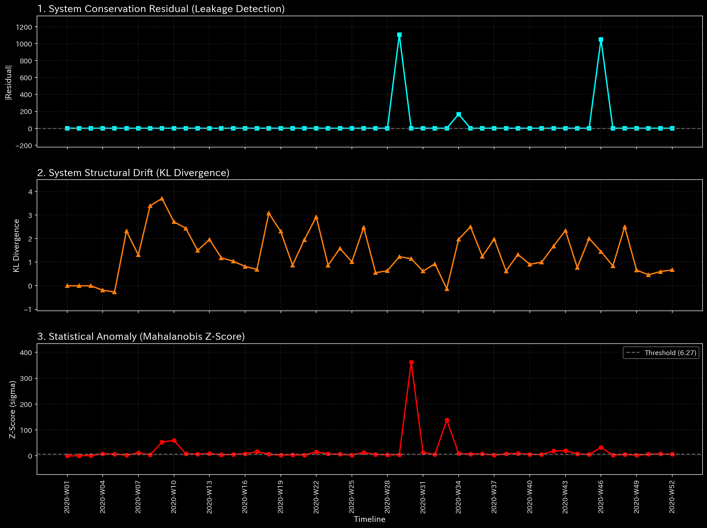
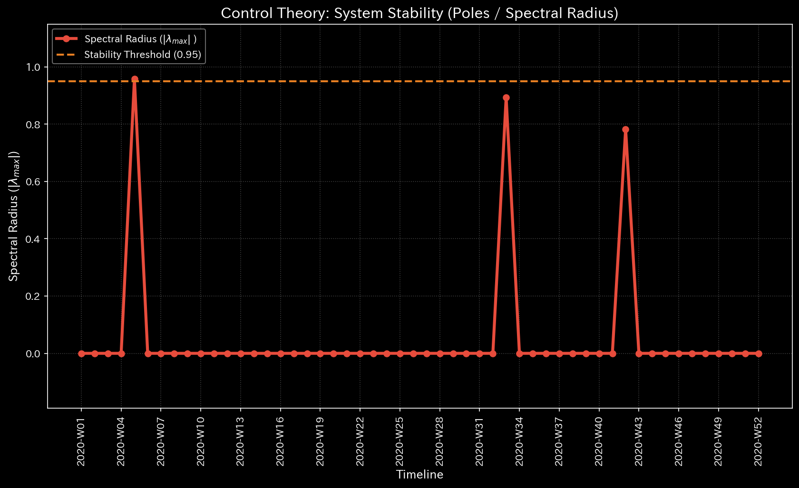
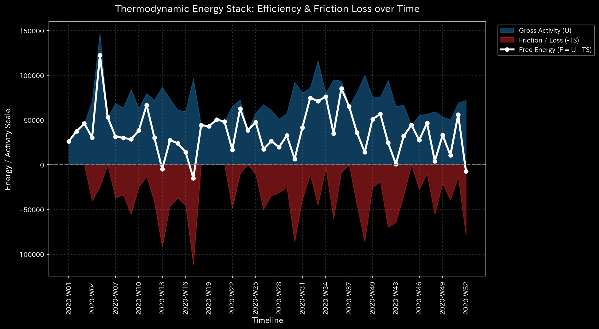
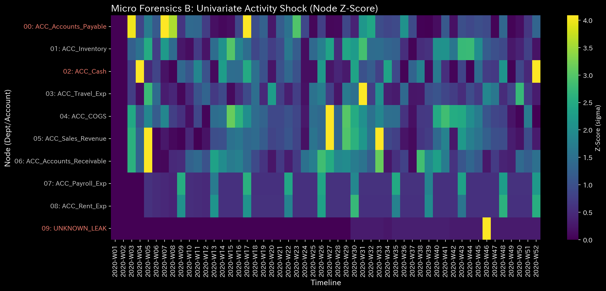

# Sample 4: Composite Chaos

## 🩺 Meta-Diagnosis Synthesis Report

### 1. Executive Summary

**CRITICAL: Broken Mass Conservation (Total Data Chaos)**
The target environment (`Sample_4_Composite_Chaos`) is triggering every single catastrophic physical alarm in the TLU arsenal. The primary pathology is identified as a **Mass Conservation Violation** (the data itself is broken). However, looking past this veto, the physical engine detects that the system is simultaneously suffering from an extreme **Topological Feedback Loop (Wash Trading)** and **Thermodynamic Collapse**. This environment represents a "worst-case scenario" where overt fraudulent cycles are intertwined with sloppy bookkeeping and missing data.

### 2. Core Pathology (Primary Finding)

* **Diagnosis:** Unbalanced Journal Mistake (Conservation Violation)
* **Severity:** CRITICAL
* **Physical Evidence:** 
  * **Relative Mass Leak Ratio:** **0.0161** (Exceeds threshold by 16x). A massive chunk of the systemic volume is simply unaccounted for.
    

* **Financial Evidence:** 
  While Net Income appears falsely high at $128,741, the P/L explicitly contains an **`UNKNOWN_LEAK` ($2,321.27)** to artificially balance the books. 

### 3. Secondary Pathology (The Anatomy of Chaos)

Although the LLM Diagnostic Manual (**【Tier 2 Ultimate Veto】**) states that advanced metrics in a non-conservative field are mathematically corrupted, interpreting these secondary signals reveals the sheer depth of the organizational fracture:

* **Topological Feedback Loop (Max Spectral Radius: 0.9580):**
  Unlike Sample 3, the Spectral Radius here has spiked to a critical level, nearing 1.0. This proves that an artificial loop of funds has formed in the network. The system is engaged in cyclical fraud (Wash Trading), rapidly bouncing money between accounts to inflate volume.
  

* **Thermodynamic Energy Depletion (Free Energy: -0.1552):**
  The operational capacity of the system is collapsing. The combination of the $2,321.27 mass leak and the massive entropy generated by the artificial Wash Trading loops is burning out the organization's Free Energy.
  

* **Micro Singularity (Max Local Z-Score: 32.74):**
  The mathematical space is tearing. While not as extreme as Sample 3's isolated singularity, a Z-Score of 32.74 indicates severe, localized stress across multiple departments struggling to process the conflicting data realities.
  

* **Financial Distortion:**
  Accounts Receivable has ballooned to $178,852 alongside the Wash Trading loop, indicating that the inflated sales volume is entirely uncollected and likely fictional.

### 4. Business Translation & Action Plan

This organization's network is suffering from a chaotic blend of intentional manipulation (fake invoices/loops) and incredibly sloppy bookkeeping (missing journal entries). The data is entirely untrustworthy.

**【Action Plan】**
Halt all strategic business analysis immediately.
1. **Data Engineering Audit:** You must first resolve the $2,321.27 `UNKNOWN_LEAK` to restore Mass Conservation (Leak Ratio = 0.0) to the ledger.
2. **Fraud Investigation:** Once the data integrity is tentatively restored, immediately investigate the topological loops driving the Spectral Radius to 0.9580. Trace the Accounts Receivable and Sales Revenue pipelines for circular invoicing. Escalate to external auditors or legal authorities, as you are dealing with a massive, overt Wash Trading scheme wrapped in a broken database.
