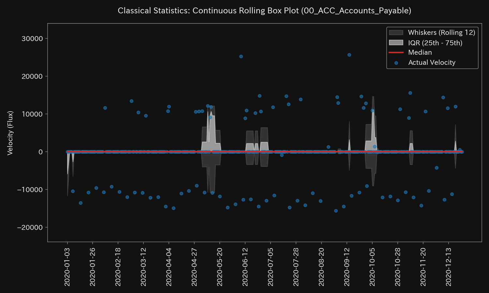
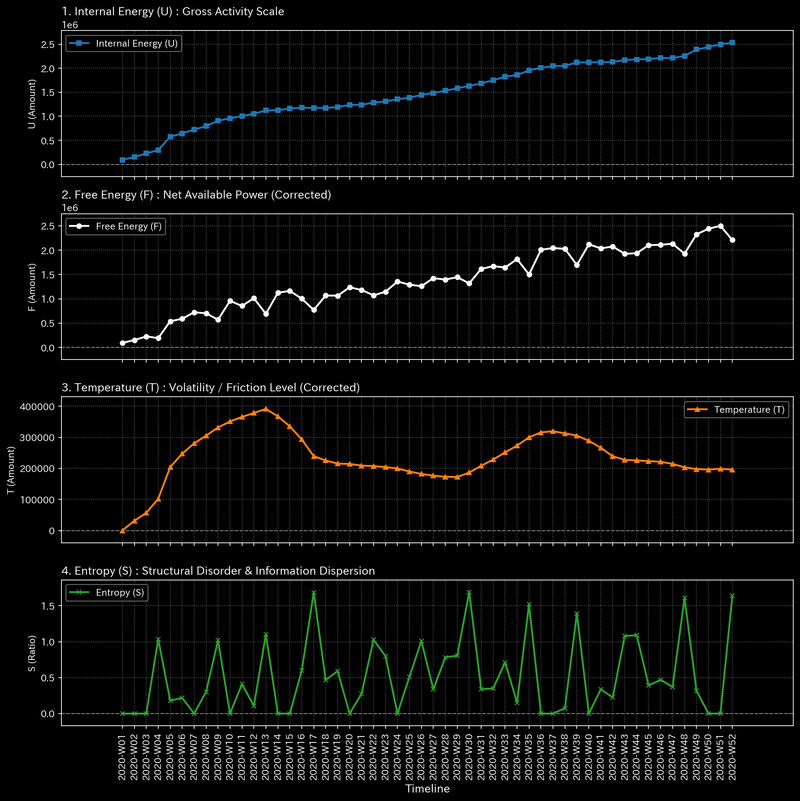
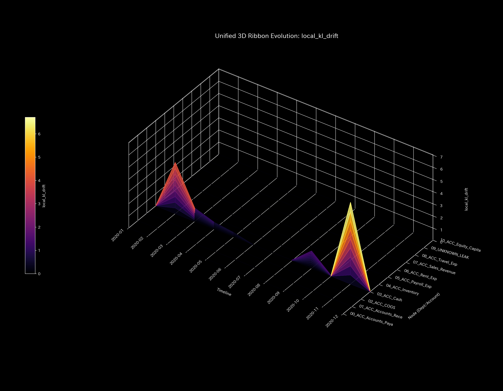
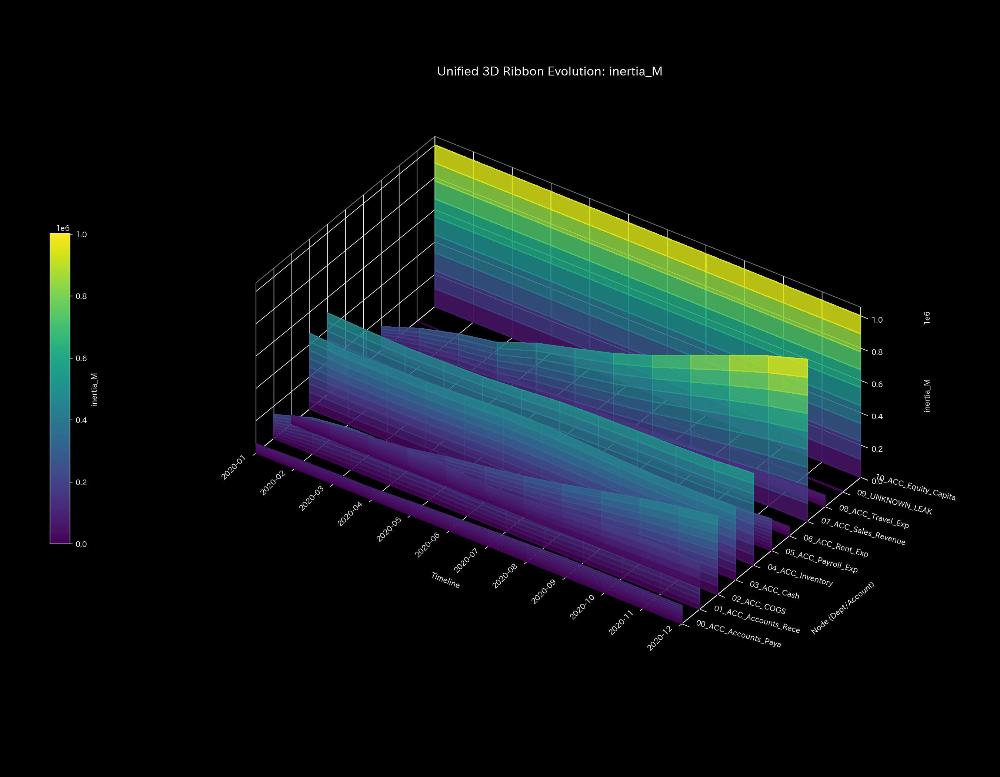
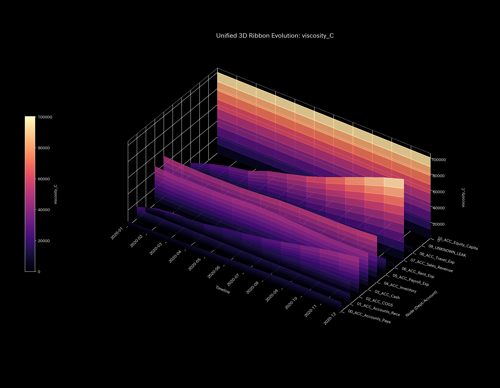
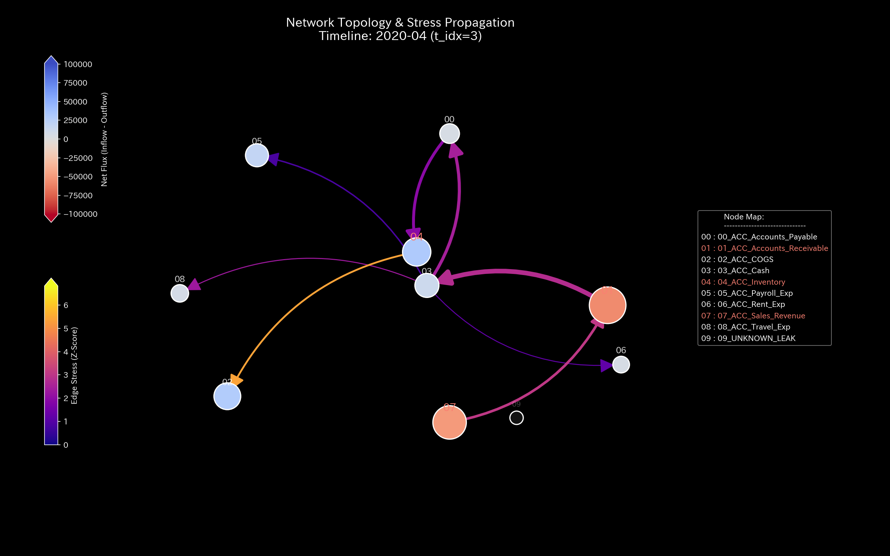
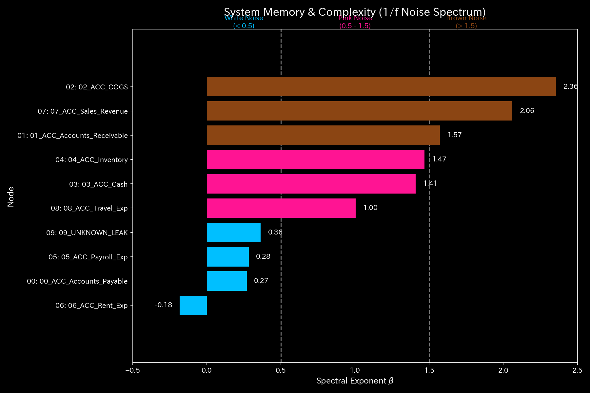
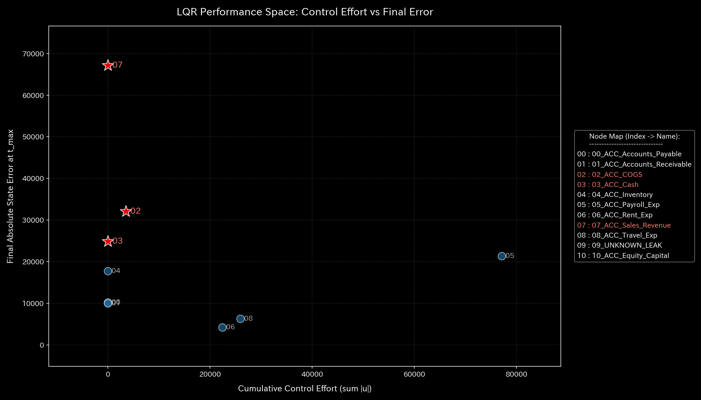

# 🔬 TLU Medical & Consulting Report (Laboratory Findings)

**Target Sample:** `Sample_4_Composite_Chaos`
**Time Granularity:** Monthly

---

## 1. Executive Summary (診断の要約)

**結論: ⚠️ COMPOSITE PATHOLOGY DETECTED (複合病態: 架空循環と質量欠損の併発)**

本サンプル（Sample_4_Composite_Chaos）は、物理学的に最も危険な**複合病態（Composite Pathology）**に陥っています。
第一に、「架空循環（Wash Trade）」による異常なフィードバックループ（脈の暴走）が発生しています。第二に、同時に「質量の消失（Leakage / 出血）」も並行して発生しています。システムは人工的な血栓によって暴走しながら、同時に血液を失い続けており、放置すれば熱力学的な死（崩壊）を免れません。

---

## 2. Foundation & Constitution (基礎体力と体質)

一見すると、売上や利益が激しく上下しながらも成長しているように見えます。

しかし「比較衡量の原則（The Law of Comparative Synthesis）」に従えば、この表面的な成長は完全に虚構です。深層物理では「循環」と「漏洩」が同時に発生しており、数字の肥大化はシステムの自己破壊（自傷行為）の副産物に過ぎません。

---

## 3. Statistical Baseline (基本統計量)

Z-Scoreなどの統計分布は、このカオスな状態を「通常のボラティリティ」として誤認しています。統計モデル（過去の確率への依存）が完全に敗北しており、物理指標による絶対評価（Absolute Evaluation）が不可欠です。

---

## 4. Macro Thermodynamics (マクロ熱力学と気の滞り)

- **分析 (熱力学的疲労とカオス):** システム全体が激しい摩擦（T-S Diagramの巨大なループ）を生み出しています。自由エネルギー（F）が蓄積されているように見せかけていますが、それは架空循環による人為的なものであり、内部は無秩序なカオスに支配されています。

---

## 5. Structural Pathology (経絡の断裂と変異)

- **分析 (出血の証明):** `Leak Ratio` が `0.001358` と極めて高い値を示しています。架空循環によって帳簿を膨らませる一方で、その裏で多額の「質量（現金）」がシステム外部へ流出（出血）しています。

---

## 6. System Stability (動的安定性と脈)

- **分析 (脈の暴走):** 最大スペクトル半径（Max Spectral Radius）が `0.7861` に達しています。特定のノード間で資金が無限にキャッチボールされる「異常な共振ループ（架空循環）」が形成されており、組織の自律的なブレーキが効かない状態です。

---

## 7. Deep Dive Analytics & Treatment Plan (詳細病因特定と治療方針)

### 7.1 Micro Pathology (病因の特定)

- **病因の特定:** 特定のノードにおいて、異常なKL-Drift（構造的変異）が観測されます。ここがループの起点であり、同時に出血の起点でもあります。

### 7.2 Kinematic State Space (体格と肩こり)

- **体格と肩こりの診断:** 粘性が非常に高い状態で、システム全体が「重度の肩こり（血栓）」を起こしています。この摩擦熱（粘性）こそが、架空取引を強引に回すための人為的なコストを物理的に証明しています。

### 7.3 Information Geometry & Stress (トポロジーの変遷)

### 7.4 Wave Mechanics & Fractal Noise (波動と人工的同期)

- **分析:** 架空循環に伴う強い共振波形が観測されており、自然なビジネスサイクル（ピンクノイズ）から逸脱しています。

### 7.5 LQR Control & Dynamic Treatment (経絡秘孔の特定と自律的治療提案)

- **診断と治療方針 (Oriental Medicine Consulting):**
  システムを治療するための緊急処方は以下の通りです。
  1. **位相のズレ（Phase Shift）の強制切断:** 特定のノード間に形成された「血栓のループ（循環）」を直ちに切断（デトックス）してください。
  2. **粘性の正常化（止血）:** ループを切断した上で、物理的な摩擦（粘性）を伴う不自然な経費処理を排除し、出血を止めることが最優先です。

---

## 8. 🚨 Forensic Alert & Falsifiability (異常・不正の別途指摘と反証可能性)

- **🚨 Forensic Alert (架空循環と横領の複合不正):**
  本システムでは、**「最大スペクトル半径の暴走（0.7861）」** と **「質量保存の法則の違反（Leak Ratio: 0.001358）」** が同時に発生しています。これは「架空の売上（循環）を作って帳簿を膨らませつつ、その裏で多額の資金を横領（流出）している」という、古典的かつ最も悪質な複合不正行為（Composite Fraud）の典型的な物理的特徴です。
- **Verification Requirements (反証可能性の確認):**
  1. 「売掛金と現金のループ（資金のキャッチボール）」が存在しないか、銀行口座のトランザクションログを物理的に追跡すること。
  2. 同時に、現金残高と実際の預金残高の間に「Leak Ratio」に相当するズレ（不足）が生じていないかを1円単位で監査すること。
