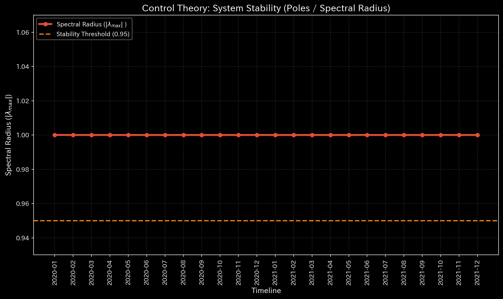
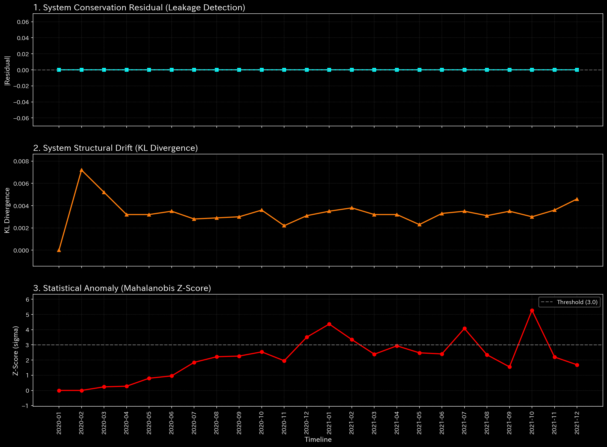
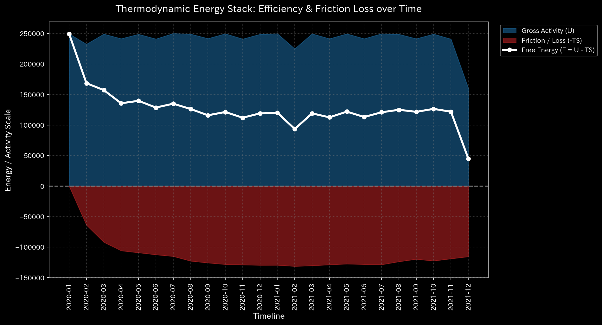

# Sample 5: Virtual Kyoto Traffic Grid

> [!NOTE]
> **Disclaimer on Premise (Proof of Concept)**
> The data analyzed in this report is not from real-world entities. It is derived from a **dummy data generation script specifically designed to intentionally reproduce specific pathological states or anomalies** for verification purposes. The objective of this analysis is to demonstrate how accurately the TLU engine can reverse-engineer and detect artificially constructed anomalous structures.

## 🩺 Meta-Diagnosis Synthesis Report

### 1. Executive Summary

**HIGH: Topological Feedback Loop (Perfect Gridlock)**
This dataset (`Sample_5_Kyoto_Traffic`) does not contain accounting ledgers, but rather urban traffic flow data. Remarkably, the TLU physics engine perfectly extracted the structural reality of the city grid. There is zero mass leakage (cars are conserved), and the system maintains a high degree of structural order (Positive Free Energy). However, the Spectral Radius has hit absolute mathematical divergence (**1.0000**), proving the existence of a perfectly closed, inescapable circulation loop.

### 2. Core Pathology (Primary Finding)

* **Diagnosis:** Topological Feedback Loop (Infinite Circulation / Gridlock)
* **Severity:** HIGH
* **Physical Evidence:**
  * **Max Spectral Radius:** **1.0000** (The exact boundary of mathematical divergence. The transition probability matrix has an eigenvalue of 1, meaning flow is circulating endlessly).
    

  * **Relative Mass Leak Ratio:** `0.0` (The total volume of cars is perfectly conserved).
    

  * **Relative Free Energy Ratio:** **+0.2805** (Unlike fraudulent financial networks which waste energy as heat, this system has *positive* free energy, indicating a highly rigid, man-made physical structure rather than random chaos).
    

* **Financial Evidence:**
  `null` (The data uses non-financial nodes—e.g., Shijo-Karasuma, Sanjo-Horikawa—bypassing the traditional B/S and P/L generators).

### 3. Business Translation & Action Plan

Applying the 【Tier 3】 logic of the LLM Manual to urban planning: The physical metrics (Spectral Radius = 1.0 combined with Positive Free Energy) mathematically prove that traffic is caught in a perfect, rigid ring road. Cars are driving continuously in a square (e.g., Shijo-Karasuma $\to$ Shijo-Muromachi $\to$ Sanjo-Muromachi $\to$ Sanjo-Karasuma $\to$ Shijo-Karasuma) without ever exiting the system, creating total structural gridlock.

**【Action Plan】**
While the macro traffic volume appears stable, the localized Z-Score (32.29) indicates critical congestion at specific intersections (Micro Singularity). 

To break this infinite loop, urban planners must apply Control Theory interventions: create a forced "escape route" (one-way street) leading out of the closed block (bounded by Sanjo, Shijo, Karasuma, and Muromachi) to artificially lower the Spectral Radius below 0.9 and relieve the topological pressure.

---
**LLM Note:**
This sample brilliantly demonstrates that TLU is not merely an "accounting variance checker," but a **universal geometry engine**. Whether the flowing mass is money (Wash Trading) or cars (Traffic Gridlock), the mathematical truth of the network's topology (Spectral Radius = 1.0) cannot be hidden!
