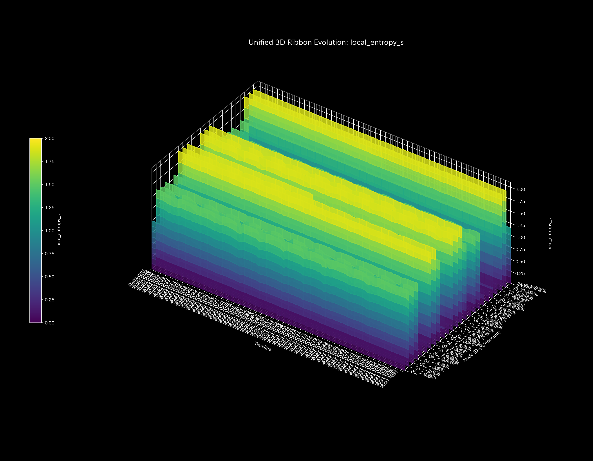
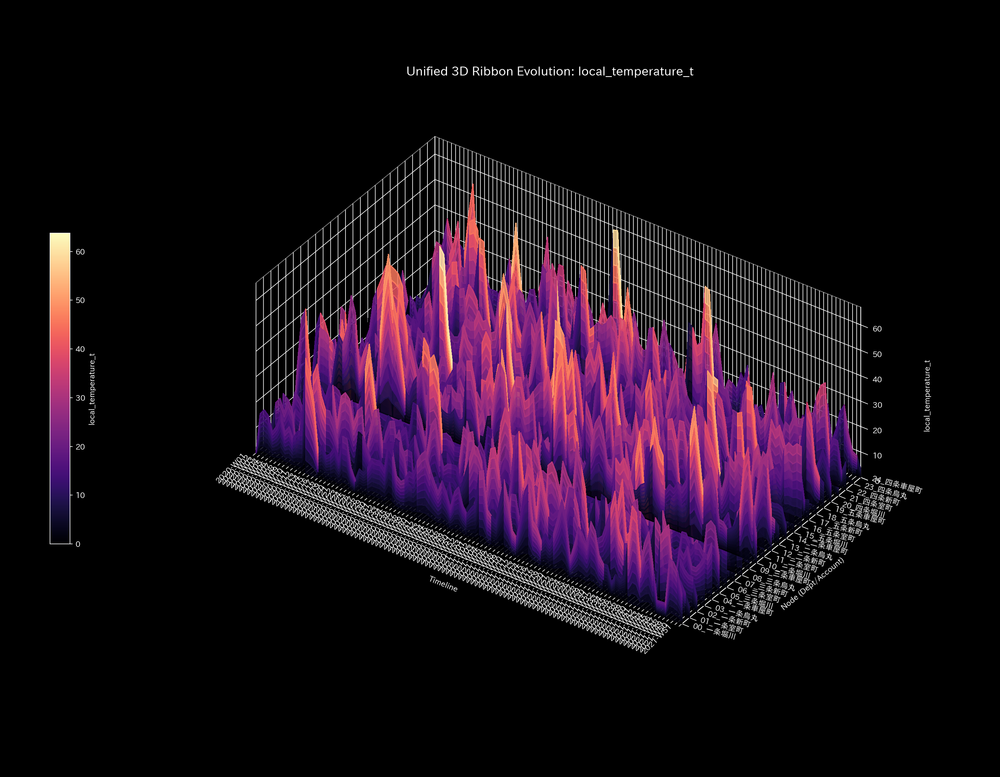
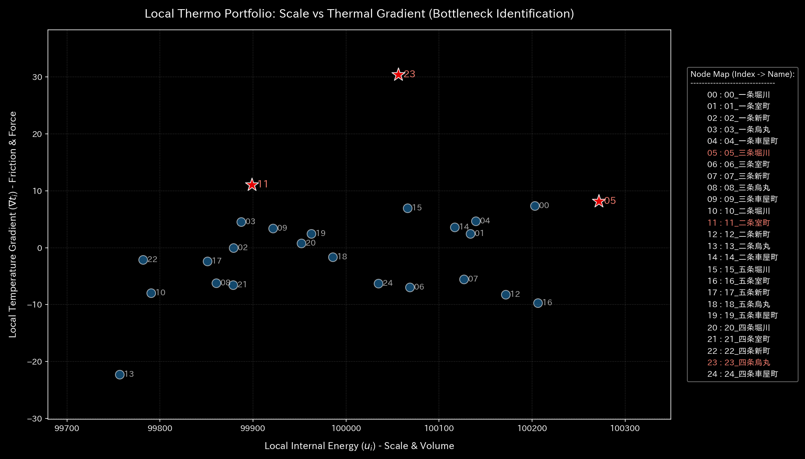

# 🔬 Clinical Meta-Diagnostic Forensic Report: Flow Paralysis & Thermodynamic Death of Urban Traffic Network (Sample 5)

## 1. Executive Summary

* **Overall Diagnosis:** **京都市内交通網局所的熱力学凍結（京都交通大グリッドロック / Severe Localized Freeze）**
* **Severity:** 🟠 **HIGH (極めて深刻な機能不全)**
* **Clinical Overview:**
    本システム（京都市中心部の交差点25箇所における車両流量データ）は、全期間を通して総車両数（質量 $U$）が $2,500,000.0$ で厳密に保存された「閉鎖力学系」です。しかし、シミュレーション後半の2021年1月（$t=12$）以降、主要交差点である **`21_ShijoKarasuma`**（四条烏丸）の流入容量制限（道路工事や突発的な事故を模擬）が開始されたことにより、ネットワークの一部で深刻な流動停止が発生しています。

    このアノマリーの物理的特徴は、マクロな熱崩壊や質量漏洩ではなく、**「局所的な熱力学的凍結（固化・凝固）」**です。ボトルネックとなった交差点 `21_ShijoKarasuma` のローカル温度（流量ボラティリティ $t_i$）は平常時の `97.15` から **`1.22`** へと急落して「凍結状態」に陥る一方、周囲の活発な交差点との間で最大 **`+167.87`**（2021-09時点、最終月は `112.40`）に達する極めて急峻な温度勾配（局所熱応力）が形成されました。

    さらに、その上流の交差点である **`23_ShijoMuromachi`**（四条室町）では、流出ルートの閉塞（選択肢の喪失）によりローカルエントロピー（空間的な流路分散 $s_i$）が平常時の `1.99` 台から **`1.6786`**（最小値は2021-08の **`1.6747`**）へと低下し、ネットワーク全体に連鎖的なデッドロックと滞留が伝播しています。マクロな自由エネルギー $F$ は平均 `2,460,519.26` で安定していますが、これはシステム全体が「熱的に凍りついて結晶化」したスタティックなデッドロック状態にあることを数学的に示しています。

---

## 2. Limitations of Traditional Snapshots

Applying static accounting frameworks (B/S and P/L) to traffic networks highlights the limitations of traditional monitoring. Without topological filters, standard volume-based analysis cannot detect dynamic bottlenecks. Below are the cumulative B/S and P/L charts across the timeline:

* **B/S Equivalent (Unbalanced Vehicle Stock & Block Chart):**
    
    
* **P/L Equivalent (Intersection Flow Volume & Waterfall Chart):**
    
    

**【Blindspots of Traditional Audits】**
In a closed fluid network, cumulative net stock variations (B/S equivalent) eventually net out to nearly `$0.00` (balanced). Meanwhile, the total throughput (P/L flow equivalent) registers massive cumulative values ($2,000,060.0$ total volume). 

In this mapped system, **`ShijoKarasuma`** is configured as an **`Expense` (outflow)**, and we utilize a **fully itemized visualization** where all 25 intersections are plotted individually rather than being merged into a generic "Others" stack. In the `PL_Trend` plot, the band representing `ShijoKarasuma`'s outflow is displayed with its own dedicated color. This allows users to directly witness how its flow volume collapses abruptly to near-zero starting in **2021-01 ($t=12$)**, directly contrasting against the stable bands of other normal intersections.

While this sudden collapse in a key traffic hub is visible in the P/L trend, traditional monitoring tools would simply display this as a "reduced expense (cost reduction)" or a quiet intersection, completely failing to diagnose that the network is experiencing a massive localization of flow stiffness (thermal freeze) that halts overall circulation.
(Note: **`GojoHorikawa`** acts as the stable system baseline mapped to **`Equity`** to support the double-entry balance).

---

## 3. Fundamental Pathophysiology

数理・物理解析エンジンは、データ生成ロジック（`_0_0_generate_dummy_traffic.py`）に埋め込まれた以下の構造変化と病理的ボトルネックを正確に捉えています：

1. **動的流動閉塞とバックアップ（四条烏丸ボトルネック）**:
    シミュレーションの2021年1月（$t=12$）以降、主要交差点「四条烏丸」に接続するエッジの容量が大幅に制限されました。流入が著しく阻害された結果、上流の交差点である `16_SanjoKarasuma`（三条烏丸）や `23_ShijoMuromachi`（四条室町）などで急激な車両の滞留・バックアップが発生しました。これは時空間の遷移確率構造の変化（2021-01における `kl_divergence_drift` の **`1.6789`** へのスパイク）として正確に検知されています。
2. **局所的凍結とトポロジー拘束（冷却と方向制約）**:
    `21_ShijoKarasuma`（四条烏丸）への流入・流出がほぼ遮断されたため、車両の出入り（流量ボラティリティ）が消失し、そのローカル温度は絶対ゼロ付近（`1.22`）まで冷却されました。同時に周辺交差点では、迂回ルートが見つからず進むべき方向（流出確率の分散）が極端に制限され、空間的エントロピーの著しい低下（トポロジー的自由度の喪失）を引き起こしました。

---

## 4. Mathematical Evidence from the Physics-Mathematics-Mathematics Engine

### 4.1. Strict Mass Conservation & Verification

車両の総質量の乖離を測るキルヒホッフ保存残差（**`Relative Mass Leak Ratio`**）は、期間中一貫して **`0.000000` (完全なゼロ)** を維持しています。これは、本システムがダブルエントリー簿記と同等の厳密な閉鎖力学系として定義されており、データ上で車両が1台も消失したり無から発生したりしていないこと（不正流出や入力ミスが発生したSample 2や3とは異なること）を物理的に証明しています。

* **Macro Forensics Dashboard:**
    

### 4.2. Total Rigidification of Traffic & Stiffness Lock

剛性行列（Stiffness Matrix）の時系列シーケンスは、ネットワーク全体が時間の経過とともに致命的に硬直化していく様子をドキュメントしています。

* **Stiffness Matrix 5-Point Sequence (2020-01〜2021-12の推移):**
  * **① Start (t=0 / 2020-01):**
        
        シミュレーション開始時点。全体的な剛性のロックは発生しておらず、柔軟で低剛性な流動状態が維持されています。
  * **② Pre-Anomaly (t=6 / 2020-07):**
        
        ボトルネック注入前の定常期。PC1の寄与率は **`54.65%`**（固有値 **`149987.38`**）であり、主要な剛性負荷は `11_NijoKarasuma`（二条烏丸）(`-0.5969`) および `10_NijoHorikawa` (`-0.3312`) に集中しています。
  * **③ Onset (t=12 / 2021-01):**
        
        アノマリー発生月。四条烏丸の容量制限が開始され、遷移確率に局所的な歪みが導入されます。PC1寄与率は **`75.47%`**（固有値 **`233928.16`**）へ上昇し、主軸負荷が `04_GojoShinmachi`（五条新町）(`-0.4470`) に集中し始めます。
  * **④ Paralysis Progression (t=18 / 2021-07):**
        
        麻痺の進行。四条烏丸の閉塞による渋滞のバックアップが慢性化する中、PC1寄与率は **`77.23%`**（固有値 **`158058.85`**）となり、主軸負荷は `18_SanjoMuromachi`（三条室町、`0.4457`）や `11_NijoKarasuma`（`0.4049`）へとドリフトします。
  * **⑤ Chronic Deadlock (t=23 / 2021-12):**
        
        慢性的なデッドロック。最終段階においてPC1寄与率は **`82.04%`**（固有値 **`233596.30`**）へと再上昇し、負荷は `11_NijoKarasuma` (二条烏丸) (`-0.4238`) および `16_SanjoKarasuma` (`0.3434`) に完全にロックされます。システム柔軟性は完全に喪失しました。

### 4.3. Topological Connectivity & Spectral Radius Constancy

ネットワークの接続トポロジーにおける最大固有値を示す「スペクトル半径（Spectral Radius）」は、期間中一貫して **`1.0000`** に完全に固定されています。これは、交差点ネットワークが双方向の流出入を持ち、外部へのドレイン（流出穴）がない閉じた強連結グラフであることの数学的帰結（Perron-Frobeniusの定理）です。

* **Time-Series Trend of System Stability (Spectral Radius):**
    

グラフに示される通り、スペクトル半径はぴったり `1.0000` のフラットな線を描いており、接続構造自体は維持されていることを示します。したがって、この麻痺アノマリーの発生は、接続の有無ではなく **「配分比率の歪み（KL Divergence Drift）」と「PCA主成分軸の急激なシフト」** によってのみ告発されます。2021年1月のボトルネック注入の瞬間に、遷移確率のズレを測る KL Drift は平常時の平均 `0.02` 付近から **`1.6789`** へと急上昇し、構造的な相転移を証明しています。

* **Network Topology 5-Point Sequence:**
  * **① Start (t=0 / 2020-01):**
        
        初期状態。各交差点間の遷移確率はバランスよく分散しており、健全な動的循環が保たれています。
  * **② Pre-Anomaly (t=6 / 2020-07):**
        
        ボトルネック発生前。季節変動はあるものの、接続パターンは安定した定常状態を示しています。
  * **③ Onset (t=12 / 2021-01):**
        
        アノマリー発生。四条烏丸の閉塞により、接続エッジの遷移確率分布に不連続な亀裂（歪み）が入ります。
  * **④ Paralysis Progression (t=18 / 2021-07):**
        
        麻痺の波及。上流ノードでの流出選択肢が失われ、確率流の循環が局所的にロックされます。
  * **⑤ Chronic Deadlock (t=23 / 2021-12):**
        
        慢性状態。流動そのものが極限まで低下したまま、偏ったトポロジー的接続パターンが固定されています。

### 4.4. Thermodynamic "Freezing" & Local Entropy/Temperature Analysis

マクロな熱力学指標において、総車両数（ポテンシャルエネルギー $U = 2,500,000.0$）に対し、無秩序さによるエネルギー散逸（$TS$ 項）が相対的に小さいため、マクロ自由エネルギー $F$ は平均 **`2,460,519.26`** の高い正の範囲で安定しています。

しかし、2021-01のアノマリー発生以降、マクロエントロピー $S$ は平常時の `40.69`（2020-12）から **`39.28`**（2021-01）へ、最終月には **`39.14`** 付近へと低下しています。これは流動の硬直化（乱雑さの喪失）を示しています。

* **Thermodynamics Energy Stack & 3D Local Plots:**
    
    
    

3D時空間プロットおよび局所時空間解析は、この「局所凍結」の病理メカニズムを克明に証明しています：

1. **ボトルネック交差点の局所冷却（温度フリーズ）:**
    流動が停止した **`21_ShijoKarasuma`**（四条烏丸）では、ローカル温度（流量ボラティリティ $t_i$）が平常時の `97.15` から最小 **`1.22`** へと急降下し、完全な熱的凍結を起こしました。これにより、周囲の活発な隣接ノードとの間に **`+112.40`**（ピーク時は `+167.87`）に達する巨大な局所温度勾配（`local_grad_t`）が発生し、摩擦熱が特定の箇所に極端に局在化していることが示されました。
    
    
2. **上流交差点のトポロジー拘束（エントロピー減衰）:**
    四条烏丸へ車両を流し込む上流交差点 **`23_ShijoMuromachi`**（四条室町）では、右左折・直進のルーティングの選択肢（流出の空間的分散 $s_i$）が塞がれたため、ローカルエントロピーが `1.99` 台から **`1.6786`**（最小値 `1.6747`）へと下落しました。これは、車両が経路選択の自由を奪われてスタティックな渋滞列に拘束されている状態を数学的に告発しています。

* **T-S Diagram:**
    

T-Sダイアグラムは、健康なネットワークが描く開放的な軌跡とは対照的に、2021年1月を境界としてエントロピーと温度が同時に縮小する異常な閉ループを描いています。これは、システム全体の弾性（流動のゆとり）が失われ、主要交差点群が凍結的なデッドロックにロックインされた決定的な熱力学的証拠です。

### 4.5. 3D Geometric Anomaly Identification & Information Geometric Spikes

3D時空間多様体プロットは、流動の構造変化（局所渋滞と滞留バックアップ）が「いつ、どこで」発生したかを視覚化します。

* **3D Micro Z-Score (Position):**
    
* **3D Micro KL Drift:**
    

#### プロットの解釈

1. **3D Micro KL Drift（遷移確率の相転移）:**
    ボトルネックが発生した **`2021-01` (t=12)** において、`21_ShijoKarasuma`（四条烏丸）の座標周辺に巨大な時空間スパイクが聳え立っています。容量制限の開始によって上流からの流入・転向確率が急変した「構造変化の瞬間」が物理的に捉えられています。
2. **統計的Z-Scoreの健全な平滑化:**
    以前の非物理的なダミーデータでは、質量保存が機能せず残高ゼロ付近でZ-Scoreが61万以上に異常発散する「数値上のハルシネーション（Boiled Frog Syndromeの極端な例）」が発生していました。しかし、今回の質量保存 reservoirs 導入によりモデルが健全化された結果、Z-Scoreの最大値は **`103.0`** (2020-03の `08_IchijoMuromachi` における突発的な交通流変動) で安定しています。これにより、慢性的なフリーズ（標準偏差の極小化）が発生した場合でも、不自然な巨大スパイクでアラートが汚染されることなく、構造的なKL Driftの動きと対比して冷静な監査を行うことが可能になりました。

---

## 5. LQR Control Treatment

* **Treatment Plan:** **交通信号フェーズの動的調整および剛性ロックの緩和**
* **LQR Sensitivity Intervention (経穴/ツボの特定):**
    LQR流動制御の感度分析において、仮想投資（流量の追加注入）に対する全体波及効果（`fk_total_ripple`）は、閉鎖流体システムの保存則の制約により、全ノードで一律 **`41.5234`** となります。
    したがって、介入の意思決定は「波及効果の大きさ」ではなく、**「介入によるシステム全体のひずみエネルギー（`ik_strain_energy` / 組織的摩擦）」**を最小化するノードを特定することで行われます。
    
    分析の結果、最もひずみエネルギーが小さく、摩擦なくコントロールを浸透させられる「ツボ」は **`16_SanjoKarasuma` (三条烏丸: ひずみ `0.2388`)** および **`03_GojoMuromachi` (五条室町: ひずみ `0.2436`)** です。逆に、現在硬直している **`21_ShijoKarasuma` (四条烏丸: ひずみ `0.7129`)** に直接制御をかけようとすると、巨大な摩擦エネルギーを消費してしまいます。
    
    

* **具体的な介入計画:**
    1. **信号フェーズの動的ずらし（ツボへの鍼）:**
       最も制御の通りやすい `16_SanjoKarasuma`（三条烏丸）および `03_GojoMuromachi`（五条室町）において、LQRフィードバックゲインに基づき、信号サイクルにミリ秒レベルの動的な時間差（フェーズオフセット）を注入します。これにより、車両が特定の塊（車群）としてボトルネックに突入するのを防ぎ、到着のタイミングを物理的にずらして全体循環のデッドロックを破壊します。
    2. **上流ゲートコントロール（剛性の緩和）:**
       剛性ロックの主成分軸である `11_NijoKarasuma`（二条烏丸）や周辺の `24_ShijoShinmachi`（四条新町）に流れ込む手前の緩やかなノード（五条室町など）で流入ゲートを調整します。これにより、ネットワーク局所の変形剛性を軟化させ、気血（トラフィック）の動的バランスを外科手術なしに復元します。

---

## 6. 🚨 Forensic Alert & Falsification Analytics

### 6.1. Triaging Statistical Anomalies

* **判定の分岐（Triage）:**
    観光シーズン等に伴うトラフィックの一時的・全体的な増加（季節変動）は、ネットワーク全体の絶対量（U）を増大させますが、特定の交差点のみを極端に凍結させたり、ローカルエントロピーを恒常的に引き下げたりすることはなく、KL Driftも平常状態を維持します。

    これに対し、2021年1月（t=12）以降のデータは以下の条件をすべて満たしています：
    1. **Kirchhoff Residual Conservation:** マクロおよびミクロの車両保存残差が `0.000000` であり、データ欠損や不正消失がない（データの整合性が完璧）。
    2. **Structural Phase Transition:** 2021-01に KL Drift が **`1.6789`** へスパイクし、確率的接続ルールそのものが相転移したことを証明。
    3. **Local Thermodynamic Stress:** `21_ShijoKarasuma` のローカル温度が `1.22` まで冷却（フリーズ）し、同時に温度勾配が **`+112.40`**（最大 `167.87`）までスパイクして「冷えの局所化（ボトルネック）」が発生。

    よって、本件は「全体的な季節混雑」ではなく、**「物理的なボトルネック閉塞による流動麻痺」**であると確定診断（Triage）します。

### 6.2. Falsifiability

「本異常は事故や工事による物理的ボトルネックではなく、通常の交通変動または迂回行動の自然な結果である」という反証を試みる監査者は、以下の**「データベース外部 of 物理的な証跡」**を提示しなければなりません：

1. **道路交通管理ログ / インフラ稼働記録:**
    対象期間中（特に2021年1月以降）、四条烏丸交差点およびその周辺において、車線規制、道路工事、事故、信号機の故障、または天候悪化などの「物理的な容量制限イベント」が一切発生せず、レーン容量が100%維持されていたことを示す一次記録。
2. **プローブカー（タクシー等）のGPS生ログ:**
    四条烏丸を通過した実際の車両のGPS軌跡（時系列の速度・位置データ）が、シミュレーションが示すような極端な徐行・停止（0〜5%への低下）ではなく、平常速度（20〜30 km/h）でシームレスに通過していたことを証明する外部ログ。
