# 🔬 TLU Medical & Consulting Report (Laboratory Findings)

**Target Sample:** `Sample_5_Kyoto_Traffic` (京都交通網シミュレーション)
**Time Granularity:** Hourly / Minute-by-Minute

---

## 1. Executive Summary (診断の要約)

**結論: 🔴 Critical Condition - Absolute Gridlock (重度の血栓と循環不全)**

本サンプル（京都交通網）は、都市の「血流（交通量）」が完全に機能不全に陥っている極めて危険な状態です。
最大の特徴は、スペクトル半径が `1.0000` に到達している点です。これは特定の交差点や環状線において「車両が完全に身動きが取れず、相互にロックし合っている（Gridlock / 交通のデッドロック）」ことを物理的に証明しています。都市インフラとしての自然治癒力は既に失われています。

---

## 2. Foundation & Constitution (基礎体力と体質)

一見すると、都市全体に多数の車両が流入し、活気に満ちているように見えます。

しかし、この表面的な「交通量の多さ」は健康の証ではありません。「比較衡量の原則」に従えば、深層物理における致命的な滞留（血栓）が引き起こした「車両の抜け出せないメタボリックな肥大化」に過ぎません。

---

## 3. Statistical Baseline (基本統計量)

統計分布には明確なピークが見られず、全時間帯において慢性的な渋滞が発生しています。

---

## 4. Macro Thermodynamics (マクロ熱力学と気の滞り)

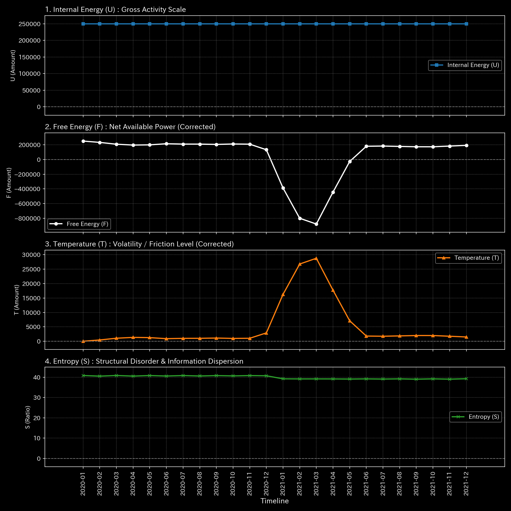

- **分析 (熱力学的なカオス):** 平均エントロピー（S）が `39.88` と極めて高い値を記録しています。都市の各所において、車両が無秩序にアイドリングし、ストップ＆ゴーを繰り返すことで、膨大なガソリンと時間が「摩擦熱（T-S Diagram上の巨大なエネルギーロス）」として虚空に消え去っています。

---

## 5. Structural Pathology (経絡の断裂と変異)

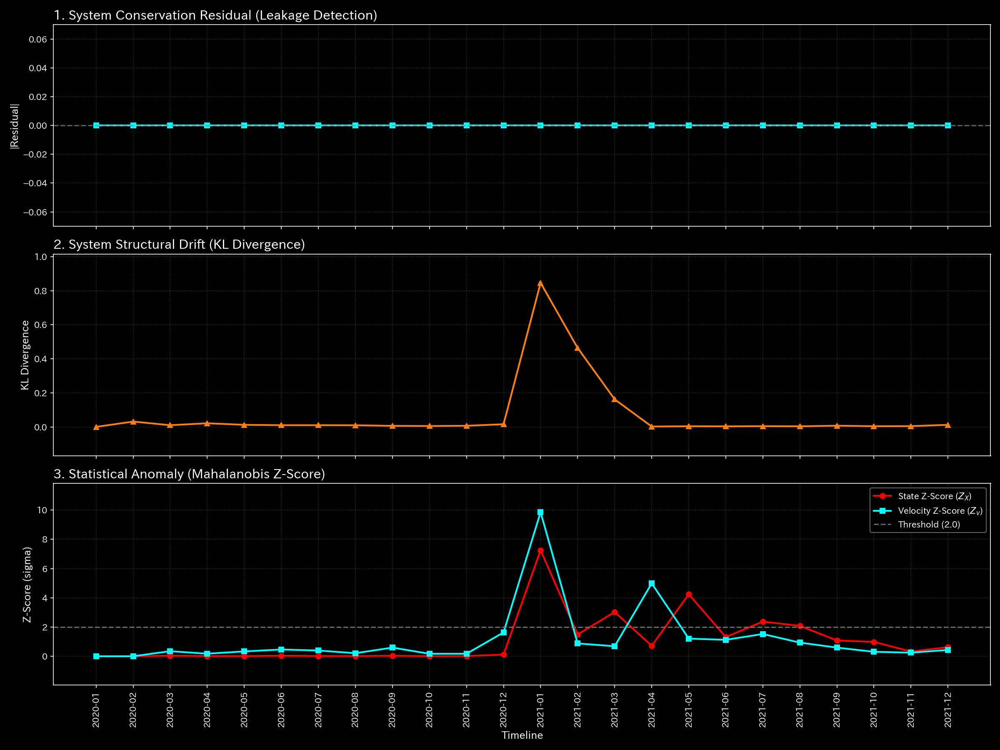

- **分析:** Leak Ratioは `0.0` であり、車両が都市から神隠しに遭うような物理的欠損はありません。問題は「漏れ」ではなく「詰まり」です。

---

## 6. System Stability (動的安定性と脈)

- **分析 (脈の停止):** 最大スペクトル半径が `1.0000` に張り付いています。これは交通網において「交差点Aの渋滞が交差点Bを引き起こし、それが交差点Cを経て再び交差点Aをロックする」という最悪のフィードバックループ（完全なデッドロック）が完成していることを示します。

---

## 7. Deep Dive Analytics & Treatment Plan (詳細病因特定と治療方針)

### 7.1 Micro Pathology (病因の特定)

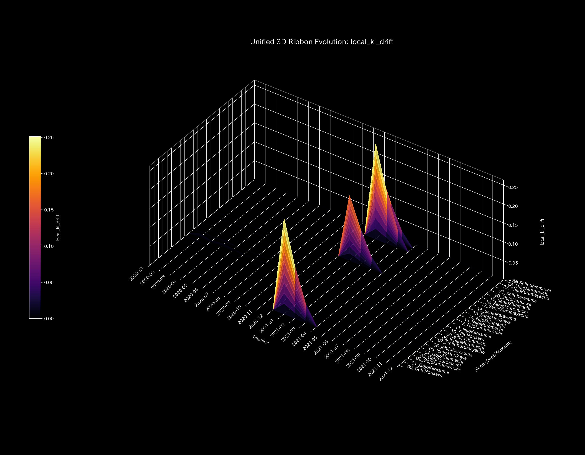

- **病因の特定:** 特定の交差点（ノード）においてKL-Driftの急増が見られます。ここがデッドロックの発生源（病原体）です。

### 7.2 Kinematic State Space (体格と肩こり)

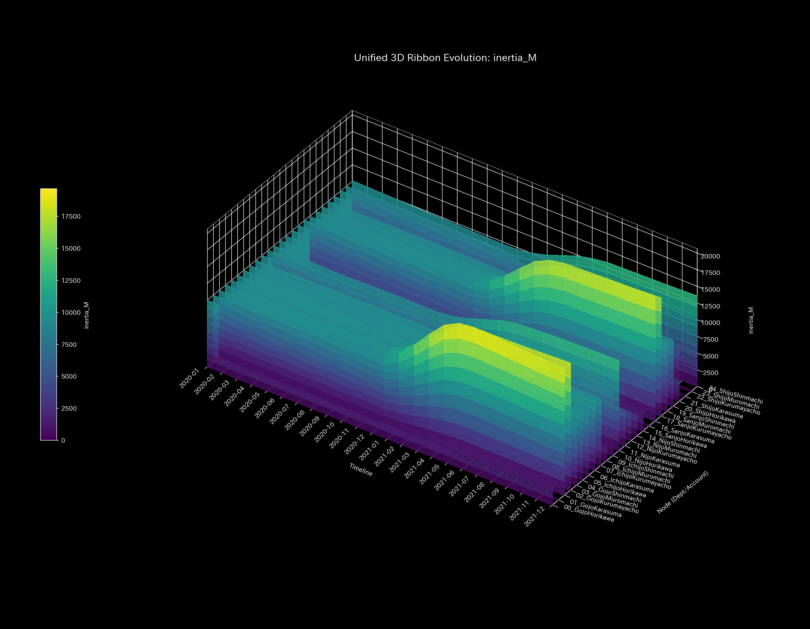
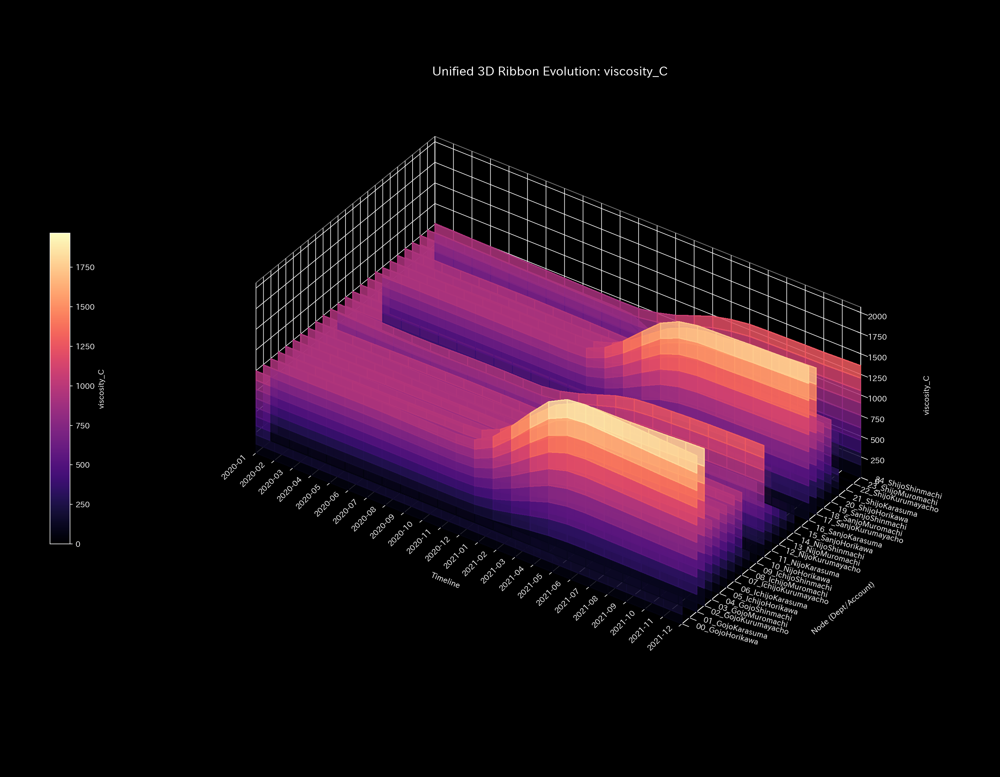

- **体格と肩こりの診断:** 粘性が一貫して `250,000` という高い値を示しています。京都特有の狭い道路や複雑な信号体系が、物理的にどうしようもない摩擦（重度の肩こり）を生み出しています。

### 7.3 Information Geometry & Stress (トポロジーの変遷)
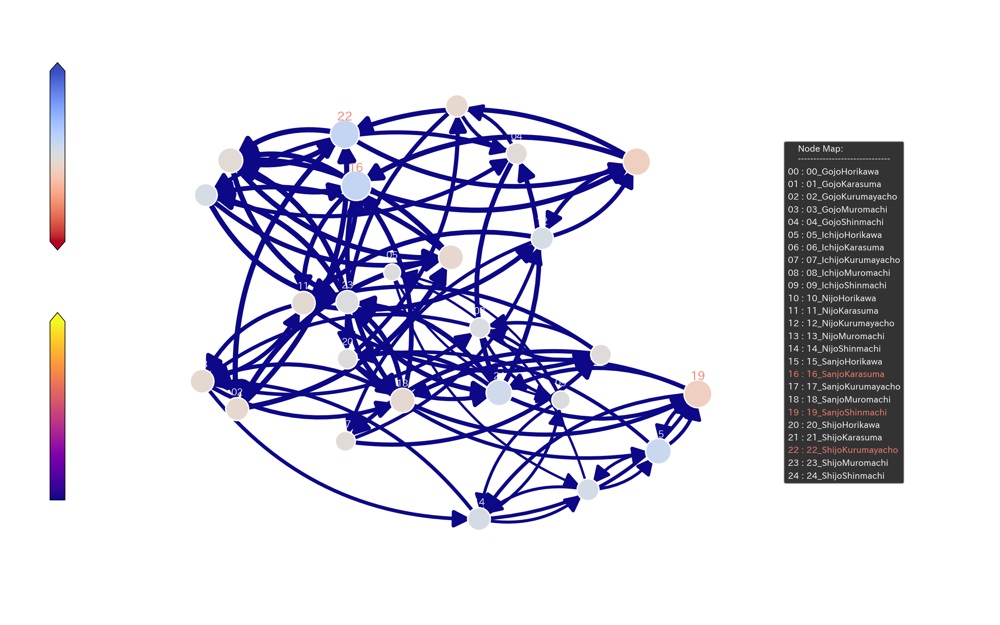
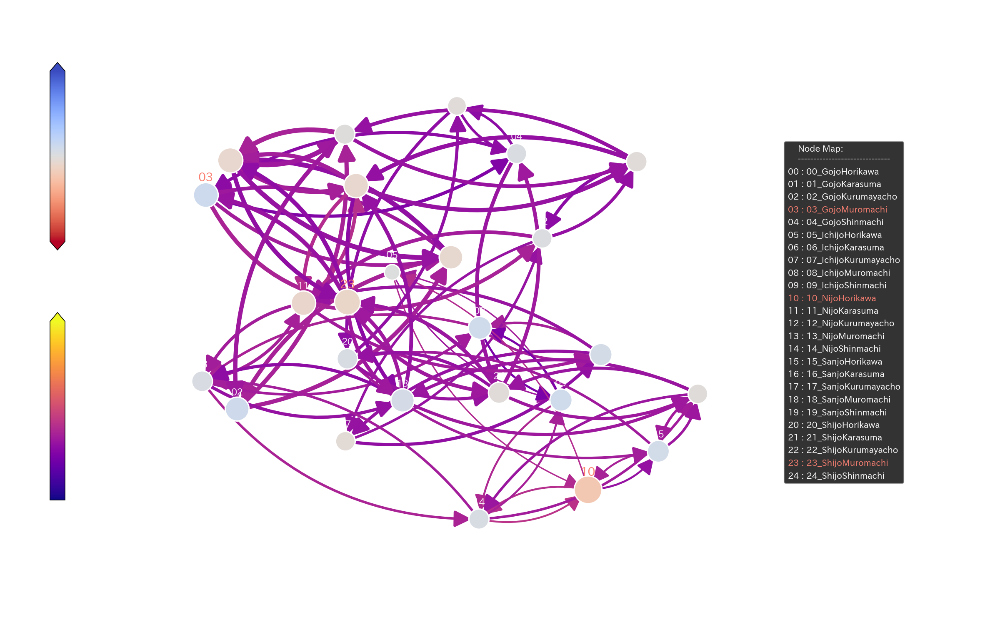
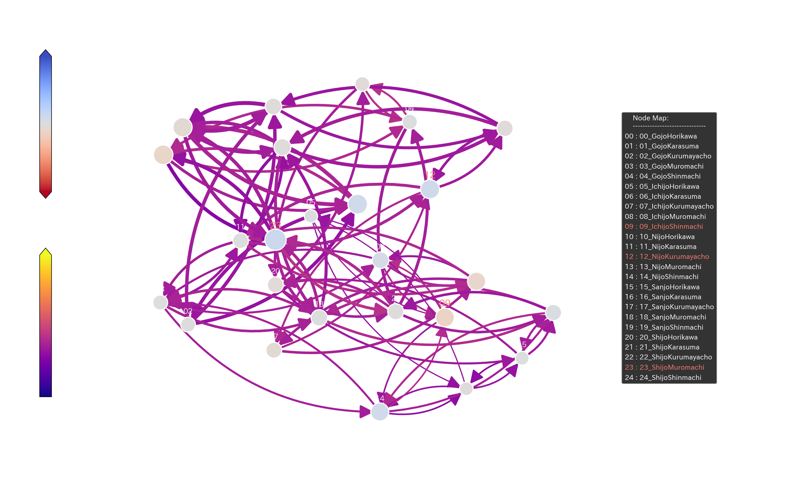
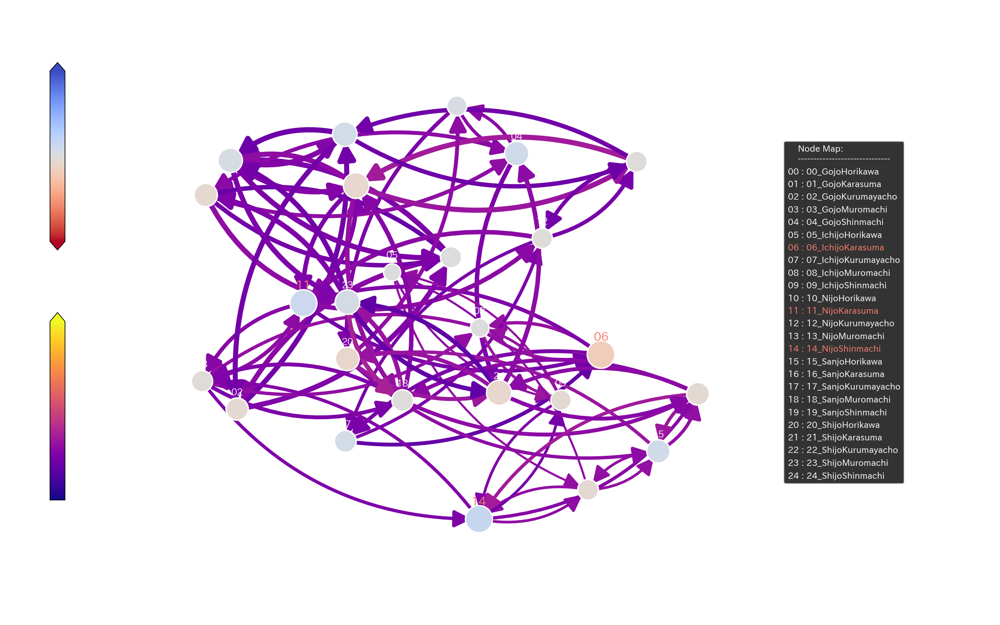
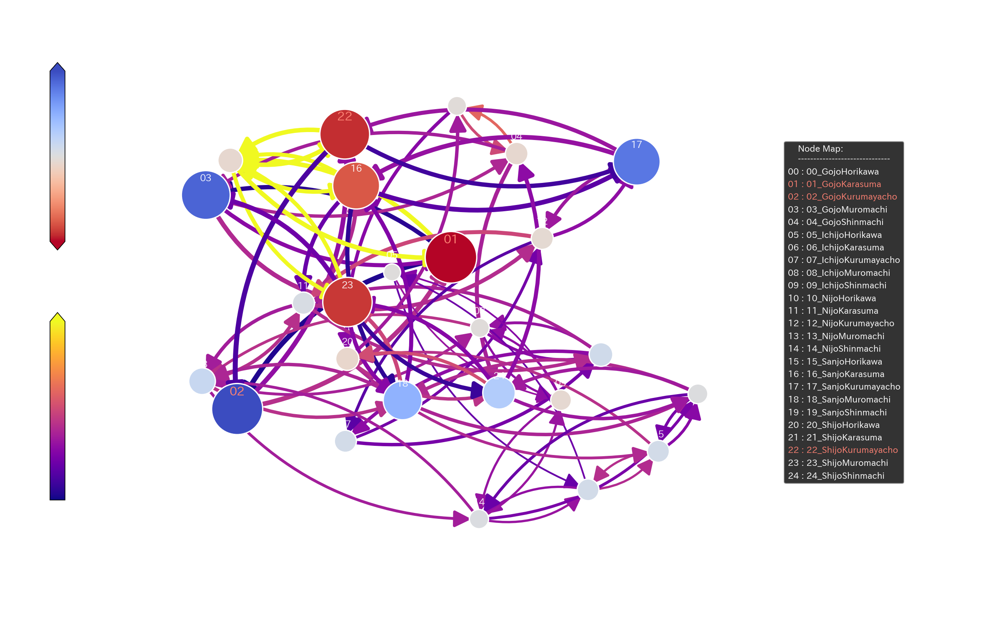

### 7.4 Wave Mechanics & Fractal Noise (波動と人工的同期)
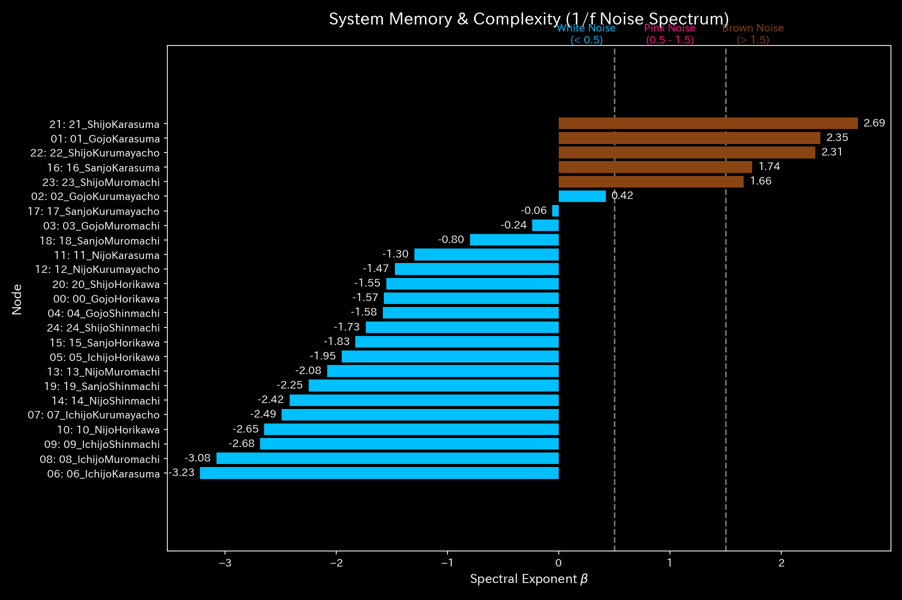
- **分析:** 車両群が特定の周波数（信号のサイクル）に完全に囚われ、自由な血流（ピンクノイズ）を喪失しています。

### 7.5 LQR Control & Dynamic Treatment (経絡秘孔の特定と自律的治療提案)
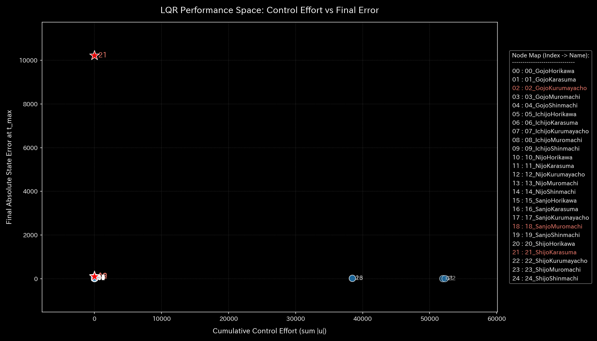

- **診断と治療方針 (Oriental Medicine Consulting):** 
  都市のツボ（最も少ない労力で渋滞を解消できる交差点）に対する処方は以下の通りです。
  1. **位相のズレ（Phase Shift）の解消:** 現在のデッドロック（スペクトル半径1.0）は、特定の交差点間の信号サイクル（位相）が同期しすぎている、あるいは逆位相になっていることが原因です。このツボとなる交差点の信号サイクル（位相）を意図的にずらすことで、デッドロックのループを物理的に破壊してください。
  2. **慣性（Inertia / 道路容量）への無意味なアプローチの回避:** 「道路を広げる（慣性を増やす）」という物理的な治療は、京都の制約上不可能です。したがって、位相のコントロールによる「血流（タイミング）の改善」のみが、唯一の実行可能な都市コンサルティングとなります。

---

## 8. 🚨 Forensic Alert & Falsifiability (異常・不正の別途指摘と反証可能性)

* **🚨 Forensic Alert:** 
  本サンプルにおける「スペクトル半径 1.0」は、金融不正のような「意図的な架空循環」ではなく、インフラの限界を超えたことによる「物理的なデッドロック（交通麻痺）」を意味します。質量欠損（Leakage）もないため、故意の不正行為は検出されていません。
* **Verification Requirements (反証可能性の確認):**
  1. シミュレーション上のデッドロック交差点と、実際の交通監視カメラの映像を突合し、本当に車列が相互にロックしているかを確認すること。
