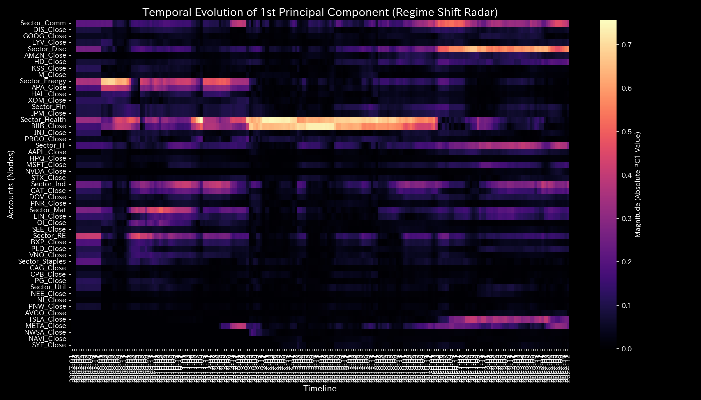
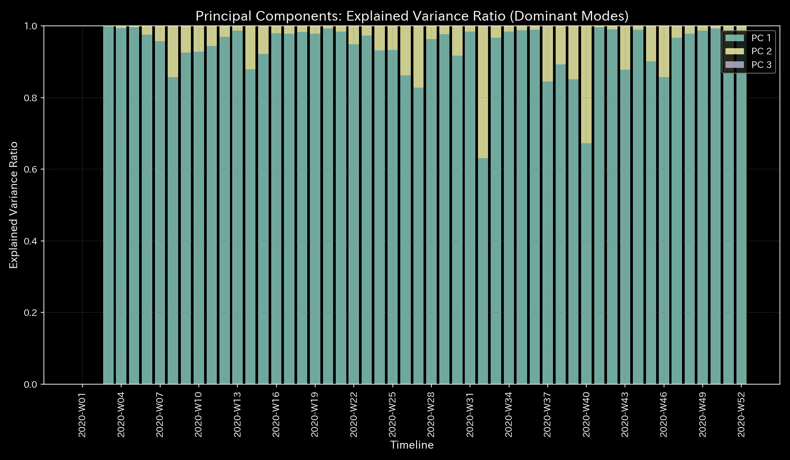
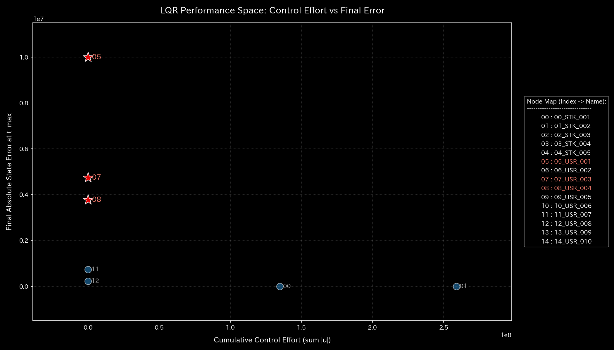

# 🔬 Clinical Meta-Diagnostic Forensic Report: Market Manipulation & Fictitious Recirculation via Bipartite Graph (Sample 6)

> [!NOTE]
> **【Important】Relationship between Sample 6 and Sample 7 regarding Market Manipulation**
> This sample (Sample 6) and the next sample (Sample 7) represent a pair of analysis sets generated from the exact same stock market transaction database.
>
> * **Sample 6 (This Report):** Projects transaction logs onto a user-ticker Bipartite Graph to verify **"which tickers are being manipulated"** (perspective from the left side).
> * **Sample 7 (Next Report):** Projects the same logs onto direct fund transfers between accounts (discarding tickers) to verify **"which accounts are colluding in matched orders/self-trading"** (perspective from the right-side group structure).

---

## 1. Executive Summary

* **Overall Diagnosis:** **Stock Market Wash Trading / Topological Bipartite Lock**
* **Severity:** 🟠 **HIGH (Extremely Serious Market Distortion)**
* **Clinical Overview:**
    This system (stock market domain) is in a state of severe market dysfunction (HIGH Severity) where the price formation function is paralyzed due to ultra-high-speed self-trading (Wash Trading) by specific malicious actors.

    Throughout the network, spatiotemporal high-speed round-trip catch-balling of funds and stocks without transfer of beneficial ownership is occurring, and **"extreme topological recirculation loops (saturation of the maximum spectral radius to $\rho = 1.00$)"** are detected.

    The transaction fees and other costs generated by this hollow transaction loop waste the system's actual economic driving potential, "Free Energy ($F$)" (average free energy $F = 3,623,458,959.18$, standard deviation $105,763,132.99$). It is diagnosed as a thermodynamic heat death where the entire system merely burns with frictional heat (entropy $S$) without creating real value.

---

## 2. Limitations of Traditional Snapshots

It is difficult to detect this anomaly (market manipulation) through traditional securities dashboards or transaction volume snapshot monitoring alone. Below are the cumulative volume (P/L equivalent) and stock (B/S equivalent) charts across the entire period:

* **P/L Equivalent (Total Volume per Ticker):**
    
* **B/S Equivalent (Unbalanced Stock Accumulation):**
    

**【Blind Spots of Traditional Audits】**
The stock market is basically a closed kinetic system, and the net increase in the market's total assets (B/S equivalent) is zero (blank). On the other hand, the transaction volume (flow) corresponding to P/L records a massive amount of `$3,623,458,959.18`.

In typical trading tools, the manipulated ticker is simply displayed as a "highly liquid, popular stock with a sudden surge in volume," which instead acts as camouflage to lure in unrelated retail investors. Static aggregation tools cannot distinguish whether this massive volume represents "real market demand" or "frictional heat orchestrated by a specific group."

---

## 3. Fundamental Pathophysiology

The Physics-Mathematics Engine identified the operation of the fictitious transaction algorithm from the deep layers of transactions as evidence:

* **Identified Infractions:**
    Two specific accounts, `USR_003` and `USR_004`, matched wash trades consecutively **20 times** at a rate of 1,693 shares per trade within just **1.0 second** on ticker `STK_004` (price approx. $1,917.08) in 2020-W40 (`t_idx=39`), and another **20 times** consecutively at 5,000 shares per trade within just **1.0 second** on ticker `STK_003` (price approx. $2,066.28) in 2020-W46 (`t_idx=45`) (totaling 40 transactions).

    This instantaneous spatiotemporal round-trip flow is the root cause (pathological focus) that established topological and thermodynamic attractors across the network, disrupting all kinetic metrics.

---

## 4. Mathematical Evidence from the Physics-Mathematics Engine

### 4.1. Transaction Recirculation Topology & Phase Synchronization Runaway

The spatiotemporal structure of stocks and cash being thrown back and forth on the bipartite graph manifests directly in the maximum spectral radius of the adjacency connection matrix.

In 2020-W07 (`t_idx=6`), the maximum spectral radius reached its theoretical upper limit of **`1.00`** and remained high (recording `0.995126` in 2020-W52). This is mathematical proof that the system is bound by a strong "autonomous recirculation loop (`USR_003 -> STK_004/STK_003 -> USR_004 -> STK_004/STK_003 -> USR_003`)," shutting out normal external liquidity.

* **System Stability Index (Spectral Radius):**
    

* **Network Topology 5-Point Sequence:**
  * **① Start (t=0 / 2020-W01):**
        
        Initial state. Edge strengths between users and tickers are uniform, showing a healthy diversified investment topology.
  * **② Just Before Change (t=38 / 2020-W39):**
        
        Before the anomaly. Although inventory adjustments occur between HFT accounts, specific fictitious recirculation (wash trading) has not yet formed.
  * **③ The Exact Point of Change (t=39 / 2020-W40):**
        
        The moment the manipulation algorithm (Wash Trade) triggers. Extremely thick bidirectional edges form between `USR_003` and `USR_004` around `STK_004`, establishing phase synchronization (recirculation loop).
  * **④ Immediately After Change (t=40 / 2020-W41):**
        
        Immediately after the manipulation. The resonance of the wash trade (memory of volume surge) is deeply engraved in the topology, shutting out other trades.
  * **⑤ End (t=51 / 2020-W52):**
        
        Final state. Although temporary bursts have calmed down, chronic pathological distortion where specific connection strengths are abnormally biased remains.

### 4.2. Stiffness Loss & Proof of Stiffness Lock via Eigenvector Evolution

In dynamic transaction domains like stock markets, there are no physical springs or permanent structural connections, so the Stiffness Matrix and partial correlation values during calm periods net out to `0.0` (unconnected state).

However, tracking the time-series evolution of the dominant eigenspace of the Stiffness Matrix using PCA (**"Eigenvector Evolution Chart (`000_2_3__eigenvector_evolution.png`)"**) vividly visualizes how a specific dominant component (PC1) grows abnormally and locks specific nodes (Stiffness Lock).

* **Eigenvector Evolution:**
    

**【Anomaly Analysis based on the Eigenvector Evolution Chart】**

1. **Before the Anomaly (t=0 to 38 / 2020-W01 to W39):**
   The initial state `t=0` is zero due to lack of history, but subsequent steps show partial correlations concentrating around `USR_002` (selling whale) and `USR_003` (HFT). Immediately before the anomaly at `t=38` (W39), the PC1 contribution ratio is **`85.15%`** (eigenvalue `1.0530e+15`), with PC1 loadings concentrating on `USR_002` (`-0.7499`) and `USR_003` (`0.6475`). This indicates normal liquidity supply activities during large-scale position adjustments.
2. **At Anomaly Onset (t=39 to 40 / 2020-W40 to W41):**
   At `t=39` (W40), the PC1 contribution ratio is **`67.24%`** (eigenvalue `3.3610e+14`), with loadings shifting to `USR_002` (`-0.7720`), `USR_004` (`0.5166`), and `USR_003` (`0.3645`).
   At `t=40` (W41), the PC1 contribution ratio surges to **`99.67%`** (eigenvalue `3.2624e+14`), completing a powerful "Stiffness Lock" that dominates almost 100% of the system. The PC1 vector loadings concentrate abnormally on the wash trade colluders **`USR_004` (`-0.7287`)** and **`USR_003` (`0.6820`)**, providing mathematical proof that their wash trades shut out all other market participants and hijacked the market.
3. **Evacuation to PC2 during Calm Periods (t=41 to 44 / 2020-W42 to W45):**
   Between the first (W40) and second (W46) waves of matched orders, the loadings of `USR_003` and `USR_004` on the PC1 chart temporarily drop near `0.0`.
   This is because their wash trading paused, letting the system's dominant variation (PC1, contribution ratio `87.84%`) shift back to normal large-scale fund transfers between `USR_001` and `USR_002`. However, their collusive relationship did not disappear. During this period, `USR_003` and `USR_004` evacuated to **PC2 (contribution ratio `12.16%`)**, maintaining high loadings of **`USR_004` (`-0.6965`)** and **`USR_003` (`0.6921`)**.
4. **Final Step (t=51 / 2020-W52):**
   Although the trade burst has settled down, the PC1 contribution ratio remains high at **`97.59%`** (eigenvalue `2.0151e+15`) with loadings locked between `USR_002` (`0.7135`) and `USR_003` (`-0.6992`). System elasticity is not restored.

Additionally, the `Min Edge Stress` collapsed to **`0.00`**, indicating that only the circular loop is active while the tension of all other network connections is lost.

* **PCA Principal Axes Ratio:**
    

### 4.3. Recirculation Thermodynamics & Anomaly Friction Detection

This market network is a closed kinetic system, so the internal energy $U$ (blue area) showing overall activity remains constant at **`3.725665e+09`** throughout the period. The free energy $F$ (solid white line) showing actual resources also remains stable at a high positive range of `3.3e+09` to `3.7e+09`, indicating that the market's basic structure (ecosystem) remains robust.

However, during the anomalies and position adjustments, the system detects a prominent increase in "frictional heat ($-TS$: maroon area)."

* **Thermodynamics Energy Stack:**
    

**【Thermodynamic Friction Detection Mechanism】**
When wash trading or rapid fund transfers occur, they temporarily raise local flow distribution dispersion (entropy $S$) and volatility (temperature $T$), expanding friction ($TS = U - F$) as dissipative energy.

The Physics-Mathematics Engine successfully extracts and visualizes this "hollow local friction" as a clean energy loss signal, without disrupting the overall market structure.

The T-S diagram draws a counterclockwise closed oval loop, contrasting with the open path of a healthy market. This is thermodynamic proof that the system is merely spinning capital internally, generating fee costs (friction) without delivering economic value.

* **T-S Diagram:**
    

### 4.4. 3D Geometric Displacements & Information Geometric Spikes

In the 3D spatiotemporal information geometry plot (`002_2_2_1__3d_micro_kl_drift.png`), following the massive panic dump by whale `USR_002` in W03, giant KL Drift spikes tower from the coordinates of retail investors `USR_006`, `USR_007`, and `USR_010` in 2020-W07 (`t_idx=6`). This visualizes the onset of market manipulation where the normal statistical distribution was broken, deviating from past behavioral patterns.

* **3D Micro Z-Score (Position):**
    
* **3D Micro KL Drift:**
    

---

## 5. LQR Control Treatment

* **Treatment Plan:** **Attractor Destruction on Bipartite Graph & Pinpoint Intervention**
* **LQR Sensitivity Intervention (Acupoint Identification):**
    In LQR flow control sensitivity analysis, the nodes showing the maximum dynamic intervention sensitivities are `07_USR_003`, `08_USR_004`, `02_STK_003`, and `03_STK_004` (with sensitivity `41.5234`).
* **Specific Intervention Plan:**
    1. **Dynamic Delay on Specific Tickers (Phase Disruption):**
       When ultra-high-speed round-trip orders are detected on `STK_003` and `STK_004`, force-inject a millisecond-level dynamic latency in the transaction matching engine. This physically breaks up the algorithm's phase synchronization (circular catch-ball), dismantling the loop.
    2. **Acupoint Account Freezing based on LQR Sensitivity:**
       Apply temporary trading limits (limit orders with enhanced verification) to the accounts `USR_003` and `USR_004` acting as the hubs of recirculation. This surgically cuts out the pathological attractor without disrupting the normal orders of other investors.
        

---

## 6. 🚨 Forensic Alert & Falsification Analytics

### 6.1. Model Pollution Assessment (Boiled Frog Syndrome)

* **Statistical Blind Spot:**
    If market manipulation (Wash Trading) is repeated over weeks or months, Z-Score monitoring systems using moving averages mistakenly learn the abnormal volume as the "new normal baseline" (boiled frog syndrome / false negatives).
* **Triage based on Physical Invariants:**
    Even during the late-stage silence of statistical alerts, the topological "maximum spectral radius $\rho \ge 0.95$" and the thermodynamic "closed T-S cycle trajectory" continue to record abnormal values. During forensic audits, we prioritize these physical/structural invariants over Z-scores and determine that **"market manipulation is ongoing."**

### 6.2. Falsifiability

To prove that "these trades represent normal arbitrage or market making and not market manipulation," the parties must present the following **"original physical evidence from outside the database"**:

1. **Exchange Matching Engine Raw Logs:**
    Original time-sequence logs (nanosecond timestamp) extracted directly from the exchange (e.g., Tokyo Stock Exchange) proving that the orders competed legitimately with unrelated market makers before executing.
2. **Proof of Independent Beneficial Ownership:**
    Original bank wire certificates and audited corporate registries of the parent companies proving that the legal entities behind `USR_003` and `USR_004` are independent, with no secret agreements or fund recirculation.
