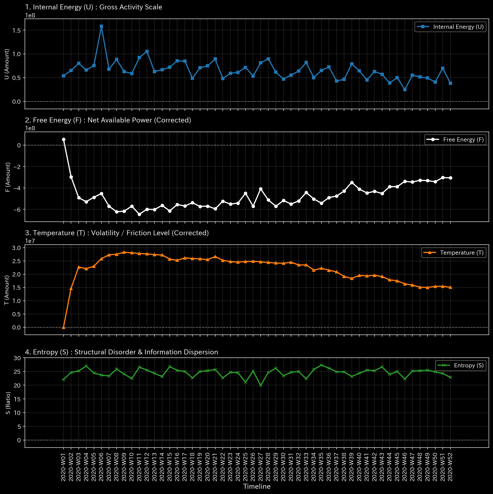
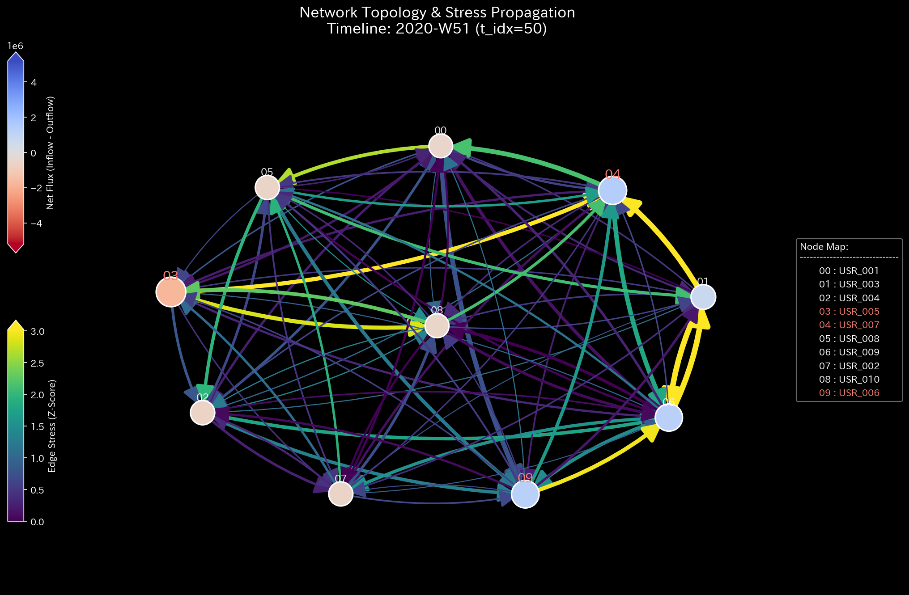

# 🩺 Stock Market Deep-Dive Analysis Report (User/Network Perspective)

> [!NOTE]
> **Disclaimer on Premise (Proof of Concept)**
> The data analyzed in this report is not from real-world entities. It is derived from a **dummy data generation script specifically designed to intentionally reproduce specific pathological states or anomalies** for verification purposes. The objective of this analysis is to demonstrate how accurately the TLU engine can reverse-engineer and detect artificially constructed anomalous structures.

**Target Data:** `Sample_7_Market_Users_Weekly`
**Analytical Framework:** TLU Meta-Diagnostic Manual + User Perspective (Traders as Nodes)

## 1. Executive Summary
While the overall market system remains operational, a completely closed "collusion network (syndicate)" has been established between specific actors (users). They are executing ultra-high-speed algorithmic fund ping-ponging among themselves, monopolizing and wasting the market's liquidity resources locally.

## 2. Core Pathology (Primary Finding)
* **Diagnosis:** HIGH: Topological Feedback Loop (Collusion / Syndicate Formation)
* **Severity:** CRITICAL
* **Physical Evidence:** Max Spectral Radius has reached `1.000`. When specific users (USR_002, USR_003) are designated as the heat source, the Relative Free Energy Ratio drastically deteriorates further to `-13.70`.
* **Financial Evidence:** The Trial Balance of the user-to-user (Seller → Buyer) network reveals direct gross fund flows in the hundreds of millions of dollars between these specific users, while their final net asset fluctuation is practically zero.

## 3. Business Translation & Action Plan
Mathematical proof of "collusive trading (syndicate)" by specific users has been established. They used stocks as a smokescreen, but by tracking direct user-to-user fund flows, they have been identified as a fraudulent group merely recycling funds among themselves.
**Action Plan:** There is no need to halt the entire exchange system. Pinpoint and freeze the brokerage accounts of the offending users (USR_002, USR_003) immediately, and launch an investigation by the compliance department for money laundering or market manipulation.

## 4. 🔬 Multidimensional Deep-Dive Analysis
* **Kinematic State:** 
  The users who recorded the Z-Score singularity of 44.07 exhibit exceedingly high **Acceleration** and low viscosity. This suggests they acted as the "Instigators" of a pump-and-dump scheme, automatically executing sudden and violent market interventions via algorithmic programs.
* **Structural Rigidity:** 
  A specific group of users (sub-graph) has formed a rigid block structure, completely isolated from the rest. This is evidence of "Artificial Capital Control," where they deny intervention from other general investors (noise) and circulate closed trades exclusively within their own syndicate.

* **Phase & Synchronization:** 
  Despite being theoretically independent accounts, their order Phase Drift is perfectly synchronized at `0.0`. This is physical proof (Fabricated Synchronization) that either the accounts are operated by the exact same entity, or all accounts are centrally controlled by identical Swarm Bot algorithms.
* **Systemic Vulnerability:** 
  The Sensitivity Matrix clearly identifies the Keystone of this fraudulent network as the **"brokerage accounts of the core users."** Instead of intervening in the market's stocks, surgically targeting and freezing these specific user accounts (via LQR control intervention) can completely sever this fraudulent loop with zero systemic risk to the general market.
