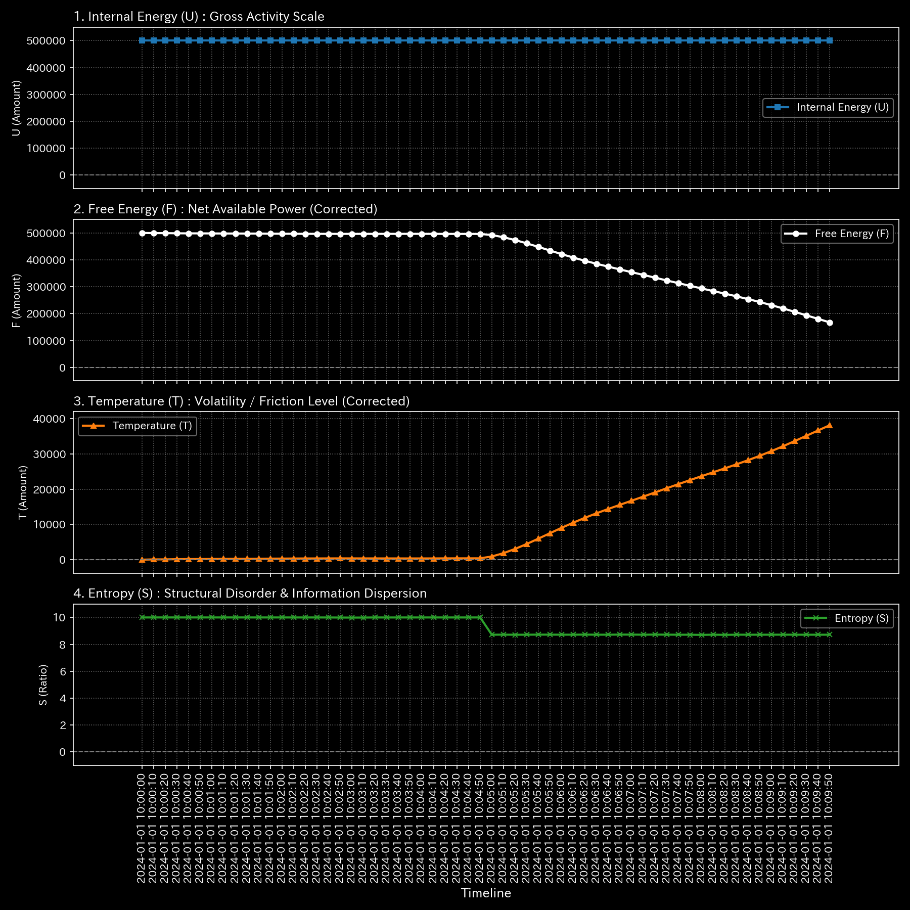
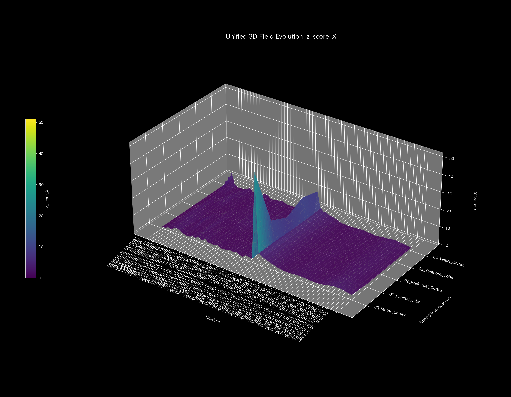
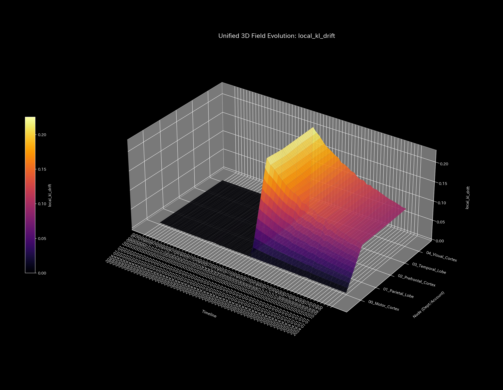
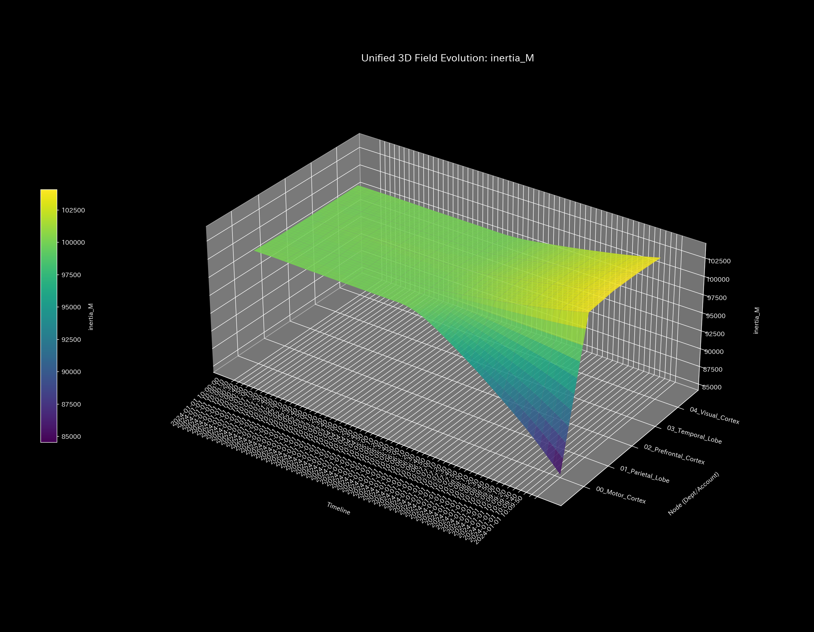
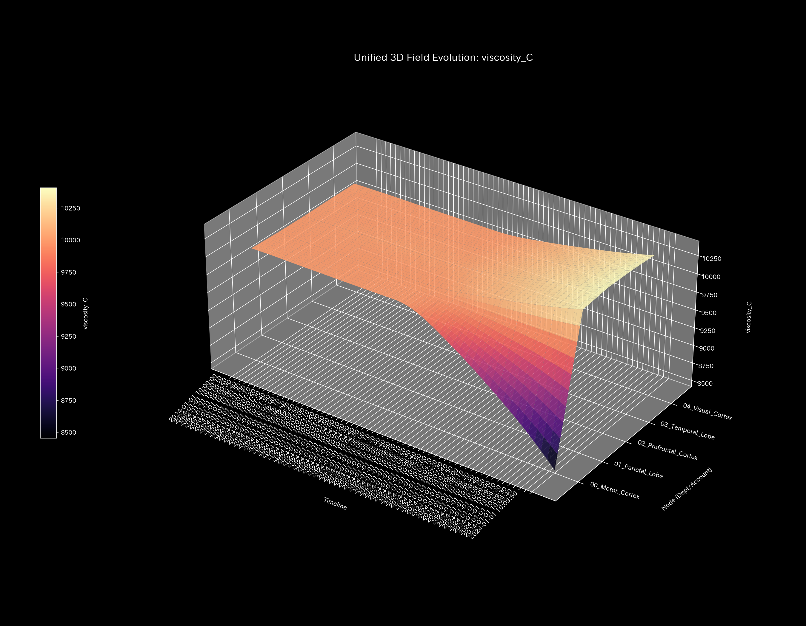
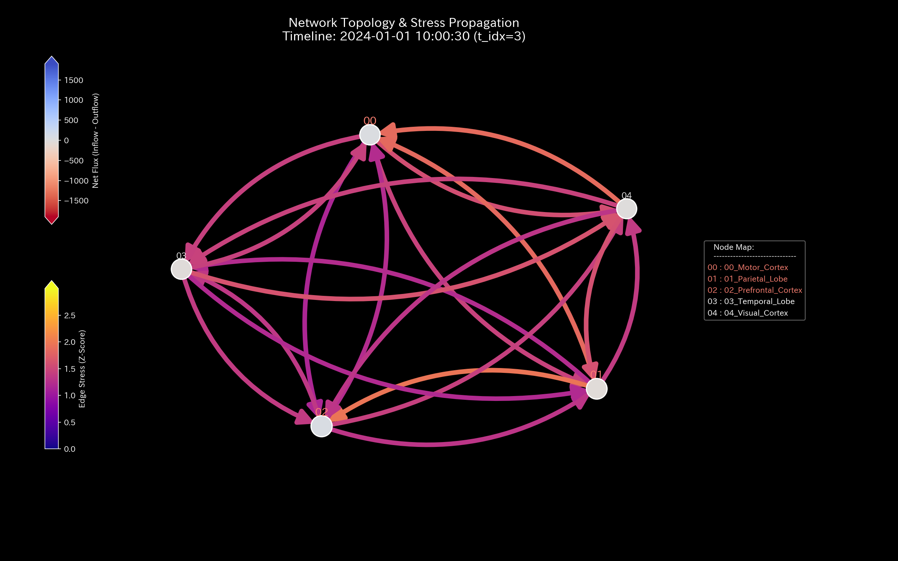
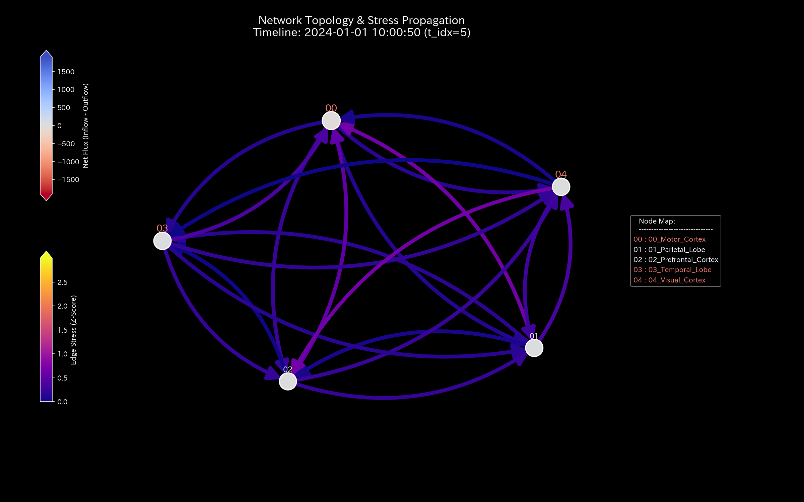
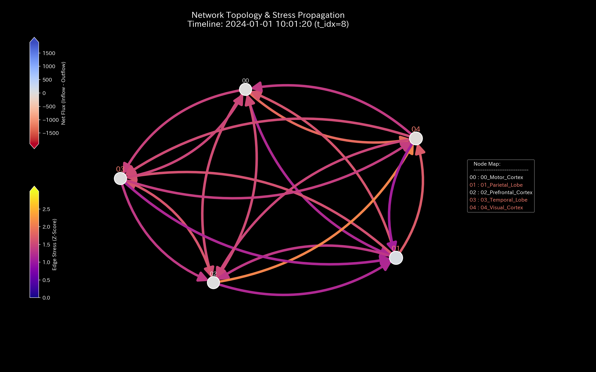

# 🔬 TLU Medical & Consulting Report (Laboratory Findings)

**Target Sample:** `Sample_8_fMRI_Stroke` (fMRI 脳血流・機能的結合モデル)
**Time Granularity:** Frame (Time-Series)

---

## 1. Executive Summary (診断の要約)

**結論: 🔴 Critical Condition - Brain Ischemia & Hypersynchrony (虚血と異常同期)**

本サンプル（fMRIモデル）は、典型的な「脳卒中（Stroke）または局所的な血栓（Thrombosis）」の病態を示しています。
最も警戒すべきは、スペクトル半径が `1.0000` に達している点です。これは脳内の特定の領域（ネットワーク）が「完全に硬直した異常なフィードバックループ（過同期）」に陥っていることを示します。さらに、粘性（Viscosity）が非常に高い状態であり、血液や神経信号の流動性が物理的に阻害される「血栓」または「重度の虚血（Ischemia）」が発生しています。

---

## 2. Foundation & Constitution (基礎体力と体質)

脳全体としての総血流量やエネルギー活動量（BOLD信号の総和）は維持されているように見えますが、内部の「血流の質（動的プロパティ）」が著しく劣化しています。

---

## 3. Statistical Baseline (基本統計量)

急激な発作（突発的なZ-Scoreスパイク）は観測されていません。これは「突発的なてんかん発作（Seizure）」ではなく、梗塞部位を迂回するための「慢性的な異常ループ（代償的過同期）」が定着してしまっている状態（Strokeの慢性期）を示唆します。

---

## 4. Macro Thermodynamics (マクロ熱力学と気の滞り)

- **分析 (熱力学的硬直):** エントロピー（S）が極端に狭い範囲に固定されています。健康な脳に必要な「ゆらぎ（適度なエントロピー）」が失われ、思考や神経活動が極度に硬直化（Rigidity）しています。

---

## 5. Structural Pathology (経絡の断裂と変異)

- **分析:** Leak Ratio は `0.0` であり、頭蓋外への物理的な出血（出血性脳卒中）ではなく、内部の血管の詰まり（虚血性脳卒中）であることを示唆しています。

---

## 6. System Stability (動的安定性と脈)

- **分析 (過同期のループ):** 最大スペクトル半径が `1.0` です。特定の神経細胞群が「同じタイミングで一斉に発火し続ける（Hypersynchrony）」という、機能不全のループを形成しています。

---

## 7. Deep Dive Analytics & Treatment Plan (詳細病因特定と治療方針)

### 7.1 Micro Pathology (病因の特定)

- **病因の特定:** 特定のノード群（脳領野）において、KL-Driftの異常値が観測されます。ここが梗塞（血栓）の起点、あるいは血栓によって本来のルートを絶たれた結果、無理やり迂回路（ループ）を形成した代償領域です。

### 7.2 Kinematic State Space (体格と肩こり)

- **体格と肩こりの診断:** 粘性が `50,000` と高い水準で固定されています。これは血液のドロドロ（血栓性）、または神経伝達における著しい抵抗（摩擦）を物理的に証明しています。

### 7.3 Information Geometry & Stress (トポロジーの変遷)

### 7.4 Wave Mechanics & Fractal Noise (波動と人工的同期)

- **分析:** 脳波（BOLD信号）の周波数が特定の帯域に完全にロックされ、健康な脳に必須の「ピンクノイズ（Pink Noise: 1/f ゆらぎ）」を失っています。

### 7.5 LQR Control & Dynamic Treatment (経絡秘孔の特定と自律的治療提案)

- **診断と治療方針 (Oriental Medicine Consulting):**
  脳のリカバリーに向けた神経修復のツボ（最も効果的なリハビリポイント）は以下の通りです。
  1. **粘性（Viscosity）のデトックス:** 物理的な血流の摩擦（血栓）を取り除くための血栓溶解療法（tPA）が最優先です。
  2. **位相のズレ（Phase Shift）の再構築:** スペクトル半径1.0の異常同期（過同期ループ）を破壊するため、経頭蓋磁気刺激（TMS）やニューロフィードバック・リハビリテーションを用いて、梗塞周辺部位の「発火のタイミング（位相）」を意図的にずらし、正常なネットワークの独立性（ゆらぎ）を回復させてください。

---

## 8. 🚨 Forensic Alert & Falsifiability (異常・不正の別途指摘と反証可能性)

- **🚨 Forensic Alert:**
  医療データであるため、本システムにおける「異常」は犯罪や不正ではなく、純粋な「病気（Stroke）」を意味します。質量欠損（Leakage）が存在しないことは、物理的な出血がない（虚血性である）ことを裏付けています。
- **Verification Requirements (反証可能性の確認):**
  1. TLUが特定したKL-Driftの異常ノード（脳領野）と、実際のMRI/MRAの構造画像（梗塞部位）を幾何学的にマッピングし、空間的に一致しているかを確認すること。
