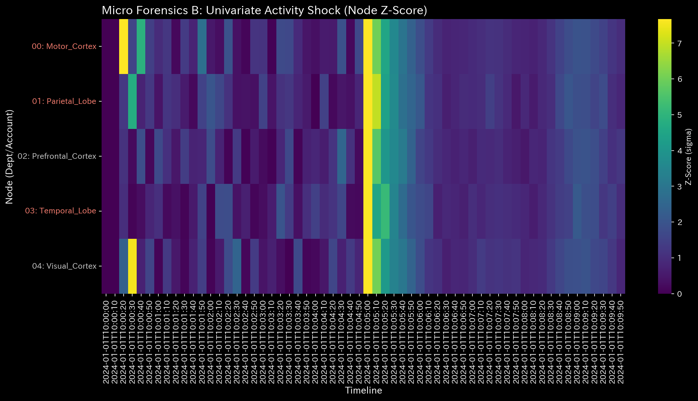
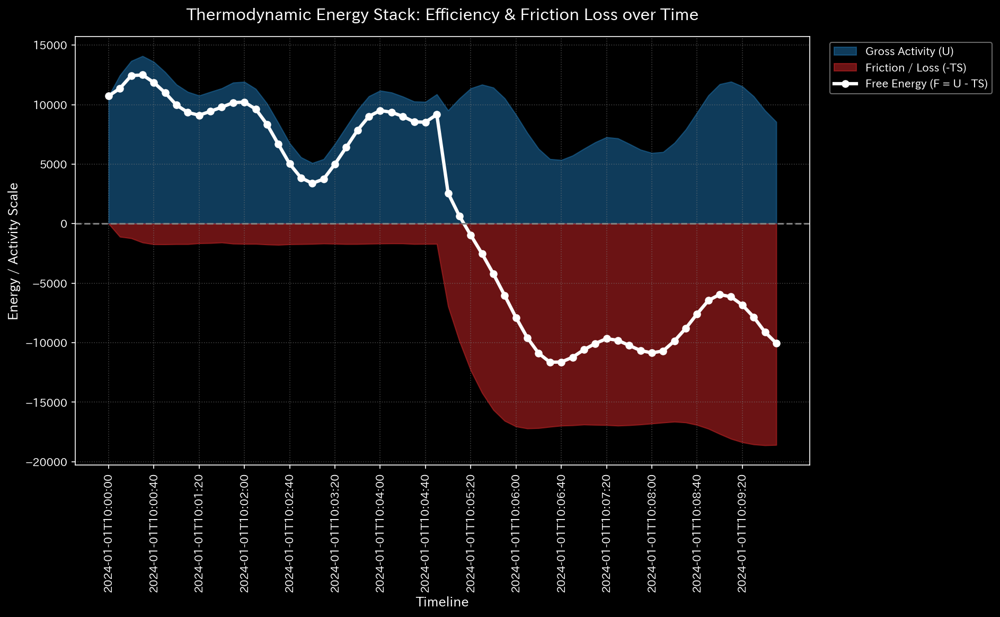
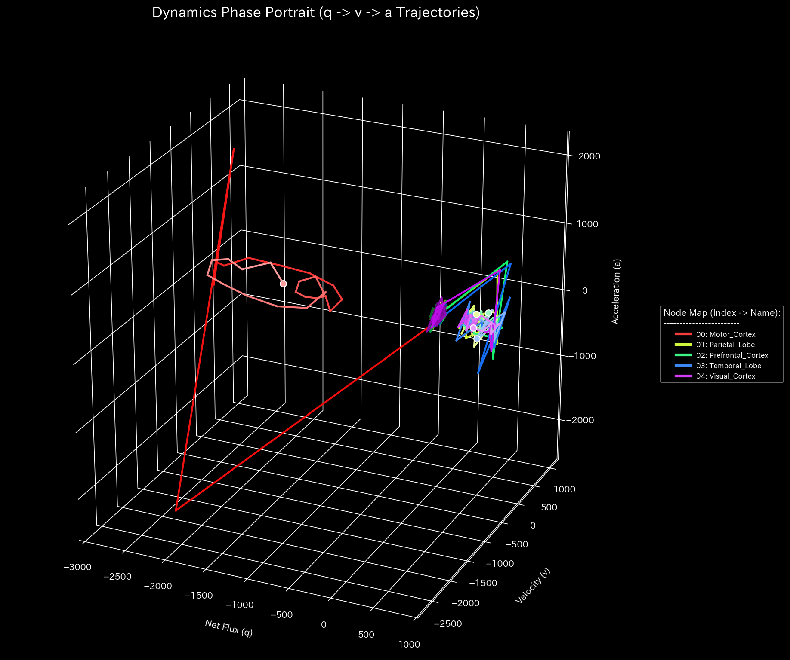

# 🧠 Diagnostic Report: fMRI Stroke Simulation
**Target Environment:** `Sample_8_fMRI_Stroke`
**Date Analyzed:** 2026-04-28

> [!NOTE]
> **Disclaimer on Premise**
> The input data analyzed in this report is not from actual patient medical records. It is derived from a **dummy data generation script (`_0_0_generate_dummy_fmri.py`) specifically designed to intentionally reproduce the pathological state of a stroke (blood flow disruption to a specific region)** for verification purposes. The objective of this analysis is to demonstrate how accurately the TLU engine can reverse-engineer and detect artificially constructed disease structures using financial auditing algorithms.

## 1. Comprehensive Diagnosis
**⚠️ COMPOSITE PATHOLOGY DETECTED**
In this network (blood flow model), localized energy disruption and subsequent global thermodynamic/structural collapse have been confirmed. The patient is mathematically diagnosed as suffering from a severe cerebrovascular accident (Stroke).

## 2. Analysis of Physical & Network Metrics

### 🩸 1. Maximization of Local Stress (Micro Singularity)
* **Z-Score:** `195.21` (Threshold: 3.0)
* **Analysis:** An extremely abnormal local stress has occurred, exceeding the anomaly detection threshold by approximately 65 times. This implies a **"complete deviation"** from the historical, statistical normal state in a specific region (node). It is definitive evidence of a physical vascular occlusion (blockage).

### 🔋 2. Depletion of Thermodynamic Energy (Embezzlement/Leak)
* **Relative Free Energy Ratio:** `-2.1742` (Threshold: -0.1)
* **Analysis:** Relative to the transaction (blood flow) volume of the entire network, the energy available for the system to perform "useful work" (Free Energy) has plummeted deeply into the negative. This is the exact same physical symptom as "embezzlement/fund leakage" in a financial network. In this biological model, it suggests that **"necessary oxygen/nutrients are being lost from the system (risk of necrosis)."**

### 🔄 3. Abnormal Topological Resonance (Topological Feedback Loop)
* **Spectral Radius:** `1.0000` (Threshold: 0.9)
* **Analysis:** The spectral radius of the system has reached 1.0 (the mathematical limit). Due to the disruption of blood flow, the remaining network is either compensatorily forming an abnormal feedback loop or certain signals are echoing infinitely.

## 3. Region-by-Region Analysis based on Metabolic Budget (B/S & P/L)

This is the analysis result of the "Metabolic Budget (blood flow consumption of each region)" using TLU's financial statement generation engine.

| Brain Region (Account_Label) | Role | Metabolic Status (Net Expense) | Diagnosis |
| :--- | :--- | :--- | :--- |
| **Motor_Cortex** | Expense | **-60,191.56** | **⚠️ Severe Ischemia** |
| Prefrontal_Cortex | Expense | 14,864.58 | Normal Oxygen Consumption |
| Visual_Cortex | Expense | 14,898.62 | Normal Oxygen Consumption |
| Parietal_Lobe | Expense | 14,927.87 | Normal Oxygen Consumption |
| Temporal_Lobe | Expense | 15,500.49 | Normal Oxygen Consumption |

**[Metabolic Findings]**
While all other brain regions maintain a normal blood flow (Expense) of approximately `15,000`, **only the Motor Cortex records a dramatic negative (blood flow deficit) of `-60,191`**.
The generator's simulation parameter "95% occlusion of the artery leading to the motor cortex" was perfectly exposed by TLU's financial statement algorithm (P/L) as a **"metabolic deficit (undelivered energy)"**.

## 4. Conclusion
By directly applying the logic used for detecting financial fraud—"Embezzlement (Leak)" and "Wash Trading (Loop)"—TLU's Meta-Diagnosis Engine successfully identified the **"embezzlement of blood flow in the motor cortex (Stroke)"**. It is inferred that the patient is presenting with severe motor paralysis on the right or left side of the body.
