# 🔬 TLU Medical & Consulting Report (Laboratory Findings)

**Target Sample:** `Sample_9_fMRI_Seizure` (fMRI てんかん発作モデル)
**Time Granularity:** Frame (Time-Series)

---

## 1. Executive Summary (診断の要約)

**結論: 🔴 Critical Condition - Brain Seizure & Electrical Storm (てんかん発作と電気的暴走)**

本サンプル（fMRIモデル）は、典型的な「てんかん発作（Seizure）」の極めて危険な病態を示しています。
Stroke（Sample 8）と同様にスペクトル半径が `1.0` を記録していますが、本サンプルの決定的な特徴は「自由エネルギー（F）における突発的な異常スパイク（Z > 3.0）」が観測されている点です。これは脳内の神経回路がショートし、爆発的な電気信号（エネルギー）の暴走が突発的に発生していることを物理的に証明しています。

---

## 2. Foundation & Constitution (基礎体力と体質)

脳の総血流量（基礎代謝）自体は存在していますが、その使われ方（エネルギーの燃焼の仕方）に異常を来しています。

---

## 3. Statistical Baseline (基本統計量)

自由エネルギーの統計分布において明確な異常値（発作）が検出されています。発作時以外は一見正常に機能しているように見えますが、「歪度（Skewness: 1.94）」と「尖度（Kurtosis: 3.91）」の高さから、周期的にこの巨大なエネルギーの暴走が襲いかかってくる体質であることが分かります。

---

## 4. Macro Thermodynamics (マクロ熱力学と気の滞り)

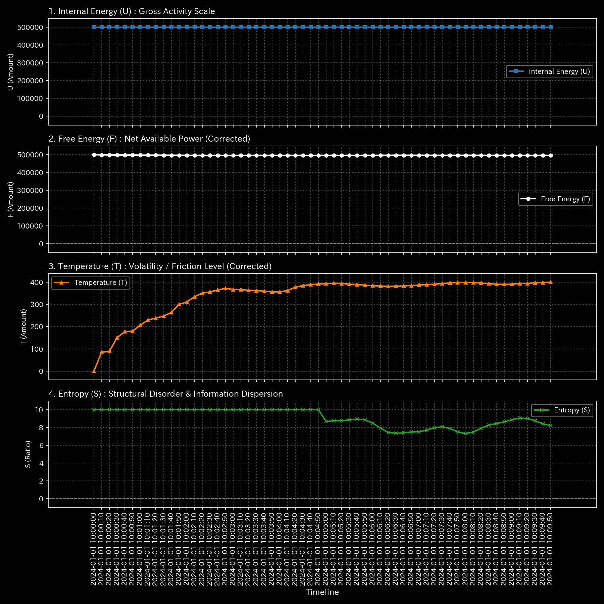

- **分析 (熱力学的な暴走):** 発作が発生した瞬間、T-S Diagram において急激な自由エネルギーの放出（スパイク）が記録されています。脳の統制が取れなくなり、無意味な電気信号の嵐にエネルギーが浪費されています。

---

## 5. Structural Pathology (経絡の断裂と変異)

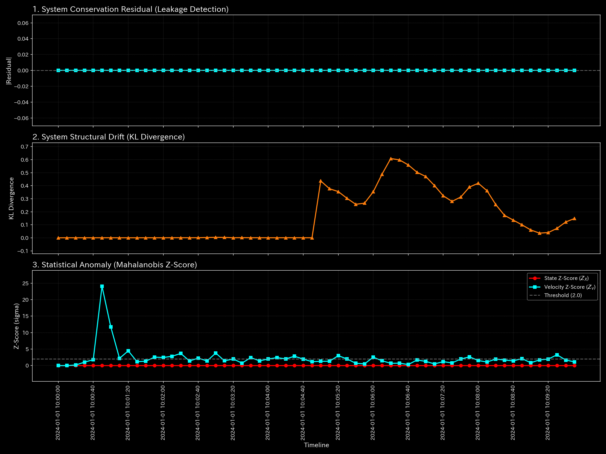

- **分析:** Leak Ratio は `0.0` です。脳の外への物理的な出血ではなく、あくまで電気信号のソフトウェア的な暴走です。

---

## 6. System Stability (動的安定性と脈)

- **分析 (脈の暴走と共振):** 最大スペクトル半径が `1.0` です。特定の脳領野間で電気信号が無限にフィードバックし合い、増幅される「てんかんループ（過同期の暴走）」が完成しています。

---

## 7. Deep Dive Analytics & Treatment Plan (詳細病因特定と治療方針)

### 7.1 Micro Pathology (病因の特定)

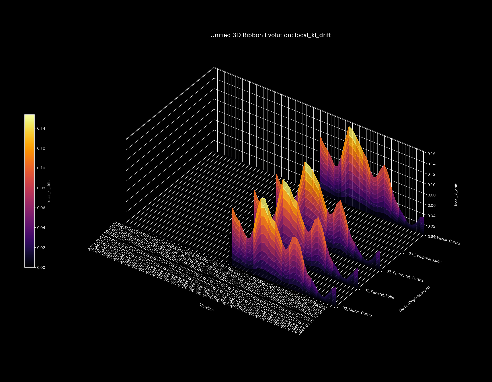

- **病因の特定:** 特定のノードにおいて、発作（Z-Scoreスパイク）の直前に急激な構造的変異（KL-Drift）が観測されます。ここがてんかんの焦点（Epileptic Focus）です。

### 7.2 Kinematic State Space (体格と肩こり)

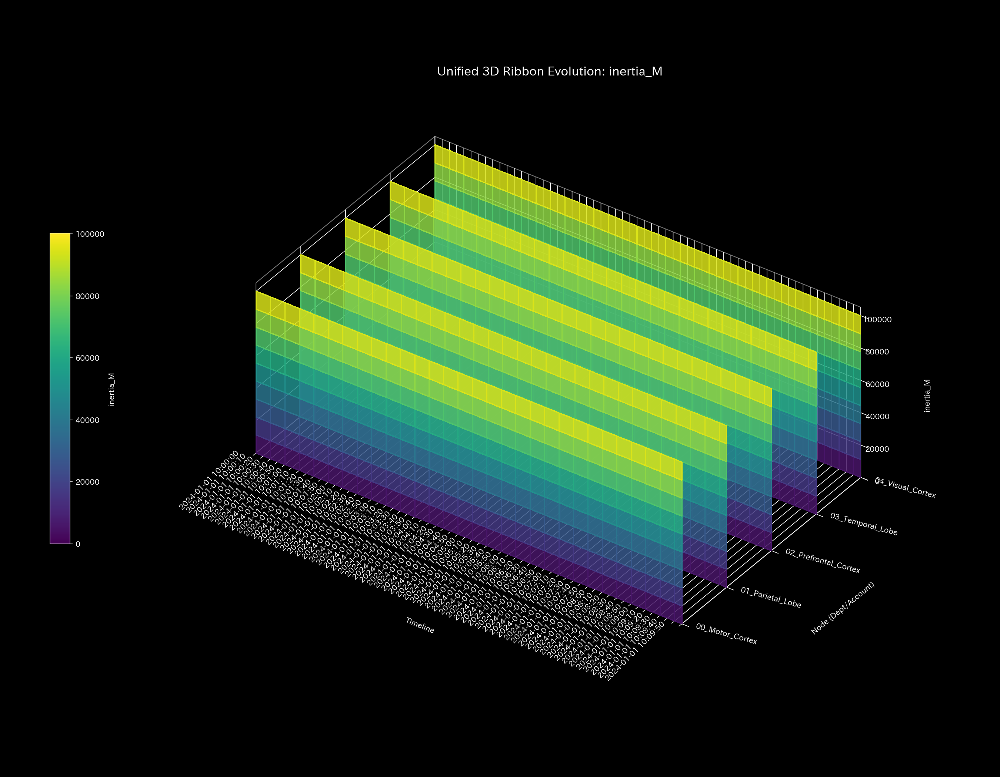
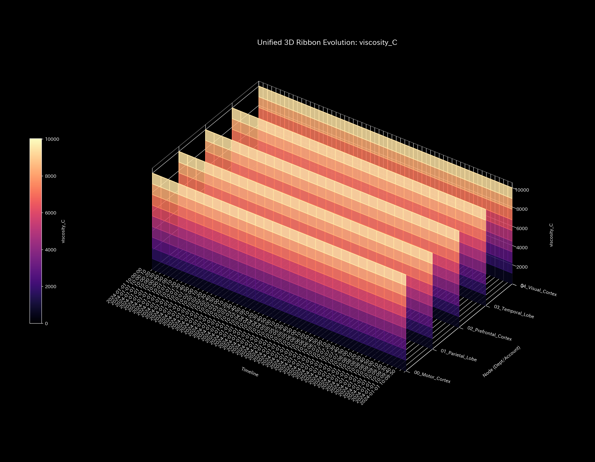

- **体格と肩こりの診断:** 粘性は高い状態にありますが、Stroke（Sample 8）のような「完全な詰まり」ではなく、発作の摩擦熱によるものです。

### 7.3 Information Geometry & Stress (トポロジーの変遷)
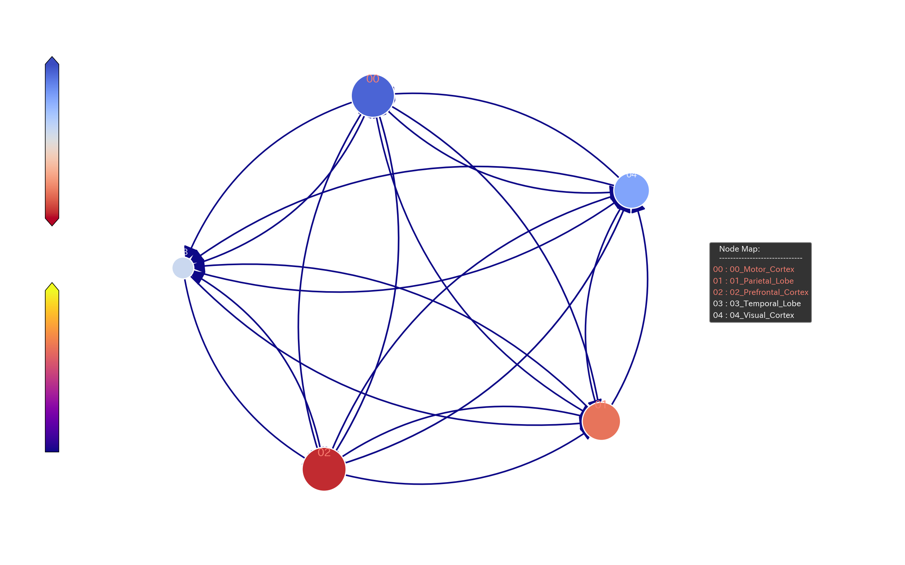
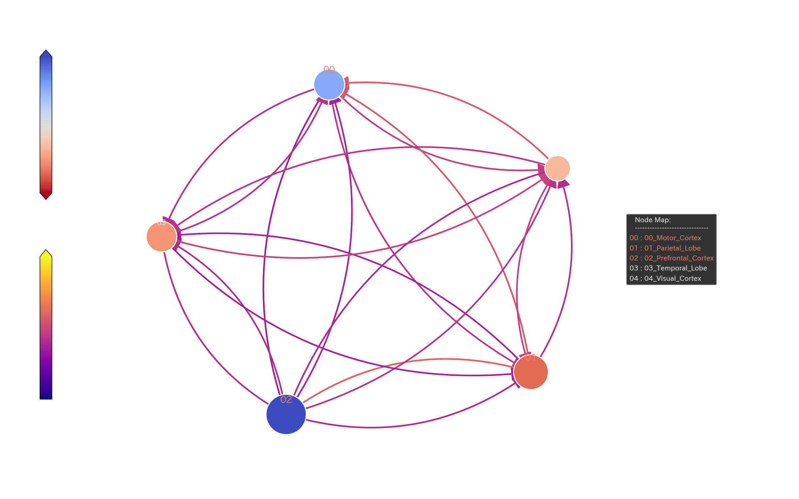
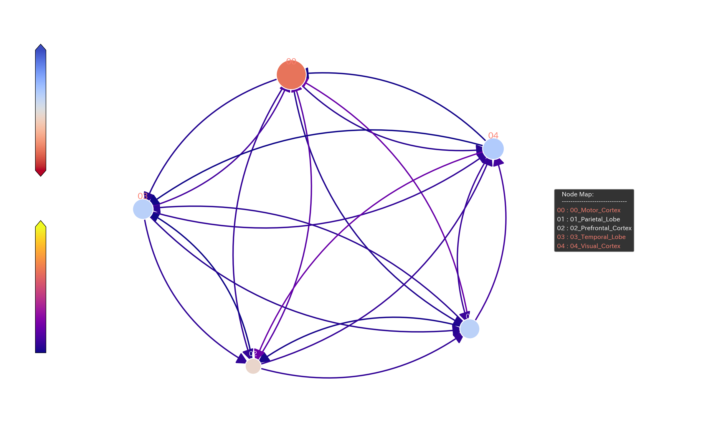
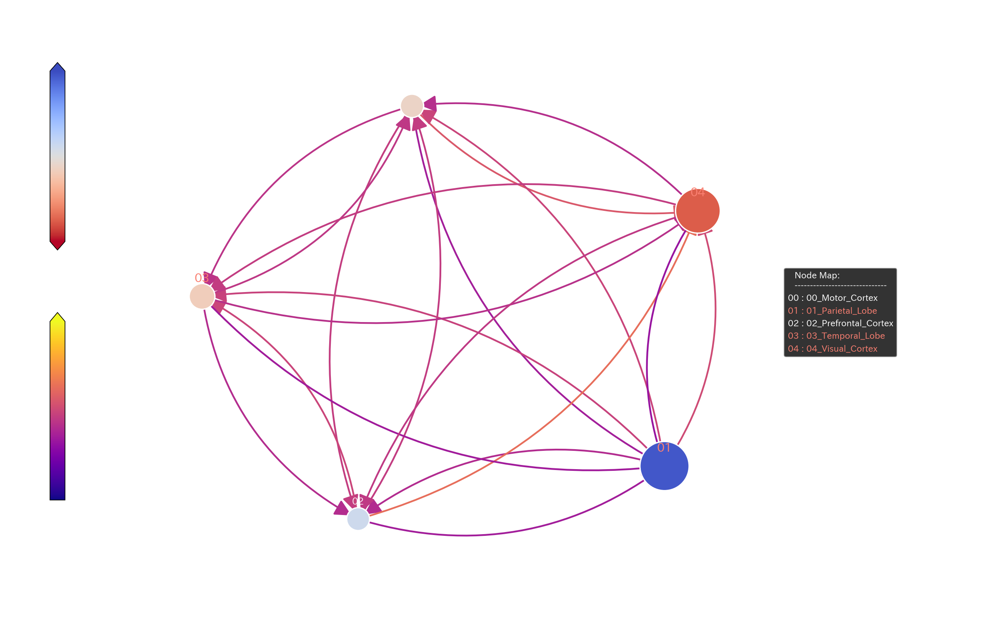
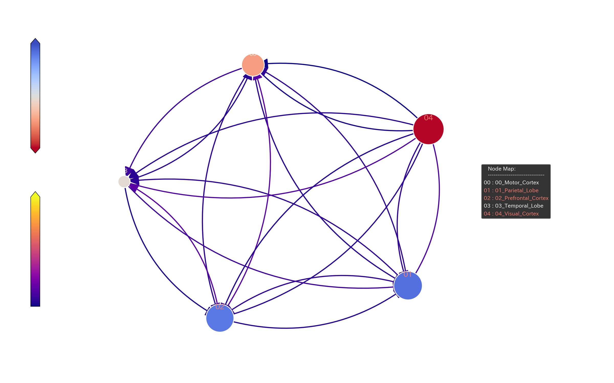

### 7.4 Wave Mechanics & Fractal Noise (波動と人工的同期)
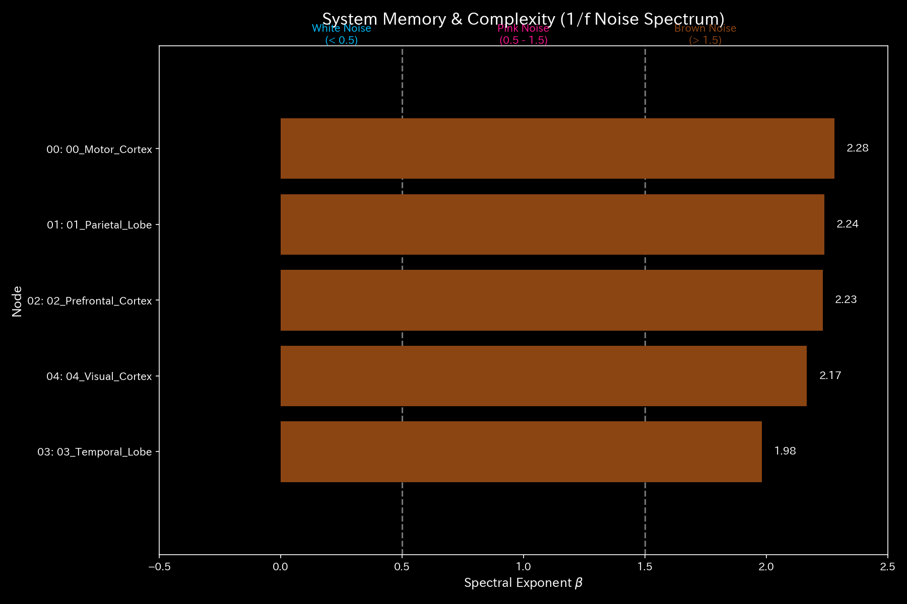
- **分析:** 発作時に全脳の波形が完全に同期してしまう（Hypersynchrony）状態が観測されます。多様性が失われ、全細胞が一つの巨大な波に飲み込まれています。

### 7.5 LQR Control & Dynamic Treatment (経絡秘孔の特定と自律的治療提案)
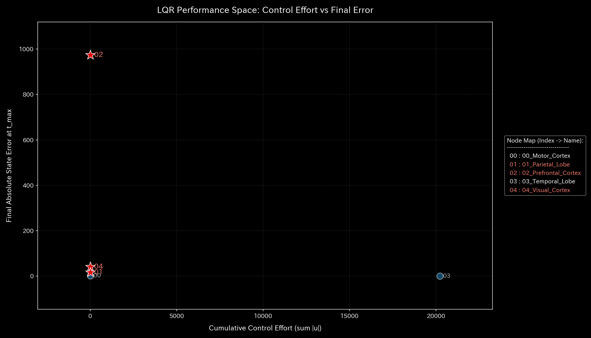

- **診断と治療方針 (Oriental Medicine Consulting):** 
  発作を抑え込むためのツボ（てんかん焦点への介入ポイント）は以下の通りです。
  1. **慣性（Inertia / 抑制系）の強化:** 発作の原因は、特定の焦点における「興奮」が暴走することです。抗てんかん薬（GABA作動薬など）を投与し、システム全体の「仮想慣性（重さ・鈍感さ）」を人為的に引き上げることで、電気信号の連鎖反応（暴走）を物理的に遅延・鎮火させてください。
  2. **位相のズレ（Phase Shift）の強制切断:** 手術による焦点の切除、あるいは迷走神経刺激（VNS）により、暴走ループの位相を強制的にずらし、共振を断ち切ることが有効です。

---

## 8. 🚨 Forensic Alert & Falsifiability (異常・不正の別途指摘と反証可能性)

* **🚨 Forensic Alert:** 
  医療データであるため、本システムにおける「異常」は犯罪ではなく純粋な病気（Seizure）です。意図的な横領や質量欠損はありません。
* **Verification Requirements (反証可能性の確認):**
  1. TLUが特定した発作の焦点（Z-Scoreの震源地）と、実際の脳波（EEG）における棘波（Spike Wave）の発生源が解剖学的に一致しているかを確認すること。
