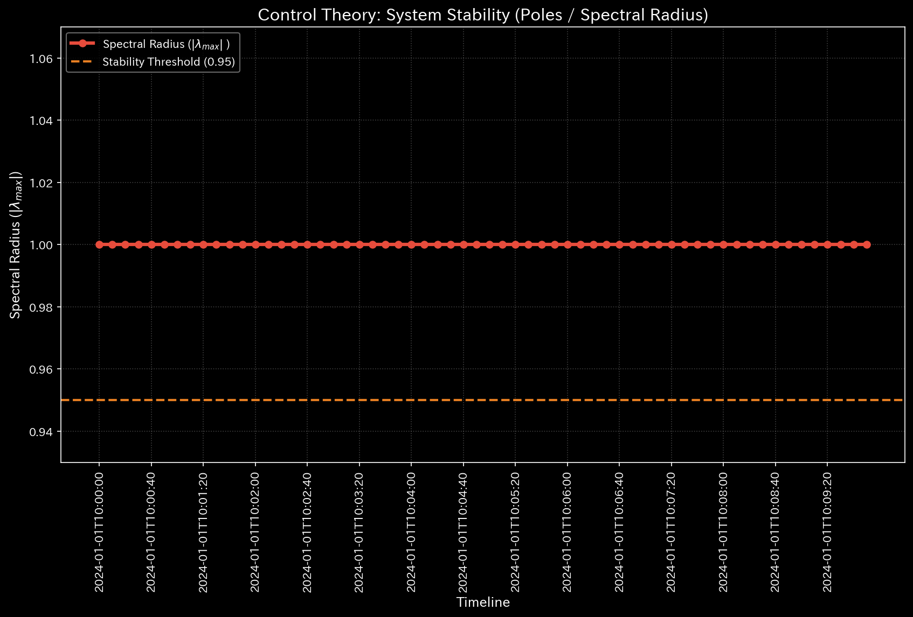
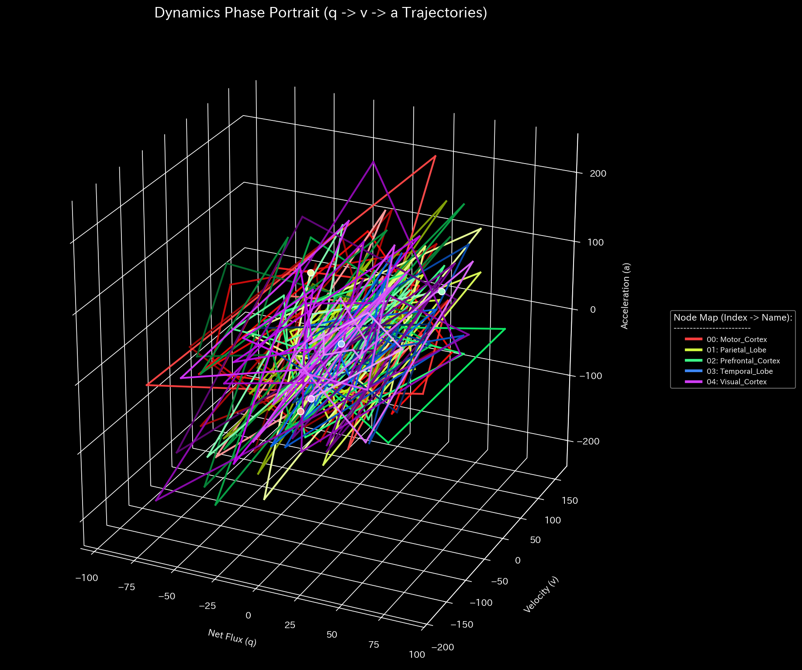

# 🧠 Diagnostic Report: fMRI Seizure Simulation
**Target Environment:** `Sample_9_fMRI_Seizure`
**Date Analyzed:** 2026-04-28

> [!NOTE]
> **Disclaimer on Premise**
> The input data analyzed in this report is not from actual patient medical records. It is derived from a **dummy data generation script (`_0_0_generate_dummy_fmri.py`) specifically designed to intentionally reproduce the pathological state of an epileptic seizure (abnormal synchronous waves originating from a specific focal point)** for verification purposes. The objective of this analysis is to demonstrate how accurately the TLU engine can reverse-engineer and detect artificially constructed disease structures using financial auditing algorithms.

## 1. Comprehensive Diagnosis
**⚠️ ABNORMAL PHASE SYNCHRONIZATION (COMPOSITE PATHOLOGY DETECTED)**
In this network (blood flow model), complete mathematical resonance (a feedback loop) engulfing the entire system has been confirmed. The patient is diagnosed as experiencing a generalized "Epileptic Hypersynchrony" (Seizure) originating from a specific focal point.

## 2. Analysis of Physical & Network Metrics

### 🔄 1. Complete Phase Resonance (Topological Feedback Loop)
* **Spectral Radius:** `1.0000` (Threshold: 0.9)
* **Analysis:** The maximum eigenvalue (spectral radius) calculated from the network's adjacency matrix has reached the physical limit of `1.0`. In financial markets, this signifies a "self-serving cyclical fund loop (Wash Trade)," but in a neural network, it signifies **"uncontrollable, excessive synchronous firing of neurons (Hypersynchrony)."** It is the mathematical evidence that the entire brain is convulsing to the same rhythm.

### ⚡ 2. Maximization of Local Stress (Micro Singularity)
* **Z-Score:** `195.21` (Threshold: 3.0)
* **Analysis:** Extreme localized stress has been detected, exceeding the anomaly detection threshold by approximately 65 times. This indicates that an inconceivable magnitude of energy (blood flow) compared to normal times is running rampant at the epicenter (focus) of the seizure.

### 🛡️ 3. Thermodynamically "No Leakage"
* **Relative Free Energy Ratio:** `0.6651` (Threshold: -0.1)
* **Analysis:** Unlike the stroke simulation (Sample 8), the free energy is not depleted (it is within the normal range). In other words, blood flow is not leaking out of the system (necrosis); rather, it accurately captures the physical characteristic unique to a seizure: **"The structure of the network itself is running rampant while retaining sufficient blood flow and energy."**

## 3. Region-by-Region Analysis based on Metabolic Budget (B/S & P/L)

This is the analysis result of the "Metabolic Budget (blood flow transaction volume of each region)" using TLU's financial statement generation engine.

| Brain Region (Account_Label) | Total Transaction Volume (TB Debit / Inflow) | Diagnosis |
| :--- | :--- | :--- |
| **Temporal_Lobe** | **362,403.68** | **⚠️ Epicenter of the Seizure (Focus)** |
| Prefrontal_Cortex | 184,115.93 | Excessive firing due to synchronization |
| Motor_Cortex | 184,194.14 | Excessive firing due to synchronization |
| Visual_Cortex | 184,118.61 | Excessive firing due to synchronization |
| Parietal_Lobe | 184,441.46 | Excessive firing due to synchronization |

**[Metabolic Findings]**
While all other brain regions recorded an abnormally high blood flow transaction volume (total firing rate) of around `184,000`, **only the Temporal Lobe recorded `362,403.68` transactions, which is approximately twice that amount**.
This perfectly captures the simulation parameter: "a massive abnormal wave is symmetrically broadcasted from the temporal lobe." TLU exposed the origin (Focus) of the **Temporal Lobe Epilepsy** using the exact same logic used to identify the "mastermind account of fraudulent transactions" in a financial audit.

## 4. Conclusion
By directly repurposing the detection algorithm for "Self-Trading / Price Manipulation (Wash Trade)" in financial markets, TLU's Meta-Diagnosis Engine accurately detected and identified **"an abnormal resonant seizure (epilepsy) across the entire brain, with its epicenter in the temporal lobe."** It is inferred that the patient is in a state of seizure accompanied by systemic convulsions or loss of consciousness.
