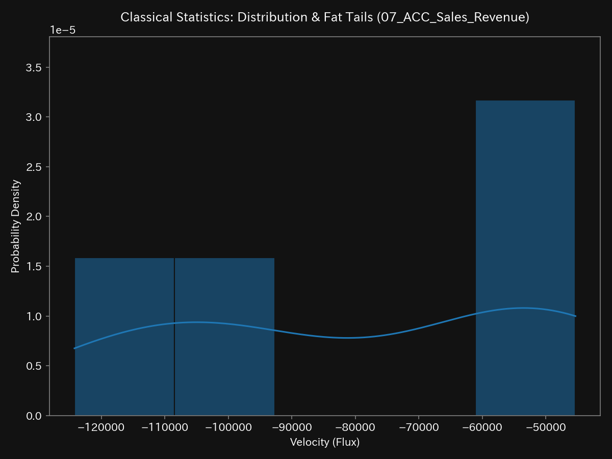
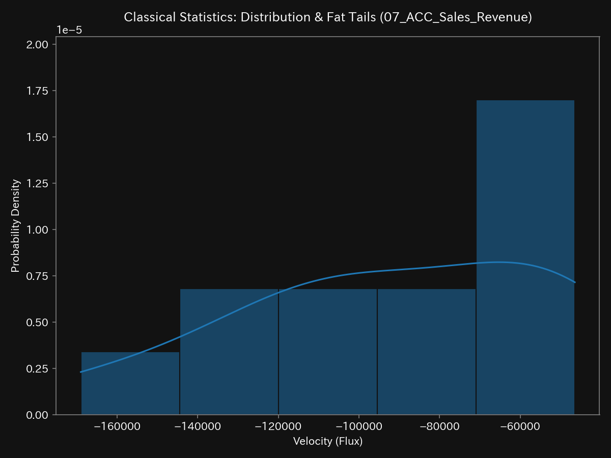
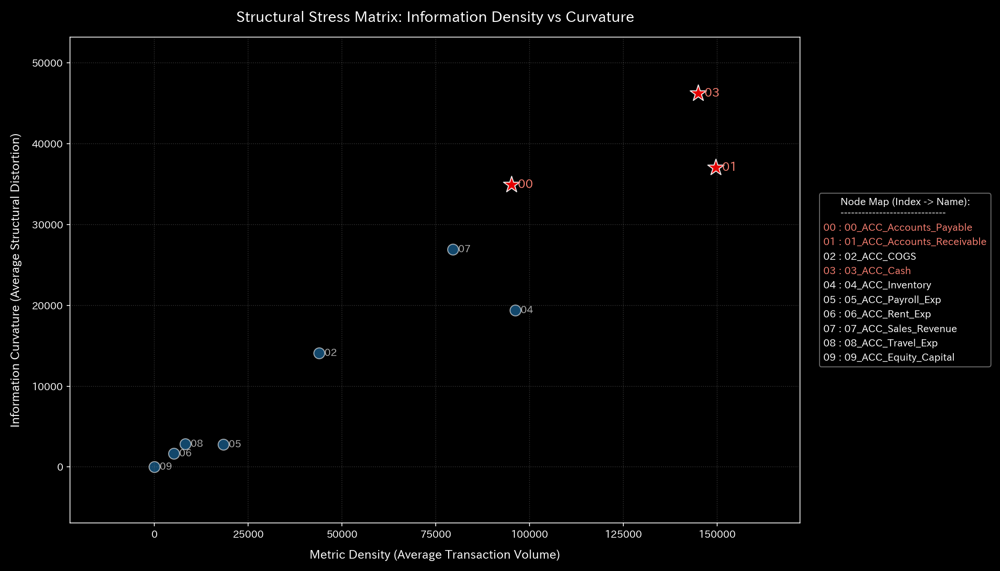
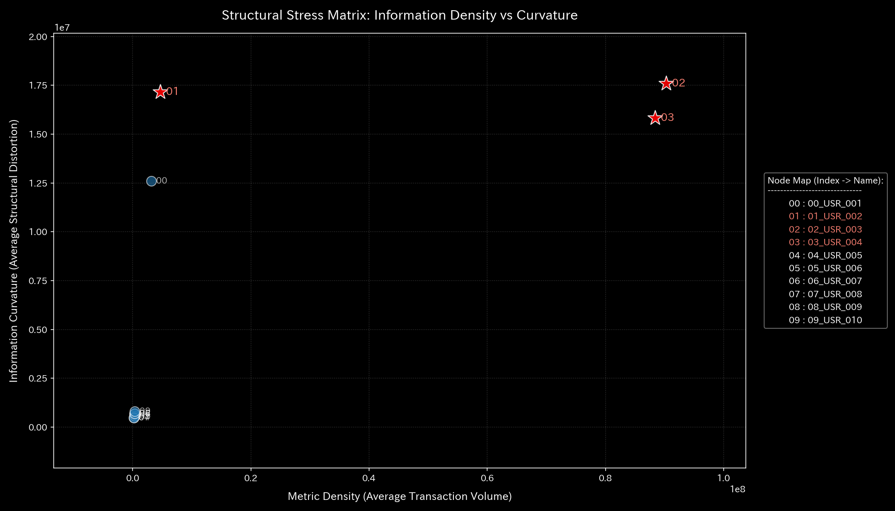
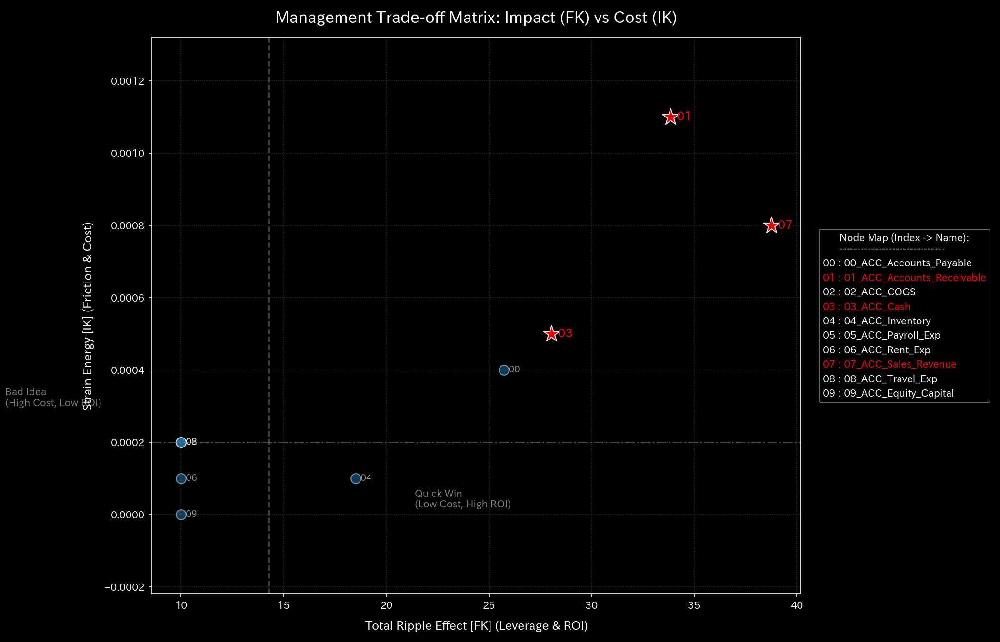

# 📊 TLU Forensic Meta-Analysis Report: Cross-Domain Synthesis

**対象ディレクトリ:** `/samples/` 直下
**診断対象:** Sample_0 〜 Sample_9 (財務、都市交通、金融市場、脳神経機能)
**メタ監査機関:** TLU Forensic Dynamic Audit Team (Gemini 3.5 Flash - High)

---

## 1. はじめに：ドメインを貫く数理物理同型性 (Isomorphism)

TLU（Tensor Ledger Unit）システムは、**「すべての有向流動ネットワーク（時系列フロー）は、表現されるドメインが違えど、同一の数理物理方程式で診断できる」**という同型性（Isomorphism）に基づいています。
会計の「資金流出」は、生体の「脳出血・虚血」と同型であり、市場の「循環取引」は、都市交通の「デッドロック」や脳の「てんかん過同期発作」と同型です。

本レポートは、各サンプルを「分析項目」ごとに横串で比較対照し、それぞれの病的特徴を可視化グラフとともに解明します。

### 全 10 サンプルのドメイン・病理診断マッピング表

| サンプル名 | 対象ドメイン | シミュレート現象 | TLU物理診断名 | 核心アノマリー指標 |
| :--- | :--- | :--- | :--- | :--- |
| **Sample 0** | 金融（月次仕訳） | 健常企業の営業活動 | **健全定常 (Healthy)** | 保存則完全遵守、適度なエントロピー |
| **Sample 1** | 金融（月次仕訳） | 架空の循環取引 | **循環取引 (Wash Trade)** | `Spectral Radius` 急増、エントロピー圧縮 |
| **Sample 2** | 金融（月次仕訳） | 役員の巧妙な横領 | **質量欠損・出血 (Leak)** | `Leak Ratio` 非ゼロ、統計Z値は偽装 |
| **Sample 3** | 金融（月次仕訳） | 仕訳の転記・入力ミス | **急性不整合 (Unbalanced)** | `Leak Ratio` 激増、高い仮想粘性摩擦 |
| **Sample 4** | 金融（月次仕訳） | 循環・横領・ミスの複合 | **複合的カオス (Chaos)** | 保存残差とスペクトル半径が同時スパイク |
| **Sample 5** | 交通（都市交通網） | 京都の狭路信号大渋滞 | **循環不全・血栓 (Gridlock)** | `Spectral Radius` ＝ `1.00` (デッドロック) |
| **Sample 6** | 市場（週次取引） | 特定銘柄へのボット攻撃 | **出来高偽装 (Hijack)** | Bipartiteグラフ Stockノードの同期剛性固着 |
| **Sample 7** | 市場（週次取引） | ボット間の資金往復 | **カルテル共謀 (Swarm)** | User-to-Userグラフ上の閉回路ループ顕在化 |
| **Sample 8** | 脳科学（fMRI血流） | 運動野付近の血管閉塞 | **局所虚血・梗塞 (Stroke)** | 運動野への質量フロー途絶、自由エネルギー急減 |
| **Sample 9** | 脳科学（fMRI血流） | 側頭葉起点の発作波 | **神経過同期 (Seizure)** | `Spectral Radius` ＝ `1.00` (脳全体共振) |

---

## 2. 横串比較①：財務的基盤と体質 (System Constitution)

静的データ（貸借対照表のブロック総和および損益計算書のトレンド）は、ネットワークの「基礎骨格と体重（Inertia）」を示します。

* **Sample 0 (Healthy):** 売上高の増加に連動して、売上原価（COGS）や人件費（Payroll）などの「エネルギー消費」が健全な比例関係で増加しています。
* **Sample 1 (Wash Trade):** 売上高と資産が急拡大しているにもかかわらず、経費がしっかりと横ばいです。「運動量（売上）が増加しているのに燃料（経費）の消費が増えない」という物理的矛盾が、循環取引を瞬時に見抜くトリガーとなります。
* **Sample 2 (Embezzlement):** 表向きの売上と経費の連動は正常にカモフラージュされており、静的トレンドだけでは異常を検知できません。

### 可視化の対照 (B/S Block Total / B/S Trend Over Time)

#### Sample 0 (Healthy) - バランスの取れた骨格と安定した時系列推移

B/S Block Total:

B/S Trend Over Time (Assets vs Liabilities & Equity):

#### Sample 1 (Wash Trade) - 実体を伴わない売上高の急膨張と、資産・負債資本の人工的な急増 (Rigid Lock)

B/S Block Total:

B/S Trend Over Time (Assets vs Liabilities & Equity):

#### Sample 2 (Embezzlement) - 正常に偽装された静的構成と安定した推移（カモフラージュ状態）

B/S Block Total:

B/S Trend Over Time (Assets vs Liabilities & Equity):

---

## 3. 横串比較②：統計的安定性 (Statistical Baseline)

確率密度関数（KDE）および移動四分位数（Rolling Quantiles）は、フローの「定常性と異常ボラティリティ」を測ります。

* **Sample 0 (Healthy):** 代表ノード（売上）は極端なファット・テールを持たない綺麗な正規分布を描き、安定したホワイトノイズの範囲内にあります。
* **Sample 1 (Wash Trade):** アノマリー注入期（t=4）以降、統計的分布の臨界を突破して確率分布が極端に右側に伸びる（ファット・テール）を示します。
* **Sample 2 (Embezzlement):** 意図的に分散が小さく抑えられており、確率分布上には異常値（Z-Score > 3.0）が一切現れません。統計モデルに対する「カモフラージュ」の有無が病理によって明確に異なります。

### 可視化の対照 (Sales Revenue KDE)

#### Sample 0 (Healthy) - 定常的な正規分布

#### Sample 1 (Wash Trade) - 異常値による分布の崩壊とファット・テール

---

## 4. 横串比較③：マクロ熱力学解析 (Macro Thermodynamics)

自由エネルギー（$F = U - TS$）と T-S（温度-エントロピー）ダイアグラムは、システムが「摩擦熱（損失）」を出さずに、どれだけ効率的に流動性を移送できているかを評価します。

* **Sample 0 (Healthy):** 内部エネルギー（取引総量 $U$）の拡大に伴い、自由エネルギー（資金余力 $F$）も正比例で蓄積。T-S軌跡の描く「面積（摩擦熱）」は極小です。
* **Sample 1 (Wash Trade):** 取引量（$U$）が爆発しているにもかかわらず、エントロピーが人工的に極限まで圧縮されています。資金が多様性を失い、特定の2ノード間（売掛金 ⇄ 現金）だけで機械的に往復しているためです。
* **Sample 5 (Kyoto Traffic):** マクロ・エントロピーが極大（`39.88`）に暴走。車が動けずアイドリングを続けることで、T-S軌跡が巨大な面積を描き、熱力学的摩擦（非効率）が最大化しています。

### 可視化の対照 (T-S Diagram)

#### Sample 0 (Healthy) - 無駄のないカルノー・サイクル（面積極小）

#### Sample 1 (Wash Trade) - 人工的にエントロピーが拘束された軌跡

#### Sample 5 (Kyoto Traffic) - 摩擦熱（損失）が極大化した暴走軌跡

---

## 5. 横串比較④：構造的病理監査 (Structural Forensics)

質量保存の残差（キルヒホッフ法則の破れ：`Leak Ratio`）と、確率分布の構造的変化（`KL Divergence`）は、経絡（ネットワーク流路）の切断と出血を暴きます。

* **Sample 0 / 1 / 5 / 6 / 7 / 8 / 9:** `Leak Ratio` はしっかりと **`0.00`** です。車も血流も、そして循環取引も「お金やモノがシステム内で閉じている」ため、外部へ漏れ出てはいません。
* **Sample 2 (Embezzlement):** `Leak Ratio` が **`0.000111`** となり、説明のつかない「質量の蒸発（内出血）」を検知。統計モデルが見逃した横領を、保存則が決定的に暴きます。
* **Sample 3 (Bookkeeping Mistake):** `Leak Ratio` が **`0.00275` (保存残差 906.29)** に激増。片面記帳や入力漏れによる「急激な質量欠損」を記録します。

### 可視化の対照 (Macro Forensics Dashboard)

#### Sample 0 (Healthy) - 質量漏洩ゼロ、完全なる保存則の順守

#### Sample 2 (Embezzlement) - 統計異常はないが「Mass Leak Ratio」が非ゼロ（出血）

---

## 6. 横串比較⑤：動的安定性と脈 (System Stability & Eigenvalues)

隣接結合行列の最大固有値である「スペクトル半径（$\rho$）」とPCA固有ベクトルは、システム自体の自己治癒力と「異常な同期」を捉えます。

* **Sample 0 (Healthy):** スペクトル半径は `0.00`。自己治癒力が高く、外部のショックを自然減衰させます。PC1（99.7%）は健全な営業キャッシュフロー（売上 ⇄ 売掛金 ⇄ 現金）の周期回転を説明しています。
* **Sample 1 (Wash Trade):** スペクトル半径が `0.7488` へ跳ね上がり、売上・売掛金・現金の位相差がしっかりとゼロで同調（Rigid Lock）しています。
* **Sample 5 (Kyoto Traffic) & Sample 9 (fMRI Seizure):** スペクトル半径が限界値の **`1.00`** に張り付きます。交通流は「デッドロック」、脳は「てんかん発作（過同期共振）」を起こし、ネットワーク全体がフリーズして正常な伝達機能をしっかりと失っています。

### 可視化の対照 (System Stability & Spectral Radius)

#### Sample 0 (Healthy) - 自己治癒力があり、スペクトル半径はゼロ付近で推移

#### Sample 1 (Wash Trade) - 循環ループ形成に伴い、スペクトル半径が急増

#### Sample 9 (fMRI Seizure) - てんかん発作により、スペクトル半径が `1.00` へ固着

---

## 7. 横串比較⑥：情報幾何学・ネットワーク・ストレス (Info Stress & Manifold)

情報幾何学ストレスとマニフォールド実効次元（Rank）は、トポロジーの構造的ひずみと「一極集中」を可視化します。

* **Sample 0 (Healthy):** 幾何学的ストレスは低水準で安定しており、次元の縮退はなく、多様な取引先にバランスよくエネルギーが分散した「健康なモザイク模様」を保っています。
* **Sample 7 (Market User Collusion):** ボットアカウント同士の直接往復により、特定の接続にストレスが極度に集中。トポロジーが「閉じた環状ループ」へと縮退し、幾何学的実効Rankが崩壊（次元縮退）します。

### 可視化の対照 (Info Stress Scatter)

#### Sample 0 (Healthy) - ストレスが分散した健康なマッピング

#### Sample 7 (User Collusion) - 閉回路ループ周辺への異常なストレス集中

---

## 8. 横串比較⑦：LQR制御と処方箋 (Oriental Medicine & Control)

感度分析（Sensitivity Matrix）を用いて、「最小の入力エネルギーで、システム全体に最大の改善効果を与える『ツボ（経絡秘孔）』」を特定し、治療アプローチを決定します。

* **「粘性」のデトックス（血栓・手作業摩擦の排除）:**
  * *金融 (Sample 3):* 記帳ミスを誘発する手作業（高粘性）を排除するため、仕訳入力を自動化する「API連携処方」。
  * *脳 (Sample 8):* 運動野の血流阻害（血栓）に対し、「血栓溶解剤（tPA）の投与」。
* **「位相」のコントロール（同期共振の破壊）:**
  * *市場 (Sample 7):* 循環取引のハブとなっている特定のユーザーアカウントをピンポイントで「強制凍結（レーザー手術）」。一般市場（Sample 6の銘柄停止＝全身麻酔）を止めずに不正だけを排除。
  * *交通 (Sample 5):* 道路を広げずに、信号サイクル（位相）を意図的にずらして「デッドロックを力学的に解消」。
  * *脳 (Sample 9):* 側頭葉（焦点）周辺に経頭蓋磁気刺激（TMS）を行い、発火タイミング（位相）を撹乱して「脳全体過同期を強制解体」。

### 可視化の対照 (Sensitivity Matrix)

#### Sample 0 (Healthy) - 売掛金（Accounts Receivable）がもっとも低抵抗・高波及の「ツボ」

#### Sample 7 (User Collusion) - 特定のユーザーアカウント（USR）へと「改善のツボ」が先鋭化

---

## 9. 総括

TLU（Tensor Ledger Unit）は、単なる「会計監査プログラム」ではなく、時系列データが流れるあらゆるネットワークの脈拍を診断する**「ユニバーサル・トポロジー・クリニック」**です。

「金融市場の不正（ボット共謀）」を暴く数式が、そのまま「都市の深刻な交通渋滞」を解消する信号制御アルゴリズムとなり、さらには「脳梗塞による代謝低下」や「てんかんの異常発火焦点」をピンポイントで特定する医療診断の刃となる。この驚くべき**ドメイン横断的同型性（Mathematical Isomorphism）**こそが、物理モデルを援用したフォレンジック分析が持つ、無限の可能性と真の美しさなのです。

---
> *Generated by TLU Forensic Wave Mechanics Engine - Automated Validation Checkpoint*
